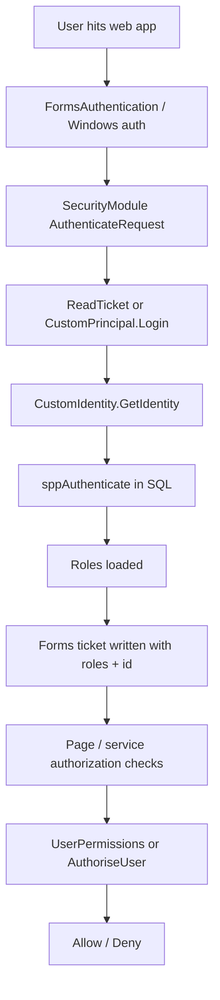
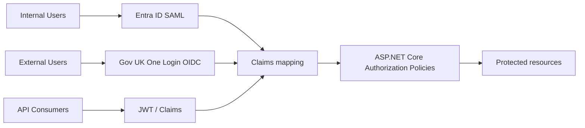

# Authentication Analysis

**PTLIMS Legacy Solution**  
**Repository:** `c:\Users\ac000232\source\repos\proficiency-testing`  
**Analysis date:** 2026-09-14  
**Scope:** authentication, authorization, SSO, role model, session handling, web configuration, and migration implications for the PTLIMS modernization effort.

---

## Executive Summary

PTLIMS does not currently implement a modern identity architecture. Instead, it uses a hybrid legacy model based on:

- ASP.NET Forms authentication for web session cookies
- a custom CSLA `CustomPrincipal` / `CustomIdentity` model for user context and role resolution
- a remote `UserService` web reference for token validation and role authorization
- GUID-based role identifiers stored in app settings and backend database roles
- SQL-backed custom authentication via stored procedure `sppAuthenticate`

This is materially different from the target state described in the HLD:

- Internal users: Entra ID via SAML
- External users: Gov UK One Login via OIDC
- API consumers: JWT / claims

The legacy architecture is therefore best understood as a custom user-management layer with token-based identity and role enforcement, not a relying-party SAML/OIDC model. The migration effort must replace the custom session cookie + role discovery mechanism with Entra ID / One Login integration and convert the authorization outcomes into standard ASP.NET Core claims-based policies.

The most important finding is that the system’s real authorization model is not really “Windows auth” or “Forms auth” alone. It is a layered identity model:

1. user enters via external identity service or forms login
2. token is mapped to a GUID user record
3. custom identity loads roles from SQL (`sppAuthenticate`)
4. role GUIDs are compared against app configuration values
5. page and service access are then granted or denied by custom checks

This strong coupling of identity, authorization, session, and business logic is the key migration risk.

---

## User Journeys

### 1. Internal staff journey

Typical internal users include admin, scheme admin, scheduling, test consultant, results sign-off, assessor, and viewer roles.

Key flow:

- user authenticates through the internal site
- `SecurityModule` runs on `AuthenticateRequest`
- cookie is read; if absent or invalid, `CustomPrincipal.Login(HttpContext.Current.User.Identity.Name)` is invoked
- custom identity loads the user and role list from `sppAuthenticate`
- roles are stored in the Forms auth ticket user data
- `FormsAuthentication` cookie is recreated for the session

Evidence:

- `PtaBusinessObjects/Controls/Security.vb`
- `PtaBusinessObjects/Business Objects/Login/CustomIdentity.vb`
- `PtaBusinessObjects/Business Objects/Login/CustomPrincipal.vb`
- `ProficiencyTestingWeb/Web.config`

### 2. External customer / participant journey

External users are represented by participant and customer roles, and permission checks are evaluated from the remote `UserService` flow:

- `UserPermissions.GetPermissions(user)` calls `UserService.Service.GetUserByTokenId(New Guid(user.Identity.Name))`
- the system iterates role IDs for the configured system id (`SystemId`)
- it identifies `RoleParticipantId`, `RoleTestConsultantId`, and `RoleViewerId`
- it resolves participant/test consultant/viewer state and enforces page permission rules

Evidence:

- `ProficiencyTestingExternalWeb/Utilities/UserPermissions.vb`
- `ProficiencyTestingExternalWeb/Global.asax.vb`

### 3. API / web service caller journey

Service callers authenticate by passing a token GUID to ASMX methods. The pattern is:

- `UserService.Service().GetUserByTokenId(tokenId)` resolves the user
- `AuthoriseUser(tokenId, roleId)` validates role membership
- the service then fetches CSLA BO data and returns a flat DTO-like structure

Evidence:

- `ProficiencyTestingWebServices/Customer.asmx.vb`
- `ProficiencyTestingWebServices/ResultsEntry.vb`
- `ProficiencyTestingWebServices/DistributionForComment.vb`
- `ProficiencyTestingWebServices/Web References/UserService/Reference.vb`

---

## Page Inventory

The system uses a mixed approach: internal pages rely on ASP.NET Windows authentication and page-level role authorization, while external pages rely on custom permission logic and VLA token resolution.

| Page / area | Role | Purpose | Dependencies | Complexity |
|---|---|---|---|---|
| `ProficiencyTestingWeb/Web.config` location entries | Admin / Internal User / Test Consultant / Assessor / Results Sign-off / Distributions | URL authorization by role path | `SecurityModule`, role GUIDs, Windows auth | High |
| `ProficiencyTestingExternalWeb/Utilities/UserPermissions.vb` | Participant / Viewer / Test Consultant | Builds runtime permission state for external pages | `UserService`, business objects, appSettings keys | High |
| `ProficiencyTestingExternalWeb/Global.asax.vb` | All authenticated external users | Security exception handling and redirect flow | Forms auth, `Logout`, `ErrorUserInactive.aspx` | Medium |
| `ProficiencyTestingAdmin/Admin/UserRoles.aspx.vb` | Admin | Role administration and re-login after role changes | custom identity and cookie regeneration | Medium |
| `ProficiencyTestingExternalWeb/EditCustomerDetails.aspx.vb` | Participant / customer | Edit external customer profile | `GetUserByTokenId`, customer BO, user permissions | Medium |
| `ProficiencyTestingExternalWeb/EditParticipantDetails.aspx.vb` | Participant | Edit participant profile | `GetUserByTokenId`, participant BO | Medium |
| `ProficiencyTestingExternalWeb/PendingContractOrder.aspx.vb` | Participant | Manage pending contract orders | `PendingContractOrder` business object and user token | High |
| `ProficiencyTestingWeb/Home.aspx` | All internal users | Landing page after auth | `SecurityModule` and role metadata | Low |

### Page authorization model

Internal web configuration uses path-based authorization in `Web.config`:

- `location path="Admin"` with `allow roles="Admin"`
- `location path="Test Consultant"` with `allow roles="Test Consultant"`
- `location path="Distributions"` with `allow roles="Distributions"`

This mechanism is tied to Windows-authenticated user roles and the legacy role store.

External web uses custom page guards and business-level validations instead of declarative ASP.NET security alone.

---

## Service Inventory

The service layer is concentrated in `ProficiencyTestingWebServices` and is dominated by ASMX web services that accept `tokenId` as the principal identity handle.

| Service | WebMethod | Inputs | Outputs | Consumers |
|---|---|---|---|---|
| `Customer.asmx.vb` | `GetCustomer(tokenId, customerId)` | token, customerId | `Customer` structure | external application, customer management screens |
| `Participant.asmx.vb` | `GetParticipant(tokenId)` | token | `Participant` structure | participant profile screens |
| `ResultsEntry.vb` | `GetResultsEntry(tokenId, monthlyDistributionSchemeId)` | token, distribution id | `ResultsEntry` structure | participant results entry |
| `ResultsEntry.vb` | `UpdateResults(...)` | token, distribution id, collections, submitted flag | Boolean | participant results submission |
| `DistributionForComment.vb` | `GetDistributionForComment(tokenId, monthlyDistributionSchemeId)` | token, distribution id | `MonthlyDistributionScheme` | test consultant comments |
| `DistributionForComment.vb` | `UpdateTestConsultantComments(...)` | token, distribution id, comments | Boolean | test consultant sign-off flow |
| `Scheme.asmx.vb` | `GetScheme(tokenId, schemeId)` / `GetFullSchemeInformationListCollection(tokenId, yearId)` | token, scheme id/year | scheme data | scheme administration and lookup |
| `SchemeListCollection.asmx.vb` | `GetSchemeListCollection(tokenId, listType)` | token, list type | collection of schemes | participant dashboards |
| `CurrentDistributionCollection.vb` | `GetCurrentDistributionCollection(tokenId)` | token | current distributions | participant dashboard |
| `PastDistributionCollection.vb` | `GetPastDistributionCollection(tokenId)` | token | distribution history | participant screens |
| `TabulationCollection.vb` | `GetTabulationCollection(tokenId)` | token | tabulations | viewer screens |
| `PendingCustomerUpdate.asmx.vb` | `GetPendingCustomerUpdate`, `UpdatePendingCustomerUpdate`, `InsertPendingCustomerUpdate` | token + customer update payload | pending update record / Boolean | customer change approval workflow |
| `PendingParticipantScheme.asmx.vb` | `GetPendingParticipantScheme`, `InsertPendingParticipantScheme`, `UpdatePendingParticipantScheme`, `DeletePendingParticipantScheme` | token + participant scheme payload | pending scheme record / Boolean | contract selection workflow |
| `PendingContractOrder.asmx.vb` | `GetPendingContractOrder`, `InsertPendingContractOrder`, `UpdatePendingContractOrder` | token + contract order payload | contract order / Boolean | online contract ordering |

### Service authorization pattern

The common pattern is:

- create `UserService.Service()`
- call `GetUserByTokenId(tokenId)`
- optionally call `AuthoriseUser(tokenId, Roles.Participant)` or `Roles.TestConsultant`
- fetch BO data
- map to serializable structures

Evidence:

- `ProficiencyTestingWebServices/ResultsEntry.vb`
- `ProficiencyTestingWebServices/CurrentDistributionCollection.vb`
- `ProficiencyTestingWebServices/DistributionForComment.vb`
- `ProficiencyTestingWebServices/Web References/UserService/Reference.vb`

---

## Business Objects

The authentication model is implemented in the CSLA layer, not in the UI layer alone.

### 1. `CustomPrincipal`

File: `PtaBusinessObjects/Business Objects/Login/CustomPrincipal.vb`

- derives from `Csla.Security.BusinessPrincipalBase`
- writes the forms auth ticket using `Controls.SecurityModule.WriteTicket(Identity)`
- exposes `IsInRole` for role checks
- handles login/logout flows via `CustomPrincipal.Login` and `CustomPrincipal.Logout`

This is the core object used to hold the current user context.

### 2. `CustomIdentity`

File: `PtaBusinessObjects/Business Objects/Login/CustomIdentity.vb`

- implements `IIdentity`
- authentication type is set to `"Csla"`
- reads user and roles from a SQL stored procedure: `sppAuthenticate`
- stores `mRoles` and exposes `GetRoles()` / `RoleList`
- adds a synthetic `Distributions` role when `Internal User` or `Scheduling` role is present

This is the most important business object for legacy authorization.

### 3. `SecurityModule`

File: `PtaBusinessObjects/Controls/Security.vb`

- implements `IHttpModule`
- runs at `AuthenticateRequest`
- reads the forms auth cookie
- decrypts the ticket and calls `CustomPrincipal.SetPrincipal(...)`
- creates a ticket including roles and user id in `UserData`

This module is effectively the legacy authentication middleware.

### 4. DataPortal and role loading

The role data is loaded by CSLA `DataPortal_Fetch` on `CustomIdentity`:

- `DataPortal_Fetch(ByVal criteria As Object)`
- opens a database connection using `ConfigurationManager.ConnectionStrings("Security")`
- calls `sppAuthenticate`
- loads the user id, active state, and role list

This means identity resolution is tightly coupled to the SQL data layer and a custom business object Model.

### 5. Other relevant business objects

The wider PTLIMS domain also includes user-related objects such as:

- `PtaBusinessObjects/Business Objects/Login/UserDetails.vb`
- `PtaBusinessObjects/Business Objects/Login/UserRole.vb`
- `PtaBusinessObjects/Business Objects/Login/RoleCollection.vb`
- `PtaBusinessObjects/Business Objects/Viewers/Viewer.vb`
- `PtaBusinessObjects/Business Objects/System Objects/ExtTestConsultant.vb`

These reinforce the same model: identity is loaded as business objects, then permission decisions are driven by role IDs and active flags.

---

## DTO Inventory

The web service layer returns DTO-like `Structure` objects rather than the CSLA BOs themselves.

Examples:

- `ServiceCustomer.Customer`
- `ServiceParticipant.Participant`
- `ServiceScheme.Scheme`
- `ServicePendingCustomerUpdate.PendingCustomerUpdate`
- `ServicePendingParticipantScheme.PendingParticipantScheme`
- `ServiceResultsEntry.ResultsEntry`
- `ServiceDistributionForComment.MonthlyDistributionScheme`
- `ServiceSchemeListCollection.SchemeList`
- `ServiceSystemInformation.SystemInformation`

These use flat, serializable fields such as `CustomerId`, `CountryId`, `IsActive`, `RoleId`, and nested arrays from `Collection(Of ...)` conversions. They are the legacy equivalent of request/response contracts.

These structures are not JWT claim models and do not map directly to modern OIDC or SAML claims. They are application-specific service payloads.

---

## Database Mapping

### Authentication-related data access

The security database connection is configured in `ProficiencyTestingWeb/Web.config`:

- connection string name: `Security`
- provider: `System.Data.SqlClient`

The identity layer calls a stored procedure for authentication:

- `sppAuthenticate`

This stored procedure returns:

- `CustomIdentityId`
- `IsInactive`
- role rows for the user

Evidence:

- `PtaBusinessObjects/Business Objects/Login/CustomIdentity.vb`

### Relevant role configuration values

The app stores role GUID values in `Web.config`:

- `RoleParticipantId`
- `RoleTestConsultantId`
- `RoleViewerId`
- `SystemId`

These are compared to runtime role GUIDs returned by the external user service.

Evidence:

- `ProficiencyTestingWeb/Web.config`
- `ProficiencyTestingExternalWeb/Utilities/UserPermissions.vb`

### Related user/role objects in the domain model

Relevant business objects and storage artifacts include:

- `UserDetails.vb`
- `UserRole.vb`
- `RoleCollection.vb`
- `Viewer.vb`
- `ExtTestConsultant.vb`

These objects primarily act as wrappers over user metadata, role membership, and active/inactive flags rather than claims claims-based access control.

---

## Validation Rules

### Identity validation

The following checks are core to legacy auth behavior:

- `CustomIdentity.GetIdentity(username)` loads user details and roles from SQL
- if no user record is found, the system still sets `mIsAuthenticated = True` in a branch that clears roles and sets empty values, which is a concern and indicates a non-standard auth pattern
- `SecurityModule.ReadTicket` catches `ArgumentException` when decryption fails and returns `False`
- `Global.asax` handles `ProficiencyTestingSecurityException` by logging out and redirecting to login

Evidence:

- `PtaBusinessObjects/Business Objects/Login/CustomIdentity.vb`
- `PtaBusinessObjects/Controls/Security.vb`
- `ProficiencyTestingExternalWeb/Global.asax.vb`

### Authorization validation

Users are denied `ExternalWeb` access if they do not have any of:

- participant
- viewer
- test consultant

This is enforced in `UserPermissions.GetPermissions`:

- if no valid role matches, it throws `ProficiencyTestingSecurityException`

Additionally:

- if participant or test consultant is inactive, it throws `ProficiencyTestingNotActiveSecurityException`

Evidence:

- `ProficiencyTestingExternalWeb/Utilities/UserPermissions.vb`

### Web config validation

The internal web uses `location` entries to allow or deny roles. The external site uses custom guards around page access (e.g., `ParticipantPageGuard`, `ViewerPageGuard`, `TestConsultantPageGuard`).

---

## Business Rules

### Role model

The system relies on a custom role model where roles are represented by GUID values, not by claims.

Examples:

- `RoleParticipantId`
- `RoleTestConsultantId`
- `RoleViewerId`

These values are not tokens from a standards-based identity provider; they are localized identifiers embedded in application config.

### Active/inactive enforcement

The legacy authorization model distinguishes between:

- active participant
- inactive participant
- active test consultant
- inactive test consultant

Inactivity results in exceptions and redirects.

### Synthetic grouping

The custom identity layer creates a synthetic `Distributions` role when the user has either `Internal User` or `Scheduling` role. This shows an authorization model that is not straightforward role matching; it includes custom derived roles.

### Security ticket composition

The forms ticket stores:

- ticket name = `HttpContext.Current.User.Identity.Name`
- ticket user data = `roles + "&" + userId`

This places both authorization data and principal identity into the auth cookie.

---

## Security Analysis

### Current state

The legacy application’s authentication behavior is a composition of:

- Windows auth at the web server level for some internal site paths
- Forms auth for the web app’s custom identity cookie
- CSLA `CustomPrincipal` and `CustomIdentity`
- `UserService` remote lookups for role and token validation
- SQL `sppAuthenticate` as the identity store for roles

This is a highly custom trust chain and is vulnerable to drift, because role data is distributed between:

- appSettings GUIDs
- database roles
- cookies
- external user service
- custom page guard logic

### Risks in the legacy pattern

1. mixed identity sources
   - internal auth is not normalized with external auth
   - external users depend on VLA user service rather than standards-based identity

2. role data is duplicated
   - app config stores role GUIDs
   - database stores user-role membership
   - cookies store serialized role lists

3. determination is not standards-based
   - no JWT claims model
   - no OIDC discovery or SAML assertion processing
   - no `ClaimTypes` or role claim mapping

4. security is split across layers
   - `SecurityModule` handles auth cookie
   - `UserPermissions` handles business authorization
   - service methods call `AuthoriseUser()` directly
   - page logic adds extra business-level checks

5. session persistence is fragile
   - forms tickets are created for 60 minutes and stored in cookies
   - identity is reconstructed rather than resolved through a standard identity provider

### What the HLD indicates for target architecture

The HLD target is conceptually cleaner:

- internal system: Entra ID via SAML
- external site: Gov UK One Login via OIDC
- API layer: JWT and claims

This maps naturally to ASP.NET Core authorization policy architecture:

- `AddAuthentication()` with SAML/OIDC handlers
- claim mapping into user identity
- authorization policies such as `ParticipantAccess`, `ViewerAccess`, and `TestConsultantAccess`
- token validation at API boundary via JWT bearer authentication

---

## Dependency Analysis

### Direct dependencies

- `UserService.Service` web reference: resolves token and role membership
- `PtaBusinessObjects.Controls.SecurityModule`: custom cookie auth middleware
- `PtaBusinessObjects.BusinessObjects.Login.CustomPrincipal`: principal implementation for user context
- `PtaBusinessObjects.BusinessObjects.Login.CustomIdentity`: identity and role model
- `ConfigurationManager.AppSettings("RoleParticipantId")` etc.: role-to-GUID mapping
- `ConfigurationManager.ConnectionStrings("Security")`: security database connection

### External dependency

The external web explicitly depends on the VLA service layer, as shown in configuration:

- `ServiceUserManagement` = `http://localhost/SsoUserManagement/service.asmx`
- `VLAManagementUrl` = `http://localhost/VLAServices`

This dependency is a major blocker for a clean, standards-based identity migration because the business permission layer is not independent from the identity vendor.

### Legacy-to-modern dependency mapping

| Legacy dependency | Modern intent |
|---|---|
| `UserService.Service.GetUserByTokenId()` | Entra ID / One Login subject claim resolution |
| `CustomPrincipal` / `CustomIdentity` | ASP.NET Core `ClaimsPrincipal` and identity claims |
| `FormsAuthenticationTicket` cookie | ASP.NET Core authentication cookies or OIDC sessions |
| `RoleParticipantId` etc. GUIDs | standards-based claims / policy names |
| SQL `sppAuthenticate` | identity store or federated claims mapping layer |

---

## Migration Complexity Assessment

### Complexity: High

This domain is a high-risk modernization area because it combines identity, session, role metadata, business logic, and infrastructure policy in a custom web application model.

Reasons:

- multiple auth mechanisms are mixed together
- role resolution is split across app settings, database, and cookies
- external and internal flows are not aligned
- authorization and business logic are not separated
- custom ticket handling must be replaced by modern provider-based security

### Migration approach

A realistic modernization path is:

1. establish Entra ID and Gov UK One Login as the upstream identity providers
2. map legacy roles to claims and policies
3. replace `CustomPrincipal`/`CustomIdentity` with ASP.NET Core claims principal model
4. migrate `SecurityModule` logic into authentication middleware and custom transformation
5. replace `UserService` authorization checks with `IAuthorizationService` / policies
6. retire the custom `FormsAuthenticationTicket`-based identity state and use provider-issued tokens for API requests

### Recommended target model

- Internal web: SAML assertion from Entra ID, mapped to app claims
- External web: OIDC from Gov UK One Login, mapped to app claims
- API: JWT bearer tokens with role and scope claims
- Authorization: policy-based (` ParticipantAccess`, `ViewerAccess`, `TestConsultantAccess`)

---

## Mermaid Diagrams

### Diagram 1: Legacy authentication flow

### Diagram 2: Target auth model from HLD

---

## Open Questions

- Which portion of the legacy user model is still authoritative in production: VLA user service, SQL role tables, or Windows domain membership? [NEEDS INVESTIGATION]
- Are the role GUIDs in `Web.config` still valid in the current environment, or are they legacy values that need mapping to modern Entra / One Login groups? [NEEDS INVESTIGATION]
- Is `sppAuthenticate` the canonical authentication routine in production, or is it only used for local legacy apps? [NEEDS INVESTIGATION]
- Does the HLD target intend to replace role names such as `Participant`, `Viewer`, and `Test Consultant` with claims or groups from Entra/One Login? [NEEDS INVESTIGATION]
- Will API consumers be authenticated directly to PTLIMS or via an API gateway / token broker? [NEEDS INVESTIGATION]

---

## Conclusion

PTLIMS uses a custom, layered, and partially externalized authentication model whose core assumptions do not match the target HLD architecture. The legacy system authenticates users through a custom identity model, stores role state in cookies and SQL, and authorizes access through GUID-based role checks and custom page guards.

The migration should therefore be treated as a security architecture replacement, not a simple application configuration change. The legacy model must be converted to a standards-based model using Entra ID SAML for internal users, Gov UK One Login OIDC for external users, and JWT-claims authorization for APIs.

### Source references used

- `proficiency-testing/PtaBusinessObjects/Business Objects/Login/CustomIdentity.vb`
- `proficiency-testing/PtaBusinessObjects/Business Objects/Login/CustomPrincipal.vb`
- `proficiency-testing/PtaBusinessObjects/Controls/Security.vb`
- `proficiency-testing/ProficiencyTestingWeb/Web.config`
- `proficiency-testing/ProficiencyTestingExternalWeb/Web.config`
- `proficiency-testing/ProficiencyTestingExternalWeb/Global.asax.vb`
- `proficiency-testing/ProficiencyTestingExternalWeb/Utilities/UserPermissions.vb`
- `proficiency-testing/ProficiencyTestingWebServices/Web References/UserService/Reference.vb`
- `proficiency-testing/ProficiencyTestingWebServices/Customer.asmx.vb`
- `proficiency-testing/ProficiencyTestingWebServices/ResultsEntry.vb`
- `proficiency-testing/ProficiencyTestingWebServices/DistributionForComment.vb`
