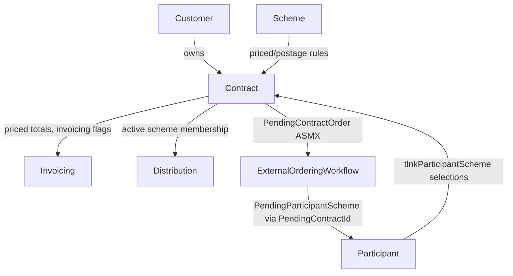

# Contract Domain Analysis (AS-IS)

**Scope:** Contract domain in the legacy PTLIMS solution as implemented in the ASP.NET Web Forms / CSLA / ASMX architecture.
**Analysis date:** 2026-09-17
**Repository:** `proficiency-testing`
**Cross-reference inputs:** `docs/analysis/customer-analysis.md`, `docs/analysis/participant-analysis.md`, `docs/analysis/csla-analysis.md`, `docs/migration/api-migration.md`, `docs/source/PTLIMS-HLD-v0.3.docx`.

This is an AS-IS analysis only. It does not define .NET 10 design, migration architecture, repository design, CQRS, DDD, or future implementation plans.

---

## Executive Summary

The Contract domain is the yearly commercial agreement between a `Customer` and PTLIMS: it fixes the year, pricing (courier/postage/special-delivery/administration charge/discount rate), UT/FT contract numbering, invoicing behaviour, and the set of scheme "contract items" (participant-scheme memberships) purchased under that agreement. A contract is always owned by exactly one customer and one year, and it aggregates the participant/scheme selections captured elsewhere in the Participant domain (`tlnkParticipantScheme`) into a single priced, reviewable unit ("Contract Items").

The current AS-IS design is a classic Web Forms + CSLA architecture, almost entirely internal-admin-facing, with a narrower ASMX surface than Customer or Participant:

- Internal pages in `ProficiencyTestingWeb/Contracts Admin` create/edit a contract (`Contract.aspx`), list a customer's current/historical contracts (`ContractList.aspx`), and review/adjust the priced scheme line items on a contract (`ContractItems.aspx`).
- The core domain object is the CSLA `Contract` business object (`PtaBusinessObjects/Business Objects/Contracts/Contract.vb`), a mutable `BusinessBase` persisted to `tblContract` via `spgContractByContractId`/`spiContract`/`spuContract`.
- `ContractItems` is a read-only aggregate object that reassembles a contract's `ContractSchemeCollection` (schemes) and, per scheme, the `ParticipantSchemeInfoCollection` (participant-level month/price selections) sourced from `spgContractItems`, then computes postage/courier/discount/total pricing.
- `ContractInfo` / `ContractInfoDataAccess` provide lightweight list projections for `ContractList.aspx` (`spgContractInfoByCustomerId`, `spgContractInfoByCustomerIdAndYearId`).
- `ContractRenewal` is a read-only object feeding mail-merge renewal letters; `ContractMergeInfo` feeds a merged multi-scheme mail-merge document (`spgContractMerge`).
- A narrow external ASMX surface (`PendingContractOrder.asmx`, `AvailableSchemeCollection.asmx`, `CurrentlyParticipatingSchemeCollection.asmx`) supports an external participant "renewal/ordering" workflow that proposes scheme changes for a year via a pending-approval object, mirroring the Customer/Participant pending-update pattern, but scoped to contract-year scheme selection rather than direct contract field edits.
- The main persistence table is `tblContract`; the contract's priced line items are derived from `tlnkParticipantScheme` (owned by the Participant domain) joined through `Scheme`/`Contract`, not a dedicated `tblContractScheme` table.

**Evidence:**
- Source file: `proficiency-testing/PtaBusinessObjects/Business Objects/Contracts/Contract.vb` — Project: `PtaBusinessObjects` — Class: `BusinessObjects.Contracts.Contract` — Method: `DataPortal_Fetch`, `DataPortal_Insert`, `DataPortal_Update`
- Source file: `proficiency-testing/ProficiencyTestingDatabase/Object Scripts/Tables/tblContract.sql` — Project: `ProficiencyTestingDatabase`
- Source file: `proficiency-testing/ProficiencyTestingWeb/Contracts Admin/Contract.aspx.vb` — Project: `ProficiencyTestingWeb` — Class: `ContractsAdmin_ContractCreate`
- Source file: `proficiency-testing/ProficiencyTestingWebServices/PendingContractOrder.asmx.vb` — Project: `ProficiencyTestingWebServices` — Class: `ServicePendingContractOrder`

---

## Business Purpose

The Contract domain exists to represent the commercial, year-scoped agreement under which a customer's participants take part in schemes, and to price and invoice that agreement.

It supports:

- one contract per customer per year (`YearId`, `CustomerId`, `UTNumber`/`FTNumber` — exactly one of the two must be populated)
- pricing configuration: courier/postage/special-delivery unit prices and counts, administration charge, discount rate
- contract lifecycle metadata: acknowledgement posted/returned dates, job sheet posted date, commencement date, date of leaving, reason for closure, renewal information, contract signatory, purchase order number, approval (`ApprovedBy`/`ApprovedDate`)
- invoicing control flags: `OptOutOfInvoiceGeneration`, `IsInvoiceSent`, `IsOnlineOrder`
- active/read-only state (`IsActive`, `IsReadOnly` — read-only derived from the SP, e.g. once invoiced/closed)
- aggregation of the customer's scheme purchases for the year into priced "contract items" for review/reporting/export
- mail-merge document generation for contract letters, sample-address letters, job sheets, and renewal letters
- an external participant-facing "contract order" pending-approval workflow for renewing/selecting schemes for the next year

**Primary business role:** the contract is the priced, year-scoped commercial envelope that turns a customer's participant/scheme selections into an invoiceable agreement.

**Evidence:**
- Source file: `proficiency-testing/PtaBusinessObjects/Business Objects/Contracts/Contract.vb` — Method: `YearId`, `UTNumber`, `FTNumber`, `DiscountRate`, `AdministrationCharge`, `OptOutOfInvoiceGeneration`, `IsInvoiceSent`, `ApprovedBy`
- Source file: `proficiency-testing/PtaBusinessObjects/Business Objects/Contracts/ContractItems.vb` — Method: `CourierPriceTotal`, `PostagePriceTotal`, `SpecialDeliveryPriceTotal`, `DiscountPrice`, `TotalPrice`
- Source file: `proficiency-testing/PtaBusinessObjects/Business Objects/Contracts/ContractRenewal.vb` — Property: `AdditionalLetterInfo`, `CurrentContractStartDate`, `CurrentContractEndDate`

---

## User Journeys

### 1. Internal admin creates or edits a contract

- User role: Contracts Admin / Scheme Admin
- Entry point: `Contracts Admin/ContractList.aspx` (via `Session("CurrentCustomer")`) → `Contract.aspx`
- Exit point: contract saved (`Contract.Save()`), page redirects back to the contract/customer context
- Workflow:
  1. Admin selects a customer, then either opens an existing contract by `ContractId` or creates a new one (`Contract.NewContract(customerId)`), which defaults `UTNumber` from `SystemSettings`, sets `IsActive = True`, `CommencementDate = Now`, and pre-fills `AdministrationCharge` from the customer's currency-specific default (`AdministrationChargeCurrencyCollection`).
  2. Form binds year, UT/FT number, pricing fields, dates, invoicing flags, and read-only state (`SetReadOnly()` if `mContract.IsReadOnly`).
  3. On save, `LoadObjectFromForm()` maps the form back to the object and `mContract.Save()` is called, which triggers `DataPortal_Insert`/`DataPortal_Update` under CSLA validation rules.
- Dependencies: `Customer` (for `CustomerId`, `CurrencyId`), `SystemObjects.SystemSettings`, `SystemObjects.AdministrationChargeCurrencyCollection`, `SystemObjects.Currency`, `SystemObjects.YearCollection`

**Evidence:**
- Source file: `proficiency-testing/ProficiencyTestingWeb/Contracts Admin/Contract.aspx.vb` — Class: `ContractsAdmin_ContractCreate` — Method: `Page_Load`, `ButtonSave_Click`, `LoadFormFromObject`, `LoadObjectFromForm`, `SetYearTextBox`, `SetYearDropDown`
- Source file: `proficiency-testing/PtaBusinessObjects/Business Objects/Contracts/Contract.vb` — Method: `NewContract`, `FetchContract`, `DataPortal_Create`, `DataPortal_Fetch`, `DataPortal_Insert`, `DataPortal_Update`

### 2. Internal admin lists a customer's contracts (current and historical) and exports documents

- User role: Contracts Admin / Scheme Admin
- Entry point: `Contracts Admin/ContractList.aspx?CustomerId={id}` (or `Session("CurrentCustomer")`)
- Exit point: contract opened for edit, contract items opened, or a mail-merge document downloaded
- Workflow:
  1. Page resolves the customer from the query string or session, then loads two grids: current/next-year contracts and historical contracts, via `ContractInfoDataAccess.FetchContractInfoCollection(customerId, active)`.
  2. Inactive contracts are rendered with strike-through styling in `RowDataBound`.
  3. Row commands (`ExportContract`, and similarly for sample-address letter, job sheet, renewal letter) validate that an uploaded mail-merge template exists (`UploadedTemplateCollection`) for the relevant `DocumentType`, then call `MailMergeContract.ExecuteSingleContract` / `MailMergeSampleAddressLetter` / `MailMergeJobSheet` / `MailMergeRenewalLetter` to stream a generated document back to the browser.
- Dependencies: `ContractInfoDataAccess`, `SystemObjects.YearCollection`, `UploadedTemplateCollection`, `PtaBusinessObjects.Exports.MailMergeContract`/`MailMergeSampleAddressLetter`/`MailMergeJobSheet`/`MailMergeRenewalLetter`

**Evidence:**
- Source file: `proficiency-testing/ProficiencyTestingWeb/Contracts Admin/ContractList.aspx.vb` — Class: `ContractsAdmin_ContractList` — Method: `Page_Load`, `GridViewCurrentContracts_RowDataBound`, `GridViewCurrentContracts_RowCommand`
- Source file: `proficiency-testing/PtaBusinessObjects/DataAccess/Contracts/ContractInfoDataAccess.vb` — Method: `FetchContractInfoCollection`, `FetchContractInfoCollectionByYear`

### 3. Internal admin reviews and adjusts priced contract items (scheme purchases)

- User role: Contracts Admin / Scheme Admin
- Entry point: `Contracts Admin/ContractItems.aspx?ContractId={id}` (or `Session("ContractId")`)
- Exit point: contract items saved/removed, or navigation back to `ContractList.aspx` / forward to `ParticipantScheme.aspx` to add a new item
- Workflow:
  1. Page fetches `ContractItems.FetchContractItems(contractId)`, a read-only aggregate that reassembles the contract's schemes (`ContractSchemeCollection`) and, per scheme, the participant-level `ParticipantSchemeInfoCollection` (month selections, pricing, override flags), then computes postage/courier/special-delivery/discount/administration totals.
  2. Nested grids render each scheme's participant-scheme rows; a `Remove` row command marks a `ParticipantSchemeInfo` as `IsRemoved = True` locally (deferred delete) and tracks the id in `mDeleteParticipantSchemeIds` for later `spdParticipantScheme`-style deletion on save.
  3. `BtnAddItem` navigates to `ParticipantScheme.aspx` (a Participant-domain page) to add a new scheme selection.
  4. If `mContract.IsReadOnly`, `BtnAddItem` and item-removal controls are hidden.
- Dependencies: `ContractItems`, `ContractSchemeCollection`, `ParticipantSchemeInfoCollection`, `ParticipantScheme` (Participant domain), `Scheme` (Scheme domain)

**Evidence:**
- Source file: `proficiency-testing/ProficiencyTestingWeb/Contracts Admin/ContractItems.aspx.vb` — Class: `Contracts_Admin_ContractItems` — Method: `GridViewContractItems_Load`, `LoadData`, `GridViewParticipants_RowCommand`, `BtnAddItem_Click`, `BtnSave_Click`
- Source file: `proficiency-testing/PtaBusinessObjects/Business Objects/Contracts/ContractItems.vb` — Method: `FetchContractItems`, `CourierPriceTotal`, `PostagePriceTotal`, `SpecialDeliveryPriceTotal`, `DiscountPrice`, `TotalPrice`
- Source file: `proficiency-testing/PtaBusinessObjects/Business Objects/Contracts/ContractScheme.vb` — Method: `GetContractScheme`, `Fetch`

### 4. External participant proposes a contract/scheme order for renewal (pending approval)

- User role: external participant
- Entry point: external ordering/renewal flow calling `PendingContractOrder.asmx` (backed by `AvailableSchemeCollection.asmx` and `CurrentlyParticipatingSchemeCollection.asmx` to populate scheme choices)
- Exit point: pending contract order record submitted for admin approval; nothing is written directly to `tblContract`
- Workflow:
  1. External caller resolves identity via `UserService.Service.GetUserByTokenId(tokenId)` (the same token-based SSO pattern used across Customer/Participant domains). Note: the commented-out `s.AuthoriseUser(tokenId, Roles.Participant)` call in `AvailableSchemeCollection.asmx.vb`/`CurrentlyParticipatingSchemeCollection.asmx.vb` mirrors the same disabled/absent role check documented in the Participant analysis.
  2. `AvailableSchemeCollection.FetchAvailableSchemes(ssoId, yearId)` returns schemes eligible to be added to a pending contract for the year; `CurrentlyParticipatingSchemeCollection.FetchCurrentlyParticipatingSchemes(ssoId, yearId, participatingYearId, participantId)` returns schemes the participant already has.
  3. `GetPendingContractOrder(tokenId, customerId, isSubmitted, yearId)` fetches (or the participant inserts/updates) a `PendingContractOrder` record keyed by `CustomerId`/`YearId`, carrying `PurchaseOrderNumber` and `IsSubmitted`.
  4. The related `PendingParticipantScheme`/`PendingParticipantSchemeCollection` ASMX services (Participant domain, cross-referenced) carry the actual proposed scheme line items tied to `PendingContractId`.
- Dependencies: `UserService`, `PtWebServicesBusinessObjects.PendingContractOrder`, `PtWebServicesBusinessObjects.AvailableSchemeCollection`, `PtWebServicesBusinessObjects.CurrentlyParticipatingSchemeCollection`, `PendingParticipantScheme`/`PendingParticipantSchemeCollection` (Participant domain)

**Evidence:**
- Source file: `proficiency-testing/ProficiencyTestingWebServices/PendingContractOrder.asmx.vb` — Class: `ServicePendingContractOrder` — Method: `GetPendingContractOrder`, `InsertPendingContractOrder`, `UpdatePendingContractOrder`
- Source file: `proficiency-testing/ProficiencyTestingWebServices/AvailableSchemeCollection.asmx.vb` — Class: `ServiceAvailableSchemeCollection` — Method: `FetchAvailableSchemes`
- Source file: `proficiency-testing/ProficiencyTestingWebServices/CurrentlyParticipatingSchemeCollection.asmx.vb` — Class: `ServiceCurrentlyParticipatingSchemeCollection` — Method: `FetchCurrentlyParticipatingSchemes`
- Source file: `proficiency-testing/ProficiencyTestingWebServices/PendingParticipantSchemeCollection.asmx.vb` — Method: `FetchPendingParticipantSchemeCollection` (parameter `contractId`)
- Cross-reference: `docs/analysis/participant-analysis.md` — Section: "External participant loads their own profile..." / `PendingParticipantScheme.asmx`

### 5. Internal admin generates a merged multi-scheme mail-merge document

- User role: Contracts Admin
- Entry point: `ContractList.aspx` merge/export actions (contract, sample-address letter, job sheet, renewal letter) — driven by `ContractMergeInfo`/`spgContractMerge` for multi-item merges
- Exit point: generated document streamed to the browser
- Workflow:
  1. `ContractMergeInfo` aggregates `ContractId`, `Suffix`, `ContractSignatory`, `RenewalInformation`, `ActionsRequired`, `IsActive`, `NoOfItems`, and a list of `ParticipantSchemeMergeInfo` for the contract.
  2. `ContractRenewal` (read-only) separately supplies the renewal-letter-specific fields (QAL number, contact/organisation/address, country, current contract start/end dates, additional letter info) sourced for the mail-merge renewal letter template.
- Dependencies: `ContractMergeInfo`, `ContractRenewal`, `PtaBusinessObjects.Exports.MailMergeRenewalLetter`

**Evidence:**
- Source file: `proficiency-testing/PtaBusinessObjects/Business Objects/Contracts/ContractMergeInfo.vb`
- Source file: `proficiency-testing/PtaBusinessObjects/Business Objects/Contracts/ContractRenewal.vb`
- Source file: `proficiency-testing/ProficiencyTestingDatabase/Object Scripts/Stored Procedures/spg/spgContractMerge.sql`

---

## Page Inventory

| Page | Project | Role | Purpose | Dependencies | Complexity |
|---|---|---|---|---|---|
| `Contracts Admin/ContractList.aspx` | `ProficiencyTestingWeb` | Contracts Admin / Scheme Admin | List current/historical contracts for a customer; export mail-merge documents | `ContractInfoDataAccess`, `UploadedTemplateCollection`, `MailMergeContract`/`MailMergeSampleAddressLetter`/`MailMergeJobSheet`/`MailMergeRenewalLetter`, `SystemObjects.YearCollection` | High |
| `Contracts Admin/Contract.aspx` | `ProficiencyTestingWeb` | Contracts Admin / Scheme Admin | Create and edit a contract (pricing, dates, invoicing flags) | `Contract`, `Customer`, `SystemObjects.SystemSettings`, `SystemObjects.AdministrationChargeCurrencyCollection`, `SystemObjects.Currency` | High |
| `Contracts Admin/ContractItems.aspx` | `ProficiencyTestingWeb` | Contracts Admin / Scheme Admin | Review/remove priced scheme line items ("contract items") on a contract | `ContractItems`, `ContractSchemeCollection`, `ParticipantSchemeInfoCollection`, `ParticipantScheme` | High |

There is no dedicated `ProficiencyTestingExternalWeb` page for Contract in this repository — external participant interaction with the contract's scheme selections happens purely through ASMX (`PendingContractOrder.asmx` + related scheme-availability services), consumed by an external ordering/renewal UI. [NEEDS INVESTIGATION: confirm which external UI screen consumes `PendingContractOrder.asmx` — not found under `ProficiencyTestingExternalWeb` in this workspace.]

**Evidence:**
- Source file: `proficiency-testing/ProficiencyTestingWeb/Contracts Admin/ContractList.aspx.vb`
- Source file: `proficiency-testing/ProficiencyTestingWeb/Contracts Admin/Contract.aspx.vb`
- Source file: `proficiency-testing/ProficiencyTestingWeb/Contracts Admin/ContractItems.aspx.vb`

---

## Service Inventory (ASMX)

| Service | Project | WebMethod | Inputs | Outputs | Consumers |
|---|---|---|---|---|---|
| `PendingContractOrder.asmx` | `ProficiencyTestingWebServices` | `GetPendingContractOrder(tokenId, customerId, isSubmitted, yearId)`, `InsertPendingContractOrder(tokenId, penConOrder)`, `UpdatePendingContractOrder(tokenId, penConOrder)` | token + customer/year + `PendingContractOrder` payload (`PurchaseOrderNumber`, `isSubmitted`) | `PendingContractOrder` DTO / `Boolean` | external participant ordering/renewal workflow |
| `AvailableSchemeCollection.asmx` | `ProficiencyTestingWebServices` | `FetchAvailableSchemes(tokenId, yearId)` | token, year | `Collection(Of AvailableScheme)` | external ordering UI (scheme picker for a pending contract) |
| `CurrentlyParticipatingSchemeCollection.asmx` | `ProficiencyTestingWebServices` | `FetchCurrentlyParticipatingSchemes(tokenId, yearId, participatingYearId, participantId)` | token, year, participating year, participant id | `Collection(Of CurrentlyParticipatingScheme)` | external ordering UI (pre-populate schemes already participated in) |
| `PendingParticipantSchemeCollection.asmx` | `ProficiencyTestingWebServices` | `FetchPendingParticipantSchemeCollection(tokenId, contractId)` | token, `contractId` | `Collection(Of PendingParticipantScheme)` | admin review of pending scheme line items tied to a contract (cross-referenced with Participant domain) |

### Service details

#### `ServicePendingContractOrder`

- Resolves identity via `UserService.Service.GetUserByTokenId(tokenId)` then loads/creates a `PtWebServicesBusinessObjects.PendingContractOrder` keyed by `ssoId`/`customerId`/`yearId`.
- `InsertPendingContractOrder` only creates a new record if one does not already exist for that customer/year (`PendingContractOrder.PendingContractOrderId = Guid.Empty` check); otherwise callers are expected to use `UpdatePendingContractOrder`.
- No explicit role/authorisation check is visible in the reviewed method bodies beyond identity resolution. [NEEDS INVESTIGATION: confirm whether role/ownership checks exist elsewhere in the call chain.]

Source:
- File: `proficiency-testing/ProficiencyTestingWebServices/PendingContractOrder.asmx.vb`
- Project: `ProficiencyTestingWebServices`
- Class / Method: `ServicePendingContractOrder.GetPendingContractOrder`, `InsertPendingContractOrder`, `UpdatePendingContractOrder`

#### `ServiceAvailableSchemeCollection` / `ServiceCurrentlyParticipatingSchemeCollection`

- Both resolve identity via `UserService.Service.GetUserByTokenId(tokenId)`.
- Both contain a **commented-out** authorisation call: `'Dim validRequest As Boolean = s.AuthoriseUser(tokenId, Roles.Participant)` / `'If Not validRequest Then Return Nothing` — i.e. the role check exists in code but is disabled, identical in shape to the gap already flagged in `docs/analysis/participant-analysis.md`.

Source:
- File: `proficiency-testing/ProficiencyTestingWebServices/AvailableSchemeCollection.asmx.vb` — Class: `ServiceAvailableSchemeCollection` — Method: `FetchAvailableSchemes`
- File: `proficiency-testing/ProficiencyTestingWebServices/CurrentlyParticipatingSchemeCollection.asmx.vb` — Class: `ServiceCurrentlyParticipatingSchemeCollection` — Method: `FetchCurrentlyParticipatingSchemes`

---

## Business Objects

### 1. `Contract` (CSLA `BusinessBase`)

**Primary domain object**

- File: `proficiency-testing/PtaBusinessObjects/Business Objects/Contracts/Contract.vb`
- Project: `PtaBusinessObjects`
- Class: `BusinessObjects.Contracts.Contract`
- Base: `BusinessBase(Of Contract)`

Key responsibilities:
- Stores contract identity (`ContractId`, `CustomerId`, `YearId`), UT/FT numbering, signatory, pricing (courier/postage/special-delivery unit prices and counts, discount rate, administration charge), lifecycle dates, invoicing flags, active/read-only state, and approval metadata.
- Enforces validation through `AddBusinessRules()`.
- `DataPortal_Create` seeds defaults (UT number from system settings, active flag, commencement date, currency-based default administration charge).
- `DataPortal_Fetch` loads via `spgContractByContractId`; `DataPortal_Insert`/`DataPortal_Update` persist via `spiContract`/`spuContract` (both routed through a shared `DoInsertUpdate` parameter-binding helper).
- `IsReadOnly` and `QALNumber`/`CustomerName` are computed/returned by the fetch stored procedure rather than being independently settable business state.

Extracted DataPortal methods:
- `DataPortal_Create(criteria)` — defaults new contract (UT number, active flag, commencement date, admin charge)
- `DataPortal_Fetch(criteria)` — `EXEC spgContractByContractId @ContractId`
- `DataPortal_Insert()` — `EXEC spiContract` (23 parameters via `DoInsertUpdate`)
- `DataPortal_Update()` — `EXEC spuContract` (same 23 parameters via `DoInsertUpdate`)

Source:
- `proficiency-testing/PtaBusinessObjects/Business Objects/Contracts/Contract.vb`
- Methods: `NewContract`, `FetchContract`, `DataPortal_Create`, `DataPortal_Fetch`, `DataPortal_Insert`, `DataPortal_Update`, `DoInsertUpdate`, `AddBusinessRules`

### 2. `ContractInfo` (plain summary DTO, not a full CSLA base)

- File: `proficiency-testing/PtaBusinessObjects/Business Objects/Contracts/ContractInfo.vb`
- Project: `PtaBusinessObjects`
- Class: `BusinessObjects.Contracts.ContractInfo`
- Purpose: lightweight summary (`ContractId`, `CustomerId`, `YearId`, `IsActive`, `Suffix`) used by `ContractList.aspx` grids.
- Populated via `ContractInfoDataAccess.FetchContractInfoCollection`/`FetchContractInfoCollectionByYear` (plain ADO.NET data-access class, not a CSLA `ReadOnlyListBase`), calling `spgContractInfoByCustomerId` / `spgContractInfoByCustomerIdAndYearId`.

Source:
- `proficiency-testing/PtaBusinessObjects/Business Objects/Contracts/ContractInfo.vb`
- `proficiency-testing/PtaBusinessObjects/DataAccess/Contracts/ContractInfoDataAccess.vb` — Method: `FetchContractInfoCollection`, `FetchContractInfoCollectionByYear`

### 3. `ContractItems` (CSLA `ReadOnlyBase`)

- File: `proficiency-testing/PtaBusinessObjects/Business Objects/Contracts/ContractItems.vb`
- Project: `PtaBusinessObjects`
- Class: `BusinessObjects.Contracts.ContractItems`
- Base: `ReadOnlyBase(Of ContractItems)`
- Purpose: read-only aggregate of a contract's priced scheme line items, sourced from `spgContractItems`, exposing `ContractSchemes` (a `ContractSchemeCollection`), and computed pricing (`CourierPriceTotal`, `PostagePriceTotal`, `SpecialDeliveryPriceTotal`, `DiscountPrice`, `TotalPrice`, `AdministrationCharge`).
- Notably re-fetches the live `Contract` inside `CourierPriceTotal` to check `IsOnlineOrder`, and — if the contract is an online order — recomputes courier/postage totals from the underlying scheme postage type and each participant-scheme's selected distribution months rather than trusting the stored `NumberCourier`/`NumberPostage` counts.

Source:
- `proficiency-testing/PtaBusinessObjects/Business Objects/Contracts/ContractItems.vb`
- Method: `FetchContractItems`, `CourierPriceTotal`, `PostagePriceTotal`, `SpecialDeliveryPriceTotal`, `DiscountPrice`, `TotalPrice`

### 4. `ContractSchemeCollection` / `ContractScheme` (CSLA `ReadOnlyBase`/collection)

- File: `proficiency-testing/PtaBusinessObjects/Business Objects/Contracts/ContractScheme.vb`, `ContractSchemeCollection.vb`
- Project: `PtaBusinessObjects`
- Class: `BusinessObjects.Contracts.ContractScheme` (`ReadOnlyBase`), `ContractSchemeCollection`
- Purpose: groups a contract's items by scheme (`SchemeId`, `SchemeIdentifier`, `SchemeName`) and holds the nested `ParticipantSchemeInfoCollection` of participant-level selections for that scheme within the contract.

Source:
- `proficiency-testing/PtaBusinessObjects/Business Objects/Contracts/ContractScheme.vb` — Method: `GetContractScheme`, `Fetch`

### 5. `ContractRenewal` (CSLA `ReadOnlyBase`)

- File: `proficiency-testing/PtaBusinessObjects/Business Objects/Contracts/ContractRenewal.vb`
- Project: `PtaBusinessObjects`
- Class: `BusinessObjects.Contracts.ContractRenewal`
- Base: `ReadOnlyBase(Of ContractRenewal)`
- Purpose: read-only projection of contract + customer fields needed to mail-merge a renewal letter (QAL number, contact/organisation/address x5, country, current contract start/end dates, additional renewal info).

Source:
- `proficiency-testing/PtaBusinessObjects/Business Objects/Contracts/ContractRenewal.vb`

### 6. `ContractMergeInfo` (plain DTO)

- File: `proficiency-testing/PtaBusinessObjects/Business Objects/Contracts/ContractMergeInfo.vb`
- Project: `PtaBusinessObjects`
- Class: `BusinessObjects.Contracts.ContractMergeInfo`
- Purpose: flattens a contract (`ContractId`, `Suffix`, `ContractSignatory`, `RenewalInformation`, `ActionsRequired`, `IsActive`, `NoOfItems`) plus a list of `ParticipantSchemeMergeInfo` for multi-item mail-merge document generation, sourced from `spgContractMerge`.

Source:
- `proficiency-testing/PtaBusinessObjects/Business Objects/Contracts/ContractMergeInfo.vb`
- `proficiency-testing/ProficiencyTestingDatabase/Object Scripts/Stored Procedures/spg/spgContractMerge.sql`

---

## DTO Inventory

### ASMX DTOs

| DTO | Project | Source file | Fields (examples) | Use |
|---|---|---|---|---|
| `PendingContractOrder` (nested `Structure`) | `ProficiencyTestingWebServices` | `ProficiencyTestingWebServices/PendingContractOrder.asmx.vb` | `PendingContractId`, `CustomerId`, `YearId`, `isSubmitted`, `PurchaseOrderNumber` | Returned/consumed by `PendingContractOrder.asmx` |
| `AvailableScheme` | `ProficiencyTestingWebServices` | `ProficiencyTestingWebServices/AvailableSchemeCollection.asmx.vb` | scheme id/name/identifier fields (per `PtWebServicesBusinessObjects.AvailableSchemeCollection`) | Returned by `FetchAvailableSchemes` |
| `CurrentlyParticipatingScheme` | `ProficiencyTestingWebServices` | `ProficiencyTestingWebServices/CurrentlyParticipatingSchemeCollection.asmx.vb` | scheme id/name/participation fields | Returned by `FetchCurrentlyParticipatingSchemes` |
| `PendingParticipantScheme` (nested `Structure`, includes `PendingContractId`) | `ProficiencyTestingWebServices` | `ProficiencyTestingWebServices/PendingParticipantScheme.asmx.vb` | month flags, pricing, `PendingContractId` | Links pending scheme selections back to a pending contract order |

### Internal / read-model DTOs

- `ContractInfo` — customer contract-list summary
- `ContractMergeInfo` — multi-item mail-merge payload
- `ParticipantSchemeMergeInfo` (nested in `ContractMergeInfo`) — per-item merge fields [NEEDS INVESTIGATION: full field list not read in this pass]

**Evidence:**
- Source file: `proficiency-testing/ProficiencyTestingWebServices/PendingContractOrder.asmx.vb` — `Structure PendingContractOrder`
- Source file: `proficiency-testing/PtaBusinessObjects/Business Objects/Contracts/ContractMergeInfo.vb`

---

## Database Mapping

### Page → Business Object → Stored Procedure → Table

| Page | Business Object | Stored Procedure | Database Table |
|---|---|---|---|
| `Contracts Admin/Contract.aspx` | `Contract` | `spgContractByContractId`, `spiContract`, `spuContract` | `tblContract` |
| `Contracts Admin/ContractList.aspx` | `ContractInfo` (via `ContractInfoDataAccess`) | `spgContractInfoByCustomerId`, `spgContractInfoByCustomerIdAndYearId` | `tblContract` |
| `Contracts Admin/ContractItems.aspx` | `ContractItems`, `ContractSchemeCollection`, `ParticipantSchemeInfoCollection` | `spgContractItems` | `tblContract` joined to `tlnkParticipantScheme` / scheme tables (via Participant/Scheme domains) |
| Mail-merge (multi-item) | `ContractMergeInfo` | `spgContractMerge` | `tblContract` joined to `tlnkParticipantScheme` |
| `PendingContractOrder.asmx` | `PtWebServicesBusinessObjects.PendingContractOrder` | pending contract order stored procedures [NEEDS INVESTIGATION: exact SP names not located in this pass — not under the standard `spg/spi/spu` folders searched] | pending contract order table(s) [NEEDS INVESTIGATION] |

### Stored procedures

#### `spgContractByContractId`
- File: `ProficiencyTestingDatabase/Object Scripts/Stored Procedures/spg/spgContractByContractId.sql`
- Purpose: fetch a single contract by `@ContractId`, including a derived `Readonly` flag and joined `fldQALNumber`/customer name.

#### `spiContract` / `spuContract`
- Referenced by `Contract.Insert`/`Contract.DataPortal_Insert` and `Contract.DataPortal_Update`.
- Both take the same 23-parameter shape (`@ContractId`, `@CustomerId`, `@YearId`, `@UTNumber`, `@FTNumber`, `@ContractSignatory`, `@ActionsRequired`, `@RenewalInformation`, `@DiscountRate`, `@AdministrationCharge`, `@NumberCourier`, `@CourierPrice`, `@NumberPostage`, `@PostagePrice`, `@NumberSpecialDelivery`, `@SpecialDeliveryPrice`, `@AcknowledgementPostedDate`, `@AcknowledgementReturnedDate`, `@JobSheetPostedDate`, `@ReasonForClosure`, `@DateOfLeaving`, `@IsActive`, `@Suffix`, `@CommencementDate`, `@PurchaseOrderNumber`, `@OptOutOfInvoiceGeneration`, `@IsOnlineOrder`, `@ApprovedBy`, `@ApprovedDate`) — count exceeds 23 labels above because some are combined; see `DoInsertUpdate` for the authoritative parameter list. [NEEDS INVESTIGATION: confirm exact current parameter count against live schema, per the schema-drift pattern already observed for `spiParticipant` in the apha-ptl-apps memory notes.]

#### `spgContractInfoByCustomerId` / `spgContractInfoByCustomerIdAndYearId`
- File: `ProficiencyTestingDatabase/Object Scripts/Stored Procedures/spg/spgContractInfoByCustomerId.sql`, `spgContractInfoByCustomerIdAndYearId.sql`
- Purpose: list-projection procedures backing `ContractList.aspx`'s current/historical grids and year-filtered lookups.

#### `spgContractItems`
- File: `ProficiencyTestingDatabase/Object Scripts/Stored Procedures/spg/spgContractItems.sql`
- Purpose: returns the joined contract/scheme/participant-scheme rows used to reconstruct `ContractItems`/`ContractSchemeCollection`/`ParticipantSchemeInfoCollection` in memory.

#### `spgContractMerge`
- File: `ProficiencyTestingDatabase/Object Scripts/Stored Procedures/spg/spgContractMerge.sql`
- Purpose: returns the flattened rows used to build `ContractMergeInfo` for multi-scheme mail-merge document generation.

### Tables

#### `tblContract`
- File: `ProficiencyTestingDatabase/Object Scripts/Tables/tblContract.sql`
- Purpose: contract aggregate table. Evolutionary `ALTER TABLE ... IF NOT EXISTS` script history shows `fldPurchaseOrderNumber`, `fldOptOutOfInvoiceGeneration`, `fldIsInvoiceSent`, `fldApprovedBy`, `fldApprovedDate` were added after the original table, and `fldActionsRequired` was widened to `varchar(1000)` — i.e. this table has the same incremental-migration pattern already flagged for `tblParticipant` in `docs/migration/participant-migration.md`/repo memory notes, so schema-drift risk applies here too.

#### Related tables
- `tlnkParticipantScheme` — the actual scheme/participant purchase line items that `ContractItems`/`ContractSchemeCollection` reassemble per contract; **owned by the Participant domain**, not a Contract-domain table.
- `tblCustomer` — parent of `tblContract` via `fldCustomerId`.
- Pending contract order table(s) backing `PendingContractOrder.asmx` [NEEDS INVESTIGATION: not located under the standard table-script folders in this pass].

**Evidence:**
- `proficiency-testing/ProficiencyTestingDatabase/Object Scripts/Tables/tblContract.sql`
- `proficiency-testing/ProficiencyTestingDatabase/Object Scripts/Stored Procedures/spg/spgContractByContractId.sql`
- `proficiency-testing/ProficiencyTestingDatabase/Object Scripts/Stored Procedures/spg/spgContractInfoByCustomerId.sql`
- `proficiency-testing/ProficiencyTestingDatabase/Object Scripts/Stored Procedures/spg/spgContractInfoByCustomerIdAndYearId.sql`
- `proficiency-testing/ProficiencyTestingDatabase/Object Scripts/Stored Procedures/spg/spgContractItems.sql`
- `proficiency-testing/ProficiencyTestingDatabase/Object Scripts/Stored Procedures/spg/spgContractMerge.sql`
- `docs/analysis/participant-analysis.md` — Section: "Database Mapping" (for `tlnkParticipantScheme` ownership)

---

## Validation Rules

Defined in `Contract.AddBusinessRules()`.

### Critical
- `UTNumber` XOR `FTNumber`: exactly one of the two must be populated — `ValidateUTFT` fails if both or neither are set. This is the fundamental "contract type" discriminator (UT vs FT contract numbering).
- `ValidateDate` rejects any of `DateOfLeaving`, `AcknowledgementPostedDate`, `AcknowledgementReturnedDate`, `JobSheetPostedDate` left at the sentinel year `9999` — i.e. these dates, once set, must be real dates (the `9999` sentinel is used by the code-behind as an "unset" placeholder via `Csla.SmartDate.Parse("1/1/9999")` on parse failure).
- `DiscountRate >= 0`, `NumberCourier/NumberPostage/NumberSpecialDelivery >= 0`, `CourierPrice/PostagePrice/SpecialDeliveryPrice/AdministrationCharge >= 0` — negative pricing/counts are rejected. Note: the code-behind's `Try/Catch` parse fallback sets some of these to `-1` on a parse failure (e.g. `AdministrationCharge = -1`, `CourierPrice = -1`), which would then trip this same min-value rule — i.e. a bad numeric entry in the UI is designed to surface as a validation error rather than silently defaulting to zero.

### Important
- Max lengths: `UTNumber`/`FTNumber` (10), `ContractSignatory` (50), `ActionsRequired` (1000), `RenewalInformation` (2000), `ReasonForClosure` (255), `Suffix` (2), `PurchaseOrderNumber` (255).

### Optional
- None identified beyond the above; all located rules are structural (required/format) or numeric-range checks rather than soft/advisory rules.

**Evidence:**
- Source file: `proficiency-testing/PtaBusinessObjects/Business Objects/Contracts/Contract.vb` — Method: `AddBusinessRules`, `ValidateUTFT`, `ValidateDate`

---

## Business Rules

### Contract identity and numbering
- A contract is uniquely identified by `ContractId` (GUID) and is always scoped to one `CustomerId` and one `YearId`.
- The contract is either a "UT" contract or an "FT" contract, discriminated by which of `UTNumber`/`FTNumber` is populated (see Validation Rules). The code-behind UI (`Contract.aspx.vb`) branches its layout (`SetUT()`/`SetFT()`) based on which number is present.

**Evidence:** `proficiency-testing/ProficiencyTestingWeb/Contracts Admin/Contract.aspx.vb` — Method: `LoadFormFromObject` (`isUT` branch)

### Default pricing derivation on creation
- On `NewContract(customerId)`, if a customer is supplied, `AdministrationCharge` defaults from `AdministrationChargeCurrencyCollection.FetchAdministrationChargeCurrencyCollectionByCurrencyId(customer.CurrencyId)(0).Price` — i.e. administration charge is currency-scoped reference data, not a global constant.
- `UTNumber` defaults from `SystemObjects.SystemSettings.FetchSystemSettings().UTNumber` (a system-wide sequential/next-number setting) on creation.

**Evidence:** `proficiency-testing/PtaBusinessObjects/Business Objects/Contracts/Contract.vb` — Method: `DataPortal_Create`

### Read-only contract state
- `IsReadOnly` is computed by the fetch stored procedure (aliased `Readonly` in the result set) rather than derived client-side; the UI hides/disables editing (`SetReadOnly()`) and hides item-removal/add controls in `ContractItems.aspx` when `mContract.IsReadOnly` is true. [NEEDS INVESTIGATION: exact SQL predicate for `Readonly` in `spgContractByContractId` — likely tied to invoicing/closure state, not confirmed in this pass.]

**Evidence:** `proficiency-testing/PtaBusinessObjects/Business Objects/Contracts/Contract.vb` — property `IsReadOnly`, `DataPortal_Fetch`; `proficiency-testing/ProficiencyTestingWeb/Contracts Admin/ContractItems.aspx.vb` — Method: `GridViewParticipants_RowDataBound`

### Online-order pricing recomputation
- When a contract `IsOnlineOrder`, `ContractItems.CourierPriceTotal` (and, by the same pattern, likely `PostagePriceTotal`/`SpecialDeliveryPriceTotal`) ignore the stored `NumberCourier` count and instead recompute the count/total by walking every scheme's participant-scheme distribution-month selections and matching the scheme's configured postage type (`Scheme.Postage = getPostType("Courier", realScheme.YearId)`), accounting for `CombinedPackaging` and `NonFeePaying` schemes. This means online-order contracts price dynamically from live participant-scheme selections rather than from a fixed count entered on the contract.

**Evidence:** `proficiency-testing/PtaBusinessObjects/Business Objects/Contracts/ContractItems.vb` — Property: `CourierPriceTotal`

### Deferred deletion of contract items
- Removing a participant-scheme line item in `ContractItems.aspx` does not delete immediately: it flags `ParticipantSchemeInfo.IsRemoved = True` in memory and queues the id in `mDeleteParticipantSchemeIds`, with the UI showing "[Item Removed]" or "Pending Deletion" depending on queue state. Actual persistence of the removal happens on `BtnSave_Click` [NEEDS INVESTIGATION: full save/delete SP call not read in this pass].

**Evidence:** `proficiency-testing/ProficiencyTestingWeb/Contracts Admin/ContractItems.aspx.vb` — Method: `GridViewParticipants_RowCommand`, `GridViewParticipants_RowDataBound`

### Pending contract order uniqueness per customer/year
- `InsertPendingContractOrder` only creates a new pending order when none exists yet for that `CustomerId`/`YearId` combination (checked via `PendingContractOrder.PendingContractOrderId = Guid.Empty`); otherwise the caller must use `UpdatePendingContractOrder`. This mirrors the "one pending record at a time" pattern used for `PendingCustomerUpdate`/`PendingParticipantUpdate`.

**Evidence:** `proficiency-testing/ProficiencyTestingWebServices/PendingContractOrder.asmx.vb` — Method: `InsertPendingContractOrder`

---

## Security Analysis

### Authentication dependencies
- Internal pages (`Contract.aspx`, `ContractList.aspx`, `ContractItems.aspx`) rely on ASP.NET session state (`Session("CurrentCustomer")`, `Session("CurrentContract")`, `Session("ContractId")`) rather than explicit per-request identity checks in the reviewed code; they redirect to `MenuContracts.aspx` if the expected session state is missing.
- External-facing ASMX (`PendingContractOrder.asmx`, `AvailableSchemeCollection.asmx`, `CurrentlyParticipatingSchemeCollection.asmx`) resolves identity via `UserService.Service.GetUserByTokenId(tokenId)`, the same token-based SSO pattern documented for Customer/Participant.

### Authorization dependencies
- **Gap:** `AvailableSchemeCollection.asmx.vb` and `CurrentlyParticipatingSchemeCollection.asmx.vb` both contain a commented-out authorisation check (`'Dim validRequest As Boolean = s.AuthoriseUser(tokenId, Roles.Participant)` / `'If Not validRequest Then Return Nothing`) — the role-check code exists but is disabled, so any caller with a valid token (regardless of role) can call these methods. This is the same class of gap already documented in `docs/analysis/participant-analysis.md` for Participant ASMX services.
- No role/ownership check was located in `PendingContractOrder.asmx.vb`'s method bodies beyond identity resolution to `ssoId`. [NEEDS INVESTIGATION: confirm whether ownership of `customerId` by the resolved `ssoId`/participant is checked elsewhere, e.g. in `PtWebServicesBusinessObjects.PendingContractOrder`.]
- Internal `Contracts Admin` pages did not show an explicit `Permission.CanEdit...`-style gate in the reviewed code-behind (contrast with `EditCustomerDetails.aspx`'s `master.Permission.CanEditCustomer` check documented in the Customer analysis). [NEEDS INVESTIGATION: confirm whether contract-admin page access is gated elsewhere, e.g. web.config role-based authorization on the `Contracts Admin` folder.]

### Role / identity dependency
- `Contract`-domain ASMX consistently follows the "resolve `ssoId` from `tokenId` via `UserService`, then act in the customer/participant's context" pattern seen across Customer and Participant.

**Evidence:**
- Source file: `proficiency-testing/ProficiencyTestingWebServices/AvailableSchemeCollection.asmx.vb` — Method: `FetchAvailableSchemes`
- Source file: `proficiency-testing/ProficiencyTestingWebServices/CurrentlyParticipatingSchemeCollection.asmx.vb` — Method: `FetchCurrentlyParticipatingSchemes`
- Source file: `proficiency-testing/ProficiencyTestingWebServices/PendingContractOrder.asmx.vb` — Method: `GetPendingContractOrder`
- Cross-reference: `docs/analysis/participant-analysis.md` — Section: "Security Dependencies" (equivalent disabled-role-check pattern)

---

## Cross-Domain Dependencies

### Upstream domains (Contract depends on)

```
Customer
  ↓
Contract
```
- Every `Contract` requires a `CustomerId` and inherits currency (`CurrencyId`) from the Customer for default administration charge calculation. Customer inactivation is not shown to cascade into Contract in the reviewed code (contrast with Customer→Participant cascade), but a contract cannot exist without its customer. [NEEDS INVESTIGATION: confirm whether contract deactivation is triggered by customer deactivation.]

```
Scheme
  ↓
Contract
```
- `ContractScheme`/`ContractItems` read scheme identity (`SchemeId`, `SchemeIdentifier`, `SchemeName`) and scheme-level pricing configuration (`Scheme.Postage`, `Scheme.CombinedPackaging`) from the Scheme domain to compute item pricing.

```
Participant (tlnkParticipantScheme / ParticipantScheme)
  ↓
Contract
```
- The actual priced line items on a contract are participant-scheme selections owned by the Participant domain (`tlnkParticipantScheme`, `ParticipantScheme`/`ParticipantSchemeInfo`). `ContractItems`/`ContractSchemeCollection` are a Contract-domain read-model built entirely from Participant-domain data plus `tblContract` pricing fields.

### Downstream / shared domains (depend on Contract)

```
Contract
  ↓
Distribution / Results
```
- Distribution and results workflows depend on which participants are active on which schemes for which contract/year (via `tlnkParticipantScheme`), which is itself validated/priced through the Contract aggregate. [NEEDS INVESTIGATION: exact distribution-domain read path not verified in this pass; cross-reference `docs/analysis/participant-analysis.md`'s note on `tlnkDistributionParticipant`.]

```
Contract
  ↓
Invoicing / Reporting
```
- `OptOutOfInvoiceGeneration`, `IsInvoiceSent`, and the priced totals in `ContractItems` feed invoicing and reporting processes outside the scope of the pages reviewed here.

### Shared domains
- **Scheme** is shared between Contract and Participant: Scheme defines the catalogue/pricing rules; Participant records the per-participant selection; Contract aggregates and prices those selections for a customer/year.

### Mermaid diagram



**Evidence:**
- `proficiency-testing/PtaBusinessObjects/Business Objects/Contracts/Contract.vb` — Method: `DataPortal_Create` (`Customer.FetchCustomer(CustomerID).CurrencyId`)
- `proficiency-testing/PtaBusinessObjects/Business Objects/Contracts/ContractItems.vb` — Property: `CourierPriceTotal` (`Scheme.FetchScheme(cs.SchemeId)`)
- `docs/analysis/participant-analysis.md` — Section: "Domain Dependencies" (Participant↔Contract/Scheme relationship)

---

## Workflow Boundaries

### Entry points

```
Customer
  ↓
Contract Creation (Contract.aspx, new)
```

```
Contract
  ↓
Contract Item Review (ContractItems.aspx)
```

```
Contract
  ↓
Pending Contract Order (external, PendingContractOrder.asmx)
```

### Exit points

```
Contract
  ↓
Participant Scheme Selection (ParticipantScheme.aspx — Participant domain)
```
- `ContractItems.aspx`'s `BtnAddItem_Click` exits the Contract workflow boundary and hands off to the Participant-domain `ParticipantScheme.aspx` page to add a new scheme selection, which later re-enters the Contract's `ContractItems` read-model on next fetch.

```
Contract
  ↓
Mail-Merge Document Generation (ContractList.aspx row commands)
```
- Exporting a contract/sample-address-letter/job-sheet/renewal-letter exits into the `PtaBusinessObjects.Exports.*` mail-merge subsystem and returns a streamed document, not a domain state change.

```
Contract
  ↓
Invoicing (external to reviewed pages)
```
- `IsInvoiceSent`/`OptOutOfInvoiceGeneration` are exit-boundary flags consumed by an invoicing process not covered by the pages reviewed in this analysis. [NEEDS INVESTIGATION]

**Evidence:**
- `proficiency-testing/ProficiencyTestingWeb/Contracts Admin/ContractItems.aspx.vb` — Method: `BtnAddItem_Click`
- `proficiency-testing/ProficiencyTestingWeb/Contracts Admin/ContractList.aspx.vb` — Method: `GridViewCurrentContracts_RowCommand`

---

## Stored Procedure Dependency Matrix

| Stored Procedure | Page | Business Object | Table(s) |
|---|---|---|---|
| `spgContractByContractId` | `Contract.aspx` | `Contract` | `tblContract` (+ joined customer QAL number) |
| `spiContract` | `Contract.aspx` (new) | `Contract` | `tblContract` |
| `spuContract` | `Contract.aspx` (edit) | `Contract` | `tblContract` |
| `spgContractInfoByCustomerId` | `ContractList.aspx` | `ContractInfo` (via `ContractInfoDataAccess`) | `tblContract` |
| `spgContractInfoByCustomerIdAndYearId` | `ContractList.aspx` (year-filtered variant) | `ContractInfo` (via `ContractInfoDataAccess`) | `tblContract` |
| `spgContractItems` | `ContractItems.aspx` | `ContractItems`, `ContractSchemeCollection`, `ParticipantSchemeInfoCollection` | `tblContract` joined to `tlnkParticipantScheme` and scheme tables |
| `spgContractMerge` | `ContractList.aspx` (merge/export) | `ContractMergeInfo` | `tblContract` joined to `tlnkParticipantScheme` |
| pending contract order SP(s) [NEEDS INVESTIGATION] | external ordering UI | `PtWebServicesBusinessObjects.PendingContractOrder` | pending contract order table(s) [NEEDS INVESTIGATION] |

---

## Migration Impact Assessment

If the Contract domain changes:

### High impact
- **Participant domain** — `ContractItems`/`ContractSchemeCollection` are entirely built from `tlnkParticipantScheme`/`ParticipantSchemeInfo`. Any change to contract pricing computation, item aggregation, or the `IsRemoved`/deferred-deletion model directly changes what participant-scheme rows are considered "in" a contract, which affects distribution eligibility.
- **Invoicing** — pricing fields (`DiscountRate`, `AdministrationCharge`, courier/postage/special-delivery pricing, `OptOutOfInvoiceGeneration`, `IsInvoiceSent`) and the computed `ContractItems` totals are the presumed source for invoicing; a schema or calculation change here has direct financial impact.

### Medium impact
- **Customer domain** — Contract depends on `Customer.CurrencyId` for default administration charge and on `CustomerId` for ownership; a change to Customer's currency model or identity shape would ripple into `Contract.DataPortal_Create`'s default-pricing logic.
- **Scheme domain** — `ContractItems.CourierPriceTotal`'s online-order recomputation depends on `Scheme.Postage`/`Scheme.CombinedPackaging`; changes to scheme postage-type modeling would change contract pricing for online orders.
- **External ordering workflow** (`PendingContractOrder.asmx` + `AvailableSchemeCollection.asmx` + `CurrentlyParticipatingSchemeCollection.asmx`) — any change to how a contract is identified/keyed (`CustomerId`+`YearId`) would break the pending-order lookup/uniqueness logic.

### Low impact
- **Mail-merge/export subsystem** (`ContractRenewal`, `ContractMergeInfo`, `MailMerge*` exporters) — consumes contract data read-only for document generation; a contract schema change requires updating these projections but does not risk write-path correctness.

**Evidence:**
- `proficiency-testing/PtaBusinessObjects/Business Objects/Contracts/ContractItems.vb`
- `proficiency-testing/PtaBusinessObjects/Business Objects/Contracts/Contract.vb` — Method: `DataPortal_Create`
- `docs/analysis/participant-analysis.md` — Section: "Domain Dependencies"

---

## Complexity Assessment

The Contract domain is currently **high complexity**, on par with Customer and Participant, because it combines:

- a mutable, heavily-parameterised core business object (`Contract`, ~28 persisted fields) with UT/FT mutually-exclusive numbering and multiple sentinel-date conventions (`9999`)
- a read-only aggregate (`ContractItems`) that recomputes pricing dynamically depending on `IsOnlineOrder`, re-fetching the live `Contract` and `Scheme` objects mid-calculation rather than working from a single flat projection
- a deferred-deletion UI pattern for contract items (`IsRemoved` flag + a separate delete-queue list) that must be reconciled correctly on save
- reliance on another domain's link table (`tlnkParticipantScheme`, owned by Participant) as the actual source of contract line items, rather than a dedicated Contract-owned items table
- a narrow but security-relevant external ASMX surface with a disabled authorisation check, mirroring a known gap already documented in the Participant domain
- mail-merge document generation spanning four distinct letter/document types, each with its own read-model (`ContractRenewal`, `ContractMergeInfo`) and template-existence precondition

This complexity reflects the current implementation model in the legacy application; it is not a migration-design recommendation.

---

## Open Questions

- What are the exact stored procedure(s) and table(s) backing `PtWebServicesBusinessObjects.PendingContractOrder` (fetch/insert/update)? [NEEDS INVESTIGATION]
- What SQL predicate does `spgContractByContractId` use to compute the `Readonly` flag returned as `mIsReadOnly`? [NEEDS INVESTIGATION]
- Does customer deactivation cascade to contract deactivation, the way it cascades to participant deactivation? [NEEDS INVESTIGATION]
- Is there a role/ownership authorization check for `Contracts Admin` pages (e.g. web.config-level), given none was found in the reviewed code-behind? [NEEDS INVESTIGATION]
- What is the full save/delete path in `ContractItems.aspx`'s `BtnSave_Click` for queued `mDeleteParticipantSchemeIds` (which stored procedure performs the actual delete)? [NEEDS INVESTIGATION]
- Which external UI (if any, inside or outside this repository) actually consumes `PendingContractOrder.asmx`/`AvailableSchemeCollection.asmx`/`CurrentlyParticipatingSchemeCollection.asmx`? No corresponding page was found under `ProficiencyTestingExternalWeb` in this workspace. [NEEDS INVESTIGATION]
- Does the HLD (`docs/source/PTLIMS-HLD-v0.3.docx`) describe Contract-domain responsibilities not reflected in this page/service inventory? [NEEDS INVESTIGATION]
- Full field list of `ParticipantSchemeMergeInfo` (nested in `ContractMergeInfo`)? [NEEDS INVESTIGATION]

---

## Source Summary

The analysis above is based on the following current-source references:

- `proficiency-testing/ProficiencyTestingWeb/Contracts Admin/Contract.aspx.vb`
- `proficiency-testing/ProficiencyTestingWeb/Contracts Admin/ContractList.aspx.vb`
- `proficiency-testing/ProficiencyTestingWeb/Contracts Admin/ContractItems.aspx.vb`
- `proficiency-testing/ProficiencyTestingWebServices/PendingContractOrder.asmx.vb`
- `proficiency-testing/ProficiencyTestingWebServices/AvailableSchemeCollection.asmx.vb`
- `proficiency-testing/ProficiencyTestingWebServices/CurrentlyParticipatingSchemeCollection.asmx.vb`
- `proficiency-testing/ProficiencyTestingWebServices/PendingParticipantSchemeCollection.asmx.vb`
- `proficiency-testing/PtaBusinessObjects/Business Objects/Contracts/Contract.vb`
- `proficiency-testing/PtaBusinessObjects/Business Objects/Contracts/ContractInfo.vb`
- `proficiency-testing/PtaBusinessObjects/Business Objects/Contracts/ContractItems.vb`
- `proficiency-testing/PtaBusinessObjects/Business Objects/Contracts/ContractScheme.vb`
- `proficiency-testing/PtaBusinessObjects/Business Objects/Contracts/ContractRenewal.vb`
- `proficiency-testing/PtaBusinessObjects/Business Objects/Contracts/ContractMergeInfo.vb`
- `proficiency-testing/PtaBusinessObjects/DataAccess/Contracts/ContractInfoDataAccess.vb`
- `proficiency-testing/ProficiencyTestingDatabase/Object Scripts/Tables/tblContract.sql`
- `proficiency-testing/ProficiencyTestingDatabase/Object Scripts/Stored Procedures/spg/spgContractByContractId.sql`
- `proficiency-testing/ProficiencyTestingDatabase/Object Scripts/Stored Procedures/spg/spgContractInfoByCustomerId.sql`
- `proficiency-testing/ProficiencyTestingDatabase/Object Scripts/Stored Procedures/spg/spgContractInfoByCustomerIdAndYearId.sql`
- `proficiency-testing/ProficiencyTestingDatabase/Object Scripts/Stored Procedures/spg/spgContractItems.sql`
- `proficiency-testing/ProficiencyTestingDatabase/Object Scripts/Stored Procedures/spg/spgContractMerge.sql`
- `docs/analysis/customer-analysis.md` (cross-reference)
- `docs/analysis/participant-analysis.md` (cross-reference)
- `docs/analysis/csla-analysis.md` (cross-reference)
- `docs/migration/api-migration.md` (cross-reference)
- `docs/source/PTLIMS-HLD-v0.3.docx` (cross-reference — not independently re-parsed in this pass beyond prior analyses' citations)

This document intentionally describes only the current AS-IS Contract domain and does not define new design targets, repositories, CQRS, DDD, migration architecture, or .NET 10 patterns.
