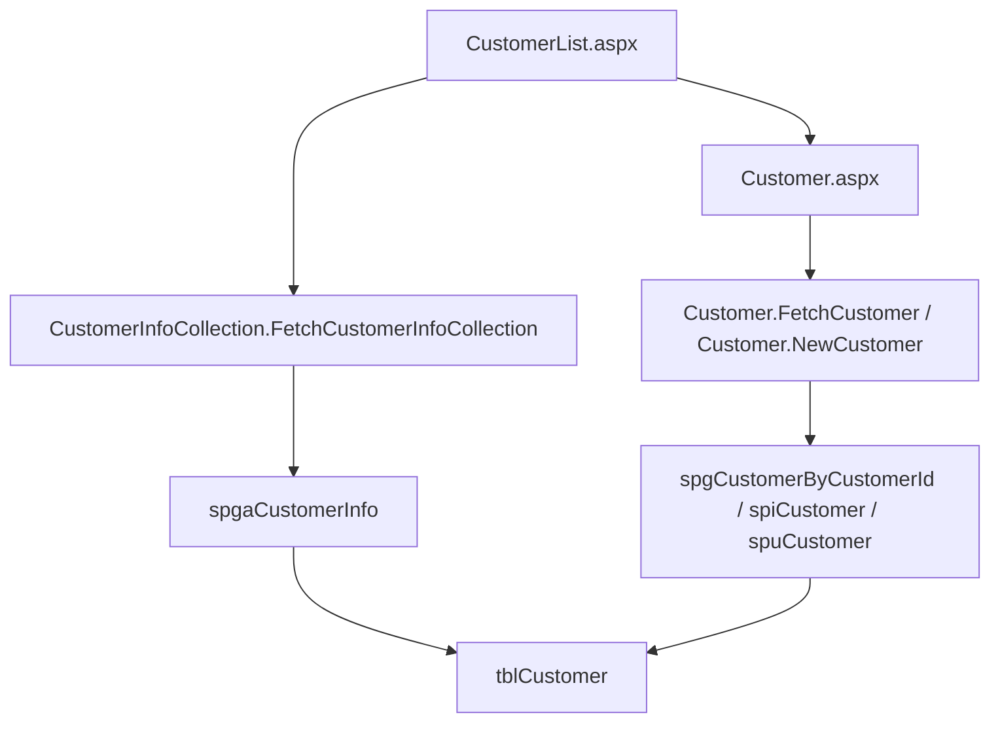
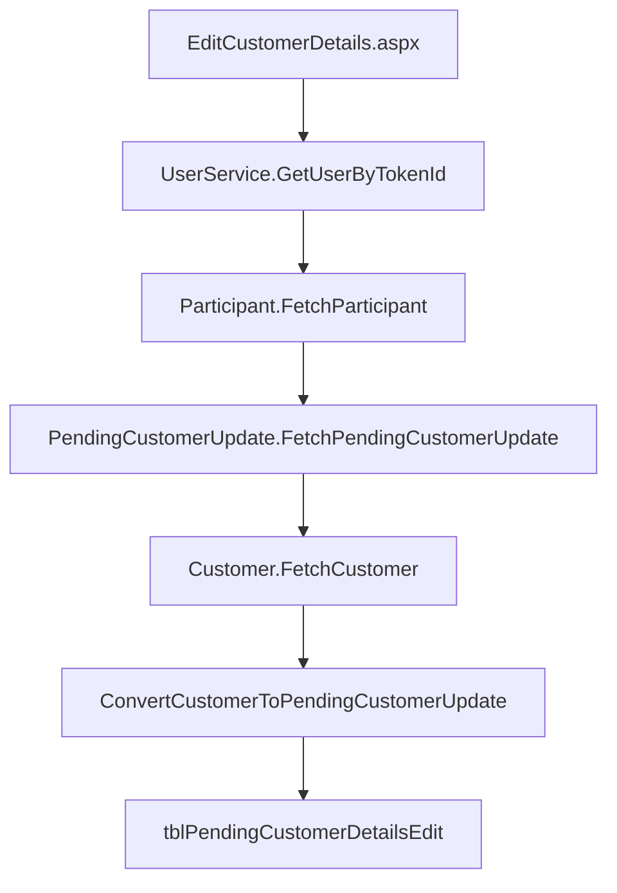

# Customer Domain Analysis (AS-IS)

**Scope:** current PTLIMS Customer domain as implemented in the legacy ASP.NET Web Forms / CSLA / ASMX solution.
**Analysis date:** 2026-09-14
**Repository:** `proficiency-testing`

---

## Executive Summary

The Customer domain in PTLIMS is the master record for an organisation or laboratory account, with contact, invoice, country, status, and financial metadata. The domain spans internal administrative workflows and external participant self-service updates, and it is deeply connected to participants, contracts, schemes, and invoicing.

The current AS-IS design is a classic Web Forms + CSLA + ASMX architecture:

- Internal pages in `ProficiencyTestingWeb/Contracts Admin` manage create, search, and edit customer records.
- External pages in `ProficiencyTestingExternalWeb` allow a participant to submit changes to their customer record via a pending update workflow.
- ASMX services expose customer fetch and pending-update operations using a token-based identity flow.
- The core domain model is the CSLA `Customer` business object under `PtaBusinessObjects/Business Objects/Contracts/Customer.vb`.
- Data access is direct SQL through stored procedures such as `spgCustomerByCustomerId` and `spgaCustomerInfo`.
- The main persistence table is `tblCustomer`; related look-up data uses `tblCustomerType`, `tblCustomerStatus`, and related contract/participant tables.

This is an AS-IS domain description only; it does not model a target-state design or migration architecture.

---

## User Journeys

### 1. Internal administrator creates or edits a customer

Flow:

- Admin loads the customer list page and filters by customer status.
- Admin opens a new or existing customer record.
- Form populates customer identity, address, contact, invoice, and financial fields.
- On save, the page calls the CSLA `Customer.Save()` method, which calls `DataPortal_Insert` or `DataPortal_Update`.
- If the customer becomes inactive, related participants are deactivated and viewer memberships are removed.

Evidence:

- Page: `ProficiencyTestingWeb/Contracts Admin/Customer.aspx.vb`
- Project: `ProficiencyTestingWeb`
- Class / Method: `ContractsAdmin_CustomerCreate.ButtonSave_Click`, `LoadObjectFromForm`, `Page_Load`
- Business object: `PtaBusinessObjects/Business Objects/Contracts/Customer.vb`
- Method: `DataPortal_Insert`, `DataPortal_Update`, `Customer.Save()`

### 2. Internal administrator searches and lists customers

Flow:

- The page loads a filtered `CustomerInfoCollection`.
- Results show `CustomerId`, `QalNumber`, `Name`, `Organisation`, and `IsActive`.
- The grid can filter by active, inactive, or all customers.

Evidence:

- Page: `ProficiencyTestingWeb/Contracts Admin/CustomerList.aspx.vb`
- Project: `ProficiencyTestingWeb`
- Class / Method: `ContractsAdmin_CustomerList.BindGrid`, `btnFilter_Click`
- BO: `PtaBusinessObjects/Business Objects/Contracts/CustomerInfoCollection.vb`
- Method: `DataPortal_Fetch`
- Stored procedure: `ProficiencyTestingDatabase/Object Scripts/Stored Procedures/spga/spgaCustomerInfo.sql`

### 3. External participant submits a change to their customer record

Flow:

- The participant loads the external customer details page.
- The page resolves the user identity using VLA / `UserService.GetUserByTokenId`.
- It loads the participant record and fetches the current customer.
- If no existing pending update is valid, it converts the current customer values into a `PendingCustomerUpdate` object.
- The participant edits address/contact details and saves the pending update.
- The update is not directly written to `tblCustomer`; it is stored as a pending approval record and reviewed by admin.

Evidence:

- Page: `ProficiencyTestingExternalWeb/EditCustomerDetails.aspx.vb`
- Project: `ProficiencyTestingExternalWeb`
- Class / Method: `EditCustomerDetails.Page_Load`, `ButtonUpdateDetails_Click`, `getPendingCustomerUpdate`, `ConvertCustomerToPendingCustomerUpdate`
- BO: `PtaBusinessObjects/Business Objects/Contracts/PendingCustomerUpdate.vb`
- Service: `ProficiencyTestingWebServices/PendingCustomerUpdate.asmx.vb`

### 4. Admin reviews pending customer updates

Flow:

- Internal admin opens a list of pending update records and reviews details.
- Pending changes are compared to the current customer record.
- Approval or rejection occurs in the admin workflow.

Evidence:

- Page: `ProficiencyTestingWeb/Contracts Admin/ReviewPendingCustomerUpdates.aspx.vb`
- Project: `ProficiencyTestingWeb`
- Class / Method: `ReviewPendingCustomerUpdates` page and related admin review logic
- Related BO: `PtaBusinessObjects/Business Objects/Contracts/PendingCustomerUpdate.vb`
- Database procedures: pending customer update stored procedures under `ProficiencyTestingDatabase/Release Scripts/.../Pending Customer updates/`

---

## Page Inventory

### Internal Web pages

| Page | Project | Role | Purpose | Dependencies | Complexity |
|---|---|---|---|---|---|
| `Contracts Admin/CustomerList.aspx` | `ProficiencyTestingWeb` | Contracts Admin / Scheme Admin | Search and filter the customer list | `CustomerInfoCollection`, `spgaCustomerInfo`, `Enums.CustomerStatus` | Medium |
| `Contracts Admin/Customer.aspx` | `ProficiencyTestingWeb` | Contracts Admin / Scheme Admin | Create and edit customer record | `Customer`, `CustomerStatusCollection`, `ParticipantInfoCollection`, `Participant` | High |
| `Contracts Admin/PendingCustomerUpdateDetails.aspx` | `ProficiencyTestingWeb` | Admin | View details of a submitted customer update | `PendingCustomerUpdate` | Medium |
| `Contracts Admin/ReviewPendingCustomerUpdates.aspx` | `ProficiencyTestingWeb` | Admin | List and review pending customer updates | `PendingCustomerUpdate` / approval workflow | Medium |

Evidence:

- `ProficiencyTestingWeb/Contracts Admin/CustomerList.aspx.vb`
- `ProficiencyTestingWeb/Contracts Admin/Customer.aspx.vb`
- `ProficiencyTestingWeb/Contracts Admin/PendingCustomerUpdateDetails.aspx.vb`
- `ProficiencyTestingWeb/Contracts Admin/ReviewPendingCustomerUpdates.aspx.vb`

### External Web pages

| Page | Project | Role | Purpose | Dependencies | Complexity |
|---|---|---|---|---|---|
| `EditCustomerDetails.aspx` | `ProficiencyTestingExternalWeb` | Participant | Submit a request to update their customer details | `UserService`, `Participant`, `Customer`, `PendingCustomerUpdate` | High |

Evidence:

- `ProficiencyTestingExternalWeb/EditCustomerDetails.aspx.vb`
- Project: `ProficiencyTestingExternalWeb`
- Class / Method: `EditCustomerDetails.getPendingCustomerUpdate`, `ButtonUpdateDetails_Click`

---

## Service Inventory (ASMX)

| Service | Project | WebMethod | Inputs | Outputs | Consumers | Source |
|---|---|---|---|---|---|---|
| `Customer.asmx` | `ProficiencyTestingWebServices` | `GetCustomer(tokenId, customerId)` | `Guid tokenId`, `Guid customerId` | `Customer` DTO | Internal/external customer pages and service callers | `ProficiencyTestingWebServices/Customer.asmx.vb` |
| `PendingCustomerUpdate.asmx` | `ProficiencyTestingWebServices` | `GetPendingCustomerUpdate(tokenId, customerId, isSubmitted)`, `InsertPendingCustomerUpdate(...)`, `UpdatePendingCustomerUpdate(...)` | token and pending-update payload | pending customer update DTO / Boolean | external participant workflow | `ProficiencyTestingWebServices/PendingCustomerUpdate.asmx.vb` |

### Service details

#### `ServiceCustomer.GetCustomer`

- Resolves the identity using `UserService.Service.GetUserByTokenId(tokenId)`.
- Calls `PtWebServicesBusinessObjects.Customer.FetchCustomer(ssoId, customerId)`.
- Maps the business object fields into a serializable `Customer` structure.
- Returns the DTO to the caller.

Source:

- File: `ProficiencyTestingWebServices/Customer.asmx.vb`
- Project: `ProficiencyTestingWebServices`
- Class / Method: `ServiceCustomer.GetCustomer`

#### `ServicePendingCustomerUpdate`

- Fetches a pending update by customer id and submission state.
- Inserts or updates pending updates submitted by a participant.
- Ties the flow to the user token and customer id.

Source:

- File: `ProficiencyTestingWebServices/PendingCustomerUpdate.asmx.vb`
- Project: `ProficiencyTestingWebServices`
- Class / Method: `ServicePendingCustomerUpdate.GetPendingCustomerUpdate`, `UpdatePendingCustomerUpdate`, `InsertPendingCustomerUpdate`

---

## Business Objects

### 1. `Customer` (CSLA `BusinessBase`)

**Primary domain object**

- File: `PtaBusinessObjects/Business Objects/Contracts/Customer.vb`
- Project: `PtaBusinessObjects`
- Class: `BusinessObjects.Contracts.Customer`
- Base: `BusinessBase(Of Customer)`

Key responsibilities:

- Stores customer identity, organisation, addresses, contact details, invoice details, and status.
- Enforces validation rules through `AddBusinessRules()`.
- Loads from SQL via `DataPortal_Fetch`.
- Persists with `DataPortal_Insert` and `DataPortal_Update`.
- Handles active/inactive state and related deactivation workflow.

Relevant members:

- `CustomerId`, `QalNumber`, `RegisteredFileNumber`, `Name`, `PreviousName`, `CustomerTypeID`
- `ContactName`, `Organisation`, `Address1`..`Address5`, `CountryId`
- `Telephone`, `Telephone2`, `Fax`, `Email`
- `InvoiceName`, `InvoiceOrganisation`, `InvoiceAddress1`..`InvoiceAddress5`, `InvoiceCountryId`
- `IsActive`, `CanOrderOnline`, `InactiveDate`, `CustomerStatusId`

Source:

- `PtaBusinessObjects/Business Objects/Contracts/Customer.vb`
- Methods: `AddBusinessRules`, `DataPortal_Fetch`, `DataPortal_Insert`, `DataPortal_Update`, `DoInsertUpdate`

### 2. `CustomerInfo` (CSLA `ReadOnlyBase`)

- File: `PtaBusinessObjects/Business Objects/Contracts/CustomerInfo.vb`
- Project: `PtaBusinessObjects`
- Class: `BusinessObjects.Contracts.CustomerInfo`
- Base: `ReadOnlyBase(Of CustomerInfo)`

Purpose:

- Lightweight customer summary used by list screens and searches.
- Exposes `CustomerId`, `QalNumber`, `Name`, `Organisation`, and `IsActive`.

Source:

- `PtaBusinessObjects/Business Objects/Contracts/CustomerInfo.vb`
- Method: `Fetch`, `GetCustomerInfo`

### 3. `CustomerInfoCollection` (CSLA `ReadOnlyListBase`)

- File: `PtaBusinessObjects/Business Objects/Contracts/CustomerInfoCollection.vb`
- Project: `PtaBusinessObjects`
- Class: `BusinessObjects.Contracts.CustomerInfoCollection`
- Base: `ReadOnlyListBase(Of CustomerInfoCollection, CustomerInfo)`

Purpose:

- Returns a filtered list of customer summary records for screens such as `CustomerList.aspx`.

Source:

- `PtaBusinessObjects/Business Objects/Contracts/CustomerInfoCollection.vb`
- Method: `FetchCustomerInfoCollection`, `DataPortal_Fetch`

### 4. `PendingCustomerUpdate` (CSLA `BusinessBase`)

- File: `PtaBusinessObjects/Business Objects/Contracts/PendingCustomerUpdate.vb`
- Project: `PtaBusinessObjects`
- Class: `BusinessObjects.Contracts.PendingCustomerUpdate`

Purpose:

- Tracks external participant-approved or proposed updates to a customer record before admin review.
- Stores contact, organisation, address, invoice, and submission metadata.

Source:

- `PtaBusinessObjects/Business Objects/Contracts/PendingCustomerUpdate.vb`
- Related service: `ProficiencyTestingWebServices/PendingCustomerUpdate.asmx.vb`

### 5. Customer type and status lookup objects

- `PtaBusinessObjects/Business Objects/Contracts/CustomerType.vb`
- `PtaBusinessObjects/Business Objects/Contracts/CustomerTypeCollection.vb`
- `PtaBusinessObjects/Business Objects/Contracts/CustomerStatus.vb`
- `PtaBusinessObjects/Business Objects/Contracts/CustomerStatusCollection.vb`
- Project: `PtaBusinessObjects`

Purpose:

- Reference data for customer classification and status.

Evidence:

- `Customer.aspx.vb` loads `CustomerStatusCollection.FetchCustomerStatusCollection()`
- `LoadStatusValues` method in `ProficiencyTestingWeb/Contracts Admin/Customer.aspx.vb`

---

## DTO Inventory

### ASMX DTOs

| DTO | Project | Source file | Fields (examples) | Use |
|---|---|---|---|---|
| `Customer` | `ProficiencyTestingWebServices` | `ProficiencyTestingWebServices/Customer.asmx.vb` | `CustomerId`, `QalNumber`, `Name`, `ContactName`, `Address1..5`, `InvoiceAddress1..5`, `IsActive`, `CanOrderOnline` | Returned by `GetCustomer` |
| `PendingCustomerUpdate` | `ProficiencyTestingWebServices` | `ProficiencyTestingWebServices/PendingCustomerUpdate.asmx.vb` | `CustomerId`, `ContactName`, `Organisation`, `Address1..5`, `Invoice...`, `IsSubmitted` | External update workflow |

### External BO DTOs

- `PtExternalBusinessObjects/Customer.vb`
- `PtExternalBusinessObjects/PendingCustomerUpdate.vb`
- Project: `PtExternalBusinessObjects`

Purpose:

- External web pages use these lighter-weight objects to represent data for participant-facing operations.

Source:

- `ProficiencyTestingExternalWeb/EditCustomerDetails.aspx.vb`
- `PtExternalBusinessObjects/Customer.vb`
- `PtExternalBusinessObjects/PendingCustomerUpdate.vb`

---

## Database Mapping

### Page → ASMX Service → Business Object → Stored Procedure → Table

| Page | ASMX Service | Business Object | Stored Procedure | Database Table |
|---|---|---|---|---|
| `Contracts Admin/Customer.aspx` | `Customer.asmx` | `BusinessObjects.Contracts.Customer` | `spgCustomerByCustomerId`, `spiCustomer`, `spuCustomer` | `tblCustomer` |
| `Contracts Admin/CustomerList.aspx` | none (direct BO list) | `CustomerInfoCollection` | `spgaCustomerInfo` | `tblCustomer` |
| `EditCustomerDetails.aspx` | `PendingCustomerUpdate.asmx` | `PendingCustomerUpdate` | pending update stored procedures under `Pending Customer updates` | `tblPendingCustomerDetailsEdit` / related pending tables |
| Admin review pages | pending update service | `PendingCustomerUpdate` | `spgPendingCustomerDetailsEditByCustomerID`, `spuPendingCustomerDetailsEditByCustomerID`, `spiPendingCustomerDetailsEdit` | `tblPendingCustomerDetailsEdit` |

### Stored procedures

#### `spgCustomerByCustomerId`

- File: `ProficiencyTestingDatabase/Object Scripts/Stored Procedures/spg/spgCustomerByCustomerId.sql`
- Project: `ProficiencyTestingDatabase`
- Purpose: fetch a single customer by `@CustomerId` and return the full customer record.
- Result columns include the fields mapped in `Customer.DataPortal_Fetch`.

#### `spgaCustomerInfo`

- File: `ProficiencyTestingDatabase/Object Scripts/Stored Procedures/spga/spgaCustomerInfo.sql`
- Project: `ProficiencyTestingDatabase`
- Purpose: returns customer summary rows for list screens by active/inactive flag.
- Used by `CustomerInfoCollection.DataPortal_Fetch`.

#### Pending customer update procedures

- `ProficiencyTestingDatabase/Release Scripts/v1.0/01 SFW7805/Object Scripts/Pending Customer updates/...`
- Includes `spgPendingCustomerDetailsEditByCustomerID`, `spiPendingCustomerDetailsEdit`, `spuPendingCustomerDetailsEditByCustomerID`, `spdPendingCustomerDetailsEditByCustomerID`.
- Purpose: read / insert / update / delete submitted customer changes pending admin approval.

### Tables

#### `tblCustomer`

- File: `ProficiencyTestingDatabase/Object Scripts/Tables/tblCustomer.sql`
- Project: `ProficiencyTestingDatabase`
- Purpose: central customer aggregate table.
- Includes active/inactive status and customer metadata such as `fldCustomerTypeId`, `fldVatRatingId`, `fldCustomerStatusId`, `fldCanOrderOnline`, `fldInactiveDate`.

#### Related tables

- `tblCustomerType` — customer classification reference data
- `tblCustomerStatus` — active/inactive or status classification metadata
- `tblPendingCustomerDetailsEdit` — participant-submitted pending edits
- `tblParticipant` — linked participant records for the customer
- `tblContract` — customer’s contracts and scheme arrangements

Evidence:

- `ProficiencyTestingDatabase/Object Scripts/Tables/tblCustomerType.sql`
- `ProficiencyTestingDatabase/Object Scripts/Tables/tblCustomerStatus.sql`
- `ProficiencyTestingDatabase/Release Scripts/.../Pending Customer updates/*.sql`
- `ProficiencyTestingDatabase/Object Scripts/Tables/tblParticipant.sql`

---

## Validation Rules

The validation rules are concentrated in `PtaBusinessObjects/Business Objects/Contracts/Customer.vb` under `AddBusinessRules()`.

Key validation behavior:

- Required fields when `IsActive = True`: `ContactName`, `Organisation`, `Address1`, `Address2`, `Telephone`, `Email`, `InvoiceOrganisation`, `InvoiceAddress1`, `InvoiceAddress2`.
- `CustomerTypeID` cannot be an empty GUID.
- `RegisteredFileNumber` must match `^(QAL/[0-9]*)?$` and max length 10.
- `Name`, `ContactName`, `Organisation`, and address fields have max lengths.
- Telephone and fax fields must match a numeric/phone pattern: `^[ 0-9\+\-\(\)\*\#]*$`.
- Email uses conditional validation through `CustomValidators.ConditionalEmailRegexByActiveWrapper`.
- Invoice fields also have max length and regex constraints.
- `VatNumber` and `AccountNumber` are capped at length 20.
- `CustomerFinanceId` capped at length 30.

Source:

- `PtaBusinessObjects/Business Objects/Contracts/Customer.vb`
- Method: `AddBusinessRules`, `ValidCustomerType`

---

## Business Rules

### Customer identity and status

- `CustomerId` is the stable unique identifier for the customer record.
- `QalNumber` is read-only and is derived from the customer identity context; it is displayed on screens and used in search.
- `IsActive` controls whether the customer record is active for transactional use.
- When switched to inactive, the page sets `InactiveDate` and sets `CustomerStatusId` based on an inactive-status lookup.

Evidence:

- `PtaBusinessObjects/Business Objects/Contracts/Customer.vb`
- `ProficiencyTestingWeb/Contracts Admin/Customer.aspx.vb`
- Method: `LoadObjectFromForm`, `ButtonSave_Click`

### Deactivation side effects

When a customer is deactivated, all active participants under that customer are inactivated and their viewer memberships are removed.

Evidence:

- `ProficiencyTestingWeb/Contracts Admin/Customer.aspx.vb`
- Method: `ButtonSave_Click`
- Logic:
  - `If OriginalActiveStatus = True AndAlso mCustomer.IsActive = False Then`
  - `ParticipantInfoCollection.FetchActiveParticipantInfoCollection(mCustomer.CustomerId)`
  - `participant.SetInactive(); participant.Save()`
  - `ViewerParticipantCollection.GetViewerParticipantCollection(participant.ParticipantId)`

### Self-service update workflow

- External users cannot directly update the customer row.
- They submit a pending change request, which is reviewed and approved by admin.
- The pending update is created from existing customer values using `ConvertCustomerToPendingCustomerUpdate`.

Evidence:

- `ProficiencyTestingExternalWeb/EditCustomerDetails.aspx.vb`
- Method: `ConvertCustomerToPendingCustomerUpdate`, `ButtonUpdateDetails_Click`

### Invoice and contact duplication

- The customer domain contains independent operational and invoice address groups.
- There is a checkbox to copy operational details into invoice details.

Evidence:

- `ProficiencyTestingExternalWeb/EditCustomerDetails.aspx.vb`
- Method: `CheckboxCopyDetails_CheckedChanged`

---

## Security Dependencies

### Identity flow

The customer domain depends on external identity resolution and user validation, especially for the participant-facing experience.

Evidence:

- `ProficiencyTestingExternalWeb/EditCustomerDetails.aspx.vb`
- Method: `getPendingCustomerUpdate`
- Code: `Dim serv As New UserService.Service(); serv.GetUserByTokenId(New Guid(User.Identity.Name))`

### Permission gating

The external page checks `master.Permission.CanEditCustomer` before allowing access.

Evidence:

- `ProficiencyTestingExternalWeb/EditCustomerDetails.aspx.vb`
- Method: `Page_Load`

### Role / identity dependency

`Customer.asmx` calls the external identity service and resolves `ssoId` before fetching the customer by id.

Evidence:

- `ProficiencyTestingWebServices/Customer.asmx.vb`
- Method: `ServiceCustomer.GetCustomer`
- Line pattern: `Dim s As New UserService.Service(); Dim ssoId As Guid = s.GetUserByTokenId(tokenId).Id`

---

## Domain Dependencies

### Customer depends on participant records

The customer domain is linked to participant records. A participant belongs to a customer, and customer inactivation cascades through active participants.

Evidence:

- `ProficiencyTestingWeb/Contracts Admin/Customer.aspx.vb`
- Method: `ButtonSave_Click`
- `ParticipantInfoCollection.FetchActiveParticipantInfoCollection(mCustomer.CustomerId)`

### Customer depends on contracts and schemes

The customer is the anchor for contract-level activity and scheme participation. The customer domain is therefore a core aggregate within broader contract and scheme workflows.

Evidence:

- `Contracts Admin/Customer.aspx.vb` contains navigation to participant and contract lists.
- `ProficiencyTestingWeb/Contracts Admin` pages such as `Contract.aspx`, `ContractList.aspx`, and participant flows are tightly tied to the customer record.

### Customer depends on status reference data

- Customer active/inactive behaviour and inactive error state are controlled by `CustomerStatus` lookup values.

Evidence:

- `ProficiencyTestingWeb/Contracts Admin/Customer.aspx.vb`
- Method: `LoadStatusValues`
- `PtaBusinessObjects/Business Objects/Contracts/CustomerStatusCollection.vb`

### Customer depends on country and financial reference data

- Country selection is used for both operational and invoice addresses.
- Currency, VAT rating, and customer finance identifiers are stored on the customer record.

Evidence:

- `PtaBusinessObjects/Business Objects/Contracts/Customer.vb`
- `ProficiencyTestingWeb/Contracts Admin/Customer.aspx.vb`

---

## Mermaid Diagrams

### Customer page flow

### External pending update flow

---

## Current Domain Complexity Assessment

The Customer domain is currently a high-complexity AS-IS area because it combines:

- multiple pages and user roles
- customer status branching
- complex validation logic
- duplicate operational and invoice address structures
- pending approval workflow for external updates
- direct coupling to participant and contract records
- dependency on external user/token identity resolution

This complexity is not a migration-design issue; it is a reflection of the current implementation model in the legacy application.

---

## Open Questions

- Are there additional customer-specific stored procedures beyond the ones currently identified for full customer fetch and list operations? [NEEDS INVESTIGATION]
- Which table is authoritative for the current pending-update workflow in production: `tblPendingCustomerDetailsEdit` or related historical tables? [NEEDS INVESTIGATION]
- Are `CustomerStatus` values still aligned to the current business meaning of active/inactive and inactive-error states? [NEEDS INVESTIGATION]
- Are there additional admin pages or workflows beyond the ones identified that approve or reject customer update submissions? [NEEDS INVESTIGATION]
- Does the HLD describe customer-domain responsibilities that are not explicitly reflected in the legacy page/service inventory? [NEEDS INVESTIGATION]

---

## Source Summary

The analysis above is based on the following current-source references:

- `proficiency-testing/ProficiencyTestingWeb/Contracts Admin/Customer.aspx.vb`
- `proficiency-testing/ProficiencyTestingWeb/Contracts Admin/CustomerList.aspx.vb`
- `proficiency-testing/ProficiencyTestingExternalWeb/EditCustomerDetails.aspx.vb`
- `proficiency-testing/ProficiencyTestingWebServices/Customer.asmx.vb`
- `proficiency-testing/ProficiencyTestingWebServices/PendingCustomerUpdate.asmx.vb`
- `proficiency-testing/PtaBusinessObjects/Business Objects/Contracts/Customer.vb`
- `proficiency-testing/PtaBusinessObjects/Business Objects/Contracts/CustomerInfo.vb`
- `proficiency-testing/PtaBusinessObjects/Business Objects/Contracts/CustomerInfoCollection.vb`
- `proficiency-testing/PtaBusinessObjects/Business Objects/Contracts/PendingCustomerUpdate.vb`
- `proficiency-testing/ProficiencyTestingDatabase/Object Scripts/Stored Procedures/spg/spgCustomerByCustomerId.sql`
- `proficiency-testing/ProficiencyTestingDatabase/Object Scripts/Stored Procedures/spga/spgaCustomerInfo.sql`
- `proficiency-testing/ProficiencyTestingDatabase/Object Scripts/Tables/tblCustomer.sql`
- `proficiency-testing/ProficiencyTestingDatabase/Object Scripts/Tables/tblCustomerType.sql`
- `proficiency-testing/ProficiencyTestingDatabase/Object Scripts/Tables/tblCustomerStatus.sql`
- `proficiency-testing/ProficiencyTestingDatabase/Release Scripts/v1.0/01 SFW7805/Object Scripts/Pending Customer updates/*.sql`

This document intentionally describes only the current AS-IS Customer domain and does not define new design targets, repositories, CQRS, DDD, migration architecture, or .NET 10 patterns.
