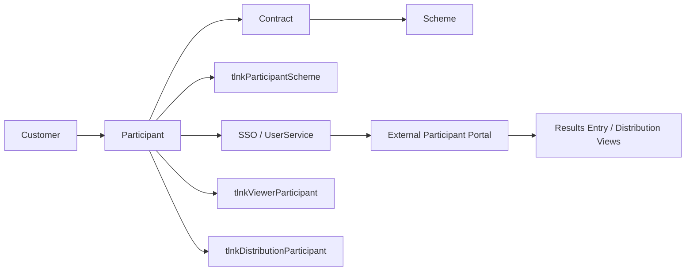
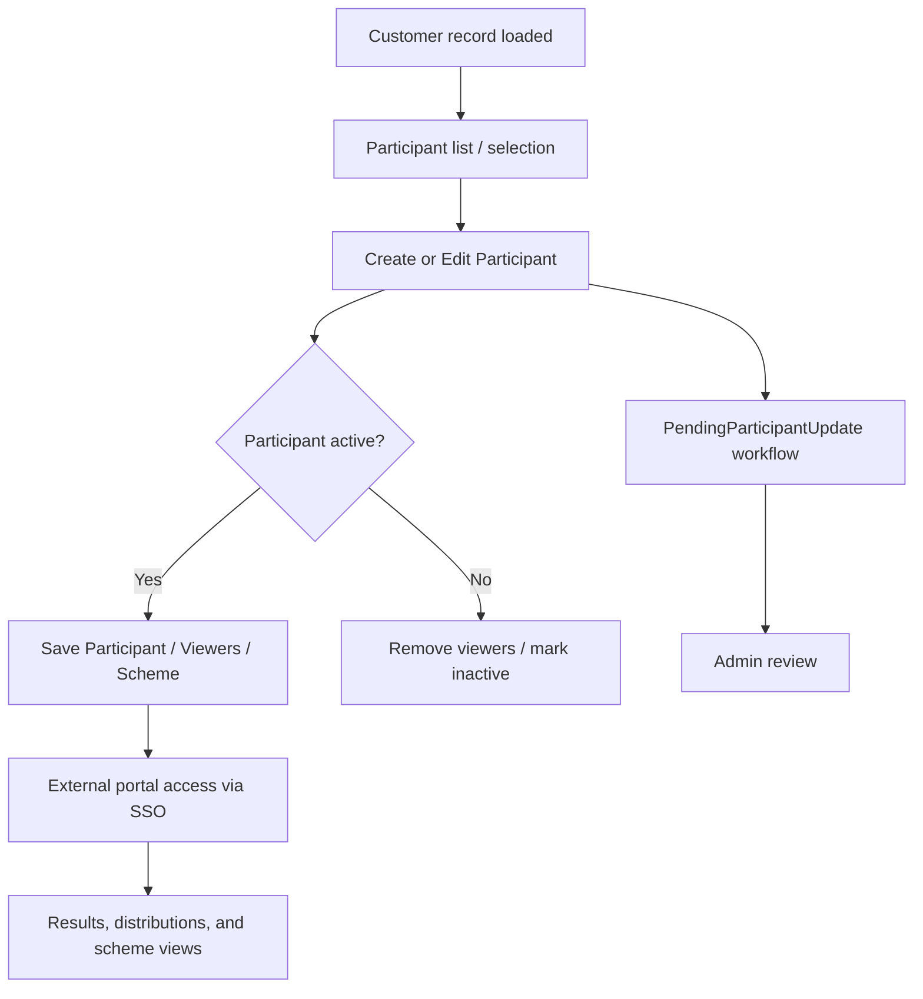
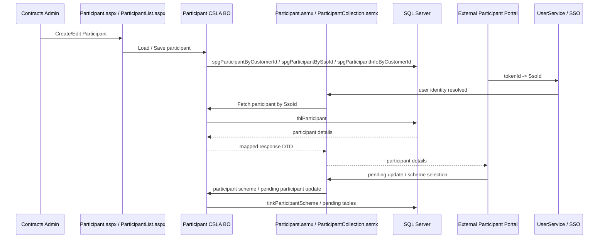

# Participant Domain Analysis (AS-IS)

**Scope:** Participant domain in the legacy PTLIMS solution as implemented in the ASP.NET Web Forms / CSLA / ASMX architecture.
**Analysis date:** 2026-09-16
**Repository:** `proficiency-testing`
**Cross-reference inputs:** `docs/source/PTLIMS-HLD-v0.3.docx`, `docs/source/PTLIMS-KT.md`, `docs/analysis/csla-analysis.md`, `docs/migration/api-migration.md`, `docs/analysis/customer-analysis.md`, `docs/migration/customer-migration.md`, and the legacy code under `proficiency-testing`.

---

## Executive Summary

The Participant domain is the laboratory identity and participation record that binds a customer organisation to a scheme contract and to the external user identity used for results entry, viewing, and profile maintenance. In PTLIMS, a participant is not just a contact record; it is the master record for a laboratory account, linked to a `Customer`, to one or more `Contract`/`ParticipantScheme` memberships, and to the SSO identity (`fldSsoId`) used by the external portal.

The domain spans internal administration, external self-service updates, and downstream distribution workflows:

- Internal pages manage participant creation, edit, inactive/error status, viewer membership, and scheme participation.
- External web pages resolve the current user by SSO token and load the participant record for self-service profile and scheme participation operations.
- ASMX services expose participant fetch and participant-scheme pending-update workflows over SOAP.
- The core business object is `Participant` in the CSLA model and is strongly linked to `Customer`, `ParticipantScheme`, `ViewerParticipantCollection`, and the distribution participation tables.
- Persistence is SQL Server based, with participant data in `tblParticipant`, scheme membership in `tlnkParticipantScheme`, viewer membership in `tlnkViewerParticipant`, and distribution participation in `tlnkDistributionParticipant`.

This is an AS-IS analysis only. It intentionally does not define a target-state design or migration architecture.

**Evidence:**
- Source file: `docs/source/PTLIMS-KT.md` — Project: `legacy PTLIMS` — Class: N/A — Method: N/A
- Source file: `proficiency-testing/PtaBusinessObjects/Business Objects/Contracts/Participant.vb` — Project: `PtaBusinessObjects` — Class: `BusinessObjects.Contracts.Participant` — Method: `DataPortal_Fetch`, `DataPortal_Insert`, `DataPortal_Update`
- Source file: `proficiency-testing/ProficiencyTestingDatabase/Object Scripts/Tables/tblParticipant.sql` — Project: `ProficiencyTestingDatabase` — Class: N/A — Method: N/A
- Source file: `proficiency-testing/ProficiencyTestingWebServices/Participant.asmx.vb` — Project: `ProficiencyTestingWebServices` — Class: `ServiceParticipant` — Method: `GetParticipant`

---

## Business Purpose

The Participant domain exists to manage a laboratory's identity, contact details, scheme participation, user account linkage, and active/inactive status across the proficiency testing lifecycle.

It supports:

- lab identification (`LabCode`, `LabName`, `Organisation`)
- customer-to-participant grouping (`CustomerId`)
- external user authentication via SSO (`SsoId` and `SsoLogin`)
- scheme participation (`tlnkParticipantScheme`)
- distribution participation (`tlnkDistributionParticipant`)
- viewer access relationships for external observers
- inactive/error workflows that remove or suppress access when a lab is no longer active

**Primary business role:** a participant is the external laboratory who receives schemes, submits results, and may view published tabulations.

**Evidence:**
- Source file: `proficiency-testing/PtaBusinessObjects/Business Objects/Contracts/Participant.vb` — Project: `PtaBusinessObjects` — Class: `BusinessObjects.Contracts.Participant` — Method: `FullName`, `SsoId`, `CustomerId`, `LabCode`, `LabName`, `ContactName`
- Source file: `proficiency-testing/ProficiencyTestingWeb/Contracts Admin/Participant.aspx.vb` — Project: `ProficiencyTestingWeb` — Class: `ContractsAdmin_ParticipantCreate` — Method: `Page_Load`, `ButtonSave_Click`
- Source file: `proficiency-testing/ProficiencyTestingDatabase/Object Scripts/Tables/tlnkParticipantScheme.sql` — Project: `ProficiencyTestingDatabase` — Class: N/A — Method: N/A

---

## User Journeys

### 1. Internal admin creates or edits participant details

- User role: Contracts Admin / Scheme Admin
- Entry point: `ProficiencyTestingWeb/Contracts Admin/Participant.aspx` or list screen
- Exit point: participant saved, scheme or viewer relationships updated
- Workflow:
  1. Admin opens the customer and loads participant list.
  2. Admin creates or edits participant record (`Participant.GetParticipant`/`Participant.NewParticipant`).
  3. Form binds customer, lab address, contact details, email, inactive flags, and SSO login state.
  4. On save, `mParticipant.Save()` is called.
  5. If participant becomes inactive, associated viewers are removed.
- Dependencies: `Customer`, `ViewerParticipantCollection`, `CountryCollection`, `GenerateLogin`, `UserManagementService`

**Evidence:**
- Source file: `proficiency-testing/ProficiencyTestingWeb/Contracts Admin/Participant.aspx.vb` — Project: `ProficiencyTestingWeb` — Class: `ContractsAdmin_ParticipantCreate` — Method: `Page_Load`, `ButtonSave_Click`, `LoadFormFromObject`, `LoadObjectFromForm`
- Source file: `proficiency-testing/ProficiencyTestingWeb/Contracts Admin/ParticipantList.aspx.vb` — Project: `ProficiencyTestingWeb` — Class: `ContractsAdmin_ParticipantList` — Method: `Page_Load`, `GridViewParticipants_RowDataBound`, `LnkGenerateLogin_Command`
- Source file: `proficiency-testing/PtaBusinessObjects/Business Objects/Contracts/Participant.vb` — Project: `PtaBusinessObjects` — Class: `BusinessObjects.Contracts.Participant` — Method: `DataPortal_Save`, `SetInactive`-style logic implied by the page code

### 2. Internal admin generates external login and manages viewer access

- User role: Contracts Admin
- Entry point: participant list page
- Exit point: login generated or viewers assigned
- Workflow:
  1. Participant row is checked for `SsoLogin` / active status.
  2. If the SSO login is absent, admin can generate a login via `GenerateLogin.Execute(user)`.
  3. Viewers can be attached to a participant via `ParticipantViewers.aspx` and `ViewerParticipantCollection`.
  4. If participant is inactive, viewer access is removed.
- Dependencies: `GenerateLogin`, `ViewerParticipantCollection`, `UserService`, `tblViewer`, `tlnkViewerParticipant`

**Evidence:**
- Source file: `proficiency-testing/ProficiencyTestingWeb/Contracts Admin/ParticipantList.aspx.vb` — Project: `ProficiencyTestingWeb` — Class: `ContractsAdmin_ParticipantList` — Method: `GridViewParticipants_RowDataBound`, `LnkGenerateLogin_Command`
- Source file: `proficiency-testing/ProficiencyTestingWeb/Contracts Admin/ParticipantViewers.aspx.vb` — Project: `ProficiencyTestingWeb` — Class: `Contracts_Admin_ParticipantViewers` — Method: `Page_Load`, `PopulateViewersListBoxes`, `BtnSave_Click`

### 3. External participant loads their own profile and updates contact details

- User role: external participant
- Entry point: external web page such as `EditParticipantDetails.aspx`
- Exit point: pending participant update submitted for approval
- Workflow:
  1. External user loads their participant profile using token (`tokenId` -> `SsoId`).
  2. `Participant.asmx` fetches the participant by `SsoId`.
  3. The page allows contact/email/address edits.
  4. Details are saved as `PendingParticipantUpdate` records instead of directly changing the live record.
- Dependencies: `UserService.Service.GetUserByTokenId`, `ServiceParticipant.GetParticipant`, `PendingParticipantUpdate`, `Customer`

**Evidence:**
- Source file: `proficiency-testing/ProficiencyTestingWebServices/Participant.asmx.vb` — Project: `ProficiencyTestingWebServices` — Class: `ServiceParticipant` — Method: `GetParticipant`
- Source file: `proficiency-testing/ProficiencyTestingWebServices/PendingParticipantUpdate.asmx.vb` — Project: `ProficiencyTestingWebServices` — Class: `ServicePendingParticipantUpdate` — Method: `GetPendingParticipantUpdate`, `InsertPendingParticipantUpdate`, `UpdatePendingParticipantUpdate`
- Source file: `docs/analysis/customer-analysis.md` — Project: `docs` — Class: N/A — Method: N/A

### 4. Participant scheme selection and contract participation

- User role: participant or contract admin
- Entry point: `ParticipantScheme.aspx`
- Exit point: selected scheme participation or override settings
- Workflow:
  1. Contract and scheme are loaded for a customer.
  2. `ParticipantScheme` object determines which months are active/overridable.
  3. Participant can select a scheme with distribution month flags and pricing.
  4. Save persists to `tlnkParticipantScheme`.
- Dependencies: `Contract`, `Scheme`, `ParticipantScheme`, `tlnkParticipantScheme`, `fnGetParticipantSchemePrice`, `fnGetParticipantSchemeNumberOfDistributions`

**Evidence:**
- Source file: `proficiency-testing/ProficiencyTestingWeb/Contracts Admin/ParticipantScheme.aspx.vb` — Project: `ProficiencyTestingWeb` — Class: `Contracts_Admin_ParticipantScheme` — Method: `Page_Load`, `LoadFormFromObject`
- Source file: `proficiency-testing/PtaBusinessObjects/Business Objects/Contracts/ParticipantScheme.vb` — Project: `PtaBusinessObjects` — Class: `BusinessObjects.Contracts.ParticipantScheme` — Method: `SchemeId`, `DistributionMonthJan`, `DistributionMonthFeb`, `CanEditJan` and related getters/setters
- Source file: `proficiency-testing/ProficiencyTestingWebServices/PendingParticipantScheme.asmx.vb` — Project: `ProficiencyTestingWebServices` — Class: `ServicePendingParticipantScheme` — Method: `InsertPendingParticipantScheme`, `UpdatePendingParticipantScheme`, `DeletePendingParticipantScheme`

---

## Page Inventory

| Page | Project | Role | Purpose | Dependencies | Complexity |
|---|---|---|---|---|---|
| `Contracts Admin/Participant.aspx` | `ProficiencyTestingWeb` | Contracts Admin / Scheme Admin | Create and edit a participant | `Customer`, `Participant`, `CountryCollection`, `ViewerParticipantCollection`, `GenerateLogin` | High |
| `Contracts Admin/ParticipantList.aspx` | `ProficiencyTestingWeb` | Contracts Admin / Scheme Admin | List participants for a customer and generate logins | `ParticipantInfoCollection`, `GenerateLogin`, `Customer` | High |
| `Contracts Admin/ParticipantScheme.aspx` | `ProficiencyTestingWeb` | Contracts Admin / Scheme Admin | Maintain participant-scheme membership and distribution month selections | `ParticipantScheme`, `Contract`, `Scheme`, `tlnkParticipantScheme` | High |
| `Contracts Admin/ParticipantViewers.aspx` | `ProficiencyTestingWeb` | Contracts Admin / Scheme Admin | Assign external viewers to a participant | `ViewerParticipantCollection`, `ViewerInfoCollection`, `Participant` | Medium |
| `EditParticipantDetails.aspx` | `ProficiencyTestingExternalWeb` | External Participant | Update participant profile details and submit pending changes | `UserService`, `Participant`, `PendingParticipantUpdate` | High |

**Evidence:**
- Source file: `proficiency-testing/ProficiencyTestingWeb/Contracts Admin/Participant.aspx.vb` — Project: `ProficiencyTestingWeb` — Class: `ContractsAdmin_ParticipantCreate` — Method: `Page_Load`, `ButtonSave_Click`
- Source file: `proficiency-testing/ProficiencyTestingWeb/Contracts Admin/ParticipantList.aspx.vb` — Project: `ProficiencyTestingWeb` — Class: `ContractsAdmin_ParticipantList` — Method: `Page_Load`
- Source file: `proficiency-testing/ProficiencyTestingWeb/Contracts Admin/ParticipantScheme.aspx.vb` — Project: `ProficiencyTestingWeb` — Class: `Contracts_Admin_ParticipantScheme` — Method: `Page_Load`
- Source file: `proficiency-testing/ProficiencyTestingWeb/Contracts Admin/ParticipantViewers.aspx.vb` — Project: `ProficiencyTestingWeb` — Class: `Contracts_Admin_ParticipantViewers` — Method: `Page_Load`, `PopulateViewersListBoxes`
- Source file: `proficiency-testing/ProficiencyTestingExternalWeb/EditParticipantDetails.aspx.vb` — Project: `ProficiencyTestingExternalWeb` — Class: `EditParticipantDetails` — Method: `Page_Load`, `ButtonUpdateDetails_Click`

---

## Service Inventory

| ASMX Service | Project | WebMethod | Inputs | Outputs | Consumers |
|---|---|---|---|---|---|
| `Participant.asmx` | `ProficiencyTestingWebServices` | `GetParticipant(tokenId)` | `tokenId` | `Participant` | external participant screens |
| `ParticipantCollection.asmx` | `ProficiencyTestingWebServices` | `FetchParticipantCollection(tokenId, customerId)` | `tokenId`, `customerId` | `Collection(Of Participant)` | customer/participant admin screens |
| `PendingParticipantUpdate.asmx` | `ProficiencyTestingWebServices` | `GetPendingParticipantUpdate`, `InsertPendingParticipantUpdate`, `UpdatePendingParticipantUpdate` | token + participant update payload | `PendingParticipantUpdate`, `Boolean` | external participant change workflow |
| `PendingParticipantScheme.asmx` | `ProficiencyTestingWebServices` | `GetPendingParticipantScheme`, `InsertPendingParticipantScheme`, `UpdatePendingParticipantScheme`, `DeletePendingParticipantScheme` | token + pending participant scheme payload | `PendingParticipantScheme`, `Boolean` | participant scheme selection workflow |

**Evidence:**
- Source file: `proficiency-testing/ProficiencyTestingWebServices/Participant.asmx.vb` — Project: `ProficiencyTestingWebServices` — Class: `ServiceParticipant` — Method: `GetParticipant`
- Source file: `proficiency-testing/ProficiencyTestingWebServices/ParticipantCollection.asmx.vb` — Project: `ProficiencyTestingWebServices` — Class: `ServiceParticipantCollection` — Method: `FetchParticipantCollection`
- Source file: `proficiency-testing/ProficiencyTestingWebServices/PendingParticipantUpdate.asmx.vb` — Project: `ProficiencyTestingWebServices` — Class: `ServicePendingParticipantUpdate` — Method: `GetPendingParticipantUpdate`, `InsertPendingParticipantUpdate`, `UpdatePendingParticipantUpdate`
- Source file: `proficiency-testing/ProficiencyTestingWebServices/PendingParticipantScheme.asmx.vb` — Project: `ProficiencyTestingWebServices` — Class: `ServicePendingParticipantScheme` — Method: `GetPendingParticipantScheme`, `InsertPendingParticipantScheme`, `UpdatePendingParticipantScheme`, `DeletePendingParticipantScheme`

---

## Business Objects

### `Participant`

- File: `proficiency-testing/PtaBusinessObjects/Business Objects/Contracts/Participant.vb`
- Project: `PtaBusinessObjects`
- Class: `BusinessObjects.Contracts.Participant`
- Base: `BusinessBase(Of Participant)`
- Purpose: participant master record; external identity, contact, address, lab code, and active/inactive state.
- Fields include `ParticipantId`, `CustomerId`, `SsoId`, `LabCode`, `LabName`, `LabType`, `ContactName`, `Organisation`, `Address1..5`, `CountryId`, `Telephone`, `Fax`, `Email`, `Email2`, `Comments`, `IsActive`, `SsoLogin`, `InactiveDate`, `InactiveError`, `InactiveErrorDate`.

**Evidence:**
- Source file: `proficiency-testing/PtaBusinessObjects/Business Objects/Contracts/Participant.vb` — Project: `PtaBusinessObjects` — Class: `BusinessObjects.Contracts.Participant` — Method: `ParticipantId`, `SsoId`, `CustomerId`, `FullName`, `LabCode`, `Address1` etc.

### `ParticipantInfoCollection`

- File: `proficiency-testing/PtaBusinessObjects/Business Objects/Contracts/ParticipantInfoCollection.vb`
- Project: `PtaBusinessObjects`
- Class: `BusinessObjects.Contracts.ParticipantInfoCollection`
- Base: `ReadOnlyListBase(Of ParticipantInfoCollection, ParticipantInfo)`
- Purpose: fetch lightweight list of participants for a customer and optionally active-only filter.

**Evidence:**
- Source file: `proficiency-testing/PtaBusinessObjects/Business Objects/Contracts/ParticipantInfoCollection.vb` — Project: `PtaBusinessObjects` — Class: `BusinessObjects.Contracts.ParticipantInfoCollection` — Method: `FetchParticipantInfoCollection`, `FetchActiveParticipantInfoCollection`, `DataPortal_Fetch`

### `ParticipantScheme`

- File: `proficiency-testing/PtaBusinessObjects/Business Objects/Contracts/ParticipantScheme.vb`
- Project: `PtaBusinessObjects`
- Class: `BusinessObjects.Contracts.ParticipantScheme`
- Base: `BusinessBase(Of ParticipantScheme)`
- Purpose: month-level participation and pricing configuration for a participant within a contract and scheme.
- Captures `ParticipantSchemeId`, `ContractId`, `ParticipantId`, `SchemeId`, `GroupAddressId`, month flags, pricing, override flags, import permit flags, and `DataConsentGiven`.

**Evidence:**
- Source file: `proficiency-testing/PtaBusinessObjects/Business Objects/Contracts/ParticipantScheme.vb` — Project: `PtaBusinessObjects` — Class: `BusinessObjects.Contracts.ParticipantScheme` — Method: `SchemeId`, `DistributionMonthJan`, `DistributionMonthFeb`, `CanEditJan`, `SetInvalid`-style business rules patterns
- Source file: `proficiency-testing/ProficiencyTestingWeb/Contracts Admin/ParticipantScheme.aspx.vb` — Project: `ProficiencyTestingWeb` — Class: `Contracts_Admin_ParticipantScheme` — Method: `LoadFormFromObject`

### `PendingParticipantUpdate`

- File: `proficiency-testing/PtWebServicesBusinessObjects/PendingParticipantUpdate.vb`
- Project: `PtWebServicesBusinessObjects`
- Class: `PendingParticipantUpdate`
- Purpose: participant-submitted profile changes pending approval.

**Evidence:**
- Source file: `proficiency-testing/ProficiencyTestingWebServices/PendingParticipantUpdate.asmx.vb` — Project: `ProficiencyTestingWebServices` — Class: `ServicePendingParticipantUpdate` — Method: `GetPendingParticipantUpdate`, `InsertPendingParticipantUpdate`, `UpdatePendingParticipantUpdate`

### `ViewerParticipantCollection`

- File: `proficiency-testing/PtaBusinessObjects/...` (viewer collection classes under `Business Objects/Contracts/` / `Viewers`)
- Project: `PtaBusinessObjects`
- Class: `ViewerParticipantCollection`
- Purpose: links participant records to viewer identities, allowing read-only access for external organisations.

**Evidence:**
- Source file: `proficiency-testing/ProficiencyTestingWeb/Contracts Admin/ParticipantViewers.aspx.vb` — Project: `ProficiencyTestingWeb` — Class: `Contracts_Admin_ParticipantViewers` — Method: `PopulateViewersListBoxes`, `BtnSave_Click`
- Source file: `proficiency-testing/ProficiencyTestingDatabase/Update Scripts/20250220_RemoveHistoricInactiveParticipantViewers.sql` — Project: `ProficiencyTestingDatabase` — Class: N/A — Method: N/A

---

## DTO Inventory

The DTOs are ASMX `Structure` types returned by SOAP services rather than modern POCO objects.

- `Participant` structure in `ServiceParticipant`
- `Participant` structure in `ServiceParticipantCollection`
- `PendingParticipantUpdate` structure in `ServicePendingParticipantUpdate`
- `PendingParticipantScheme` structure in `ServicePendingParticipantScheme`

**Evidence:**
- Source file: `proficiency-testing/ProficiencyTestingWebServices/Participant.asmx.vb` — Project: `ProficiencyTestingWebServices` — Class: `ServiceParticipant` — Method: `GetParticipant`
- Source file: `proficiency-testing/ProficiencyTestingWebServices/ParticipantCollection.asmx.vb` — Project: `ProficiencyTestingWebServices` — Class: `ServiceParticipantCollection` — Method: `ConvertToStructure`
- Source file: `proficiency-testing/ProficiencyTestingWebServices/PendingParticipantUpdate.asmx.vb` — Project: `ProficiencyTestingWebServices` — Class: `ServicePendingParticipantUpdate` — Method: `GetPendingParticipantUpdate`
- Source file: `proficiency-testing/ProficiencyTestingWebServices/PendingParticipantScheme.asmx.vb` — Project: `ProficiencyTestingWebServices` — Class: `ServicePendingParticipantScheme` — Method: `GetPendingParticipantScheme`

---

## Database Mapping

### Core tables

| Area | Table | Purpose | Evidence |
|---|---|---|---|
| Participant master | `tblParticipant` | participant lifecycle, lab code, contact, address, activation state, SSO linkage | `ProficiencyTestingDatabase/Object Scripts/Tables/tblParticipant.sql` |
| Customer relationship | `tblCustomer` | owning organisation or lab customer | `docs/analysis/customer-analysis.md` |
| Participant-scheme join | `tlnkParticipantScheme` | scheme memberships, pricing, months, override state, import permit flags | `ProficiencyTestingDatabase/Object Scripts/Tables/tlnkParticipantScheme.sql` |
| Viewer mapping | `tlnkViewerParticipant` | viewer access to participant data | `ProficiencyTestingWeb/Contracts Admin/ParticipantViewers.aspx.vb` |
| Distribution participation | `tlnkDistributionParticipant` | which participants are in which current/past distribution batches | `docs/source/PTLIMS-KT.md` |
| Pending change | `tblPendingParticipantDetailsEdit` / `PendingParticipantUpdate` pattern | participant profile change requests awaiting review | `ProficiencyTestingWebServices/PendingParticipantUpdate.asmx.vb` |

### Key stored procedures

| Page | ASMX Service | Business Object | Stored Procedure | Table |
|---|---|---|---|---|
| `Participant.aspx` / `ParticipantList.aspx` | `ParticipantCollection.asmx` | `ParticipantInfoCollection` | `spgParticipantInfoByCustomerId` | `tblParticipant` |
| `Participant.aspx` | `Participant.asmx` | `Participant` | `spgParticipantBySsoId` | `tblParticipant` |
| `Customer.aspx`-driven context / list pages | `ParticipantCollection.asmx` | `ParticipantCollection` | `spgParticipantByCustomerId` | `tblParticipant` |
| `ParticipantScheme.aspx` | `PendingParticipantScheme.asmx` | `ParticipantScheme` | `spgParticipantSchemeInfoByParticipantIdAndSchemeId` / related scheme SPs | `tlnkParticipantScheme` |
| external profile update pages | `PendingParticipantUpdate.asmx` | `PendingParticipantUpdate` | related pending participant update SPs | `tblPendingParticipantDetailsEdit` (or equivalent pending table) |

**Evidence:**
- Source file: `proficiency-testing/ProficiencyTestingDatabase/Object Scripts/Stored Procedures/spg/spgParticipantInfoByCustomerId.sql` — Project: `ProficiencyTestingDatabase` — Class: N/A — Method: N/A
- Source file: `proficiency-testing/ProficiencyTestingDatabase/Object Scripts/Stored Procedures/spg/spgParticipantBySsoId.sql` — Project: `ProficiencyTestingDatabase` — Class: N/A — Method: N/A
- Source file: `proficiency-testing/ProficiencyTestingDatabase/Object Scripts/Stored Procedures/spg/spgParticipantByCustomerId.sql` — Project: `ProficiencyTestingDatabase` — Class: N/A — Method: N/A
- Source file: `proficiency-testing/ProficiencyTestingWebServices/PendingParticipantScheme.asmx.vb` — Project: `ProficiencyTestingWebServices` — Class: `ServicePendingParticipantScheme` — Method: `GetPendingParticipantScheme` / `InsertPendingParticipantScheme`

---

## Validation Rules

### Critical

- `LabCode` is required and is used for ordering and external lab identity (`Participant.aspx.vb` validation uses `ValidatorLabCodeRegEx`).
- `LabName`, `ContactName`, `Organisation`, and address lines are required in participant creation/edit workflows.
- `CustomerId` and `CountryId` are mandatory relationship fields (`tblParticipant` defines foreign keys to `tblCustomer` and `tblCountry`).
- `IsActive` controls valid status transitions and, if false, triggers customer/participant deactivation logic and viewer removal.

**Evidence:**
- Source file: `proficiency-testing/ProficiencyTestingWeb/Contracts Admin/Participant.aspx.vb` — Project: `ProficiencyTestingWeb` — Class: `ContractsAdmin_ParticipantCreate` — Method: `ShowValidation`
- Source file: `proficiency-testing/ProficiencyTestingDatabase/Object Scripts/Tables/tblParticipant.sql` — Project: `ProficiencyTestingDatabase` — Class: N/A — Method: N/A

### Important

- `Telephone`, `Fax`, `Email`, `Email2` are validated with regex / format checks.
- `InactiveError` and `InactiveErrorDate` capture exceptional inactive state and help screen logic.
- Participant display order by `LabCode` uses numeric ordering for numeric lab codes and text ordering for non-numeric codes.

**Evidence:**
- Source file: `proficiency-testing/ProficiencyTestingWeb/Contracts Admin/Participant.aspx.vb` — Project: `ProficiencyTestingWeb` — Class: `ContractsAdmin_ParticipantCreate` — Method: `ShowValidation`, `LoadFormFromObject`
- Source file: `proficiency-testing/ProficiencyTestingDatabase/Object Scripts/Stored Procedures/spg/spgParticipantInfoByCustomerId.sql` — Project: `ProficiencyTestingDatabase` — Class: N/A — Method: N/A

### Optional

- `Comments`, `Email2`, `InactiveDate`, and `DataConsentGiven` may be blank or optional depending on workflow state.
- `GroupAddressId`, `ImportPermitReceived`, `ImportPermitExpiry` are optional scheme-level fields.

**Evidence:**
- Source file: `proficiency-testing/ProficiencyTestingDatabase/Object Scripts/Tables/tlnkParticipantScheme.sql` — Project: `ProficiencyTestingDatabase` — Class: N/A — Method: N/A
- Source file: `proficiency-testing/PtaBusinessObjects/Business Objects/Contracts/Participant.vb` — Project: `PtaBusinessObjects` — Class: `BusinessObjects.Contracts.Participant` — Method: `Email2`, `Comments`, `InactiveDate`

---

## Business Rules

### Critical

- A participant belongs to exactly one customer (`tblParticipant.fldCustomerId` is a foreign key to `tblCustomer`).
- A participant may be active or inactive; inactive records affect downstream access and viewer relationships.
- A participant can be linked to one or more scheme memberships via `tlnkParticipantScheme`, and these memberships have month-by-month participation and override rules.
- External participation is strongly tied to SSO identity and user-management services.

**Evidence:**
- Source file: `proficiency-testing/ProficiencyTestingDatabase/Object Scripts/Tables/tblParticipant.sql` — Project: `ProficiencyTestingDatabase` — Class: N/A — Method: N/A
- Source file: `proficiency-testing/PtaBusinessObjects/Business Objects/Contracts/ParticipantScheme.vb` — Project: `PtaBusinessObjects` — Class: `BusinessObjects.Contracts.ParticipantScheme` — Method: `SchemeId`, gap/override logic
- Source file: `proficiency-testing/ProficiencyTestingWeb/Contracts Admin/Participant.aspx.vb` — Project: `ProficiencyTestingWeb` — Class: `ContractsAdmin_ParticipantCreate` — Method: `ButtonSave_Click`

### Important

- A participant can be assigned viewers, which are then cleared when the participant becomes inactive.
- Scheme participation can be non-UK, import-permit required, or weighted pricing.
- Pending participant updates are used for external change approval instead of direct live edits.

**Evidence:**
- Source file: `proficiency-testing/ProficiencyTestingWeb/Contracts Admin/ParticipantViewers.aspx.vb` — Project: `ProficiencyTestingWeb` — Class: `Contracts_Admin_ParticipantViewers` — Method: `Page_Load`, `BtnSave_Click`
- Source file: `proficiency-testing/ProficiencyTestingWebServices/PendingParticipantUpdate.asmx.vb` — Project: `ProficiencyTestingWebServices` — Class: `ServicePendingParticipantUpdate` — Method: `InsertPendingParticipantUpdate`
- Source file: `proficiency-testing/PtaBusinessObjects/Business Objects/Contracts/ParticipantScheme.vb` — Project: `PtaBusinessObjects` — Class: `BusinessObjects.Contracts.ParticipantScheme` — Method: `DistributionMonthJan` and override logic

### Optional

- User management service might be unavailable; the UI handles a fallback message (`UserManagementServiceUnavailable`).
- `InactiveDate`, `InactiveError`, and `DataConsentDeclarationGiven` are operational and compliance-driven metadata.

**Evidence:**
- Source file: `proficiency-testing/PtaBusinessObjects/Business Objects/Contracts/Participant.vb` — Project: `PtaBusinessObjects` — Class: `BusinessObjects.Contracts.Participant` — Method: `UserManagementServiceUnavailable`, `InactiveDate`, `InactiveError`
- Source file: `proficiency-testing/ProficiencyTestingWeb/Contracts Admin/Participant.aspx.vb` — Project: `ProficiencyTestingWeb` — Class: `ContractsAdmin_ParticipantCreate` — Method: `LoadFormFromObject`

---

## Security Analysis

### Authentication dependencies

- Participant identity is tied to `SsoId`, and external service calls fetch the participant using `UserService.Service().GetUserByTokenId(tokenId)`.
- `Participant.asmx` uses the token id to resolve the user and fetch the associated participant record.
- The external user model implements `IExternalUser` and exposes `SsoId` and `UserName`.

**Evidence:**
- Source file: `proficiency-testing/ProficiencyTestingWebServices/Participant.asmx.vb` — Project: `ProficiencyTestingWebServices` — Class: `ServiceParticipant` — Method: `GetParticipant`
- Source file: `proficiency-testing/PtaBusinessObjects/Business Objects/Contracts/Participant.vb` — Project: `PtaBusinessObjects` — Class: `BusinessObjects.Contracts.Participant` — Method: `SsoId`, `ContactName`, `IExternalUser` implementation

### Authorization dependencies

- Many ASMX services comment out role checks in code, leaving the request effectively driven by token validity rather than explicit role enforcement.
- The participant/user relationship is resolved via SSO and then used to decide what participant or viewer data is visible.
- Role checks appear in the broader system but are not always enforced in participant code paths.

**Evidence:**
- Source file: `proficiency-testing/ProficiencyTestingWebServices/Participant.asmx.vb` — Project: `ProficiencyTestingWebServices` — Class: `ServiceParticipant` — Method: `GetParticipant` (role line commented out)
- Source file: `proficiency-testing/ProficiencyTestingWebServices/ParticipantCollection.asmx.vb` — Project: `ProficiencyTestingWebServices` — Class: `ServiceParticipantCollection` — Method: `FetchParticipantCollection` (role line commented out)
- Source file: `docs/migration/api-migration.md` — Project: `docs` — Class: N/A — Method: N/A

### Role checks and ownership checks

- Participant list pages filter by `CustomerId` and active/inactive state.
- Viewer assignment pages check whether the participant is active before allowing Add button operations.
- External participant updates are owner-scoped to the current `SsoId` / participant identity.

**Evidence:**
- Source file: `proficiency-testing/ProficiencyTestingWeb/Contracts Admin/ParticipantViewers.aspx.vb` — Project: `ProficiencyTestingWeb` — Class: `Contracts_Admin_ParticipantViewers` — Method: `Page_Load`
- Source file: `proficiency-testing/ProficiencyTestingWeb/Contracts Admin/ParticipantList.aspx.vb` — Project: `ProficiencyTestingWeb` — Class: `ContractsAdmin_ParticipantList` — Method: `GridViewParticipants_RowDataBound`

### External user dependencies

- Participant identity is exposed through external login and VLA / SSO integration.
- There are explicit dependencies on external user creation and login generation logic (`GenerateLogin` and `SsoLogin`).

**Evidence:**
- Source file: `proficiency-testing/ProficiencyTestingWeb/Contracts Admin/ParticipantList.aspx.vb` — Project: `ProficiencyTestingWeb` — Class: `ContractsAdmin_ParticipantList` — Method: `LnkGenerateLogin_Command`
- Source file: `docs/source/PTLIMS-KT.md` — Project: `docs` — Class: N/A — Method: N/A

---

## Cross-Domain Dependencies

### Customer → Participant

- Participant rows are owned by a `Customer` record.
- `Customer` is the organisation or laboratory account; `Participant` is the laboratory-level person/contact record under that customer.
- Many administrative pages load `Customer` then fetch participants by `CustomerId`.

**Evidence:**
- Source file: `proficiency-testing/ProficiencyTestingDatabase/Object Scripts/Tables/tblParticipant.sql` — Project: `ProficiencyTestingDatabase` — Class: N/A — Method: N/A
- Source file: `proficiency-testing/ProficiencyTestingDatabase/Object Scripts/Stored Procedures/spg/spgParticipantInfoByCustomerId.sql` — Project: `ProficiencyTestingDatabase` — Class: N/A — Method: N/A
- Source file: `docs/analysis/customer-analysis.md` — Project: `docs` — Class: N/A — Method: N/A

### Participant → Contract

- A participant participates in contracts via `ParticipantScheme` objects and `tlnkParticipantScheme` rows.
- Contract-level pricing, scheme selection, month availability, and import-permit requirements are stored per participant-scheme relation.

**Evidence:**
- Source file: `proficiency-testing/PtaBusinessObjects/Business Objects/Contracts/ParticipantScheme.vb` — Project: `PtaBusinessObjects` — Class: `BusinessObjects.Contracts.ParticipantScheme` — Method: `SchemeId`, `DistributionMonthJan` etc.
- Source file: `proficiency-testing/ProficiencyTestingWeb/Contracts Admin/ParticipantScheme.aspx.vb` — Project: `ProficiencyTestingWeb` — Class: `Contracts_Admin_ParticipantScheme` — Method: `LoadFormFromObject`

### Participant → Scheme

- Each participant's scheme membership is a participant-scheme join record, not a direct relationship on the participant table.
- The scheme controls distribution month availability and price calculation, and the participant-scheme row stores selection and override information.

**Evidence:**
- Source file: `proficiency-testing/ProficiencyTestingDatabase/Object Scripts/Tables/tlnkParticipantScheme.sql` — Project: `ProficiencyTestingDatabase` — Class: N/A — Method: N/A
- Source file: `proficiency-testing/ProficiencyTestingDatabase/Object Scripts/Functions/fnGetParticipantSchemeNumberOfDistributions.sql` — Project: `ProficiencyTestingDatabase` — Class: N/A — Method: N/A
- Source file: `proficiency-testing/ProficiencyTestingDatabase/Object Scripts/Functions/fnGetParticipantSchemePrice.sql` — Project: `ProficiencyTestingDatabase` — Class: N/A — Method: N/A

### Participant identity and user account mapping

- The relationship between participant and SSO account is stored in `tblParticipant.fldSsoId`.
- This is the identity key used by external portal requests and by `UserService`.

**Evidence:**
- Source file: `proficiency-testing/ProficiencyTestingDatabase/Object Scripts/Tables/tblParticipant.sql` — Project: `ProficiencyTestingDatabase` — Class: N/A — Method: N/A
- Source file: `proficiency-testing/ProficiencyTestingWebServices/Participant.asmx.vb` — Project: `ProficiencyTestingWebServices` — Class: `ServiceParticipant` — Method: `GetParticipant`

### Viewer relationships and distribution participation

- `tlnkViewerParticipant` links viewers to participants.
- `tlnkDistributionParticipant` links participants to monthly distributions for samples/results and distribution management.

**Evidence:**
- Source file: `proficiency-testing/ProficiencyTestingWeb/Contracts Admin/ParticipantViewers.aspx.vb` — Project: `ProficiencyTestingWeb` — Class: `Contracts_Admin_ParticipantViewers` — Method: `PopulateViewersListBoxes`
- Source file: `proficiency-testing/ProficiencyTestingDatabase/Update Scripts/20250220_RemoveHistoricInactiveParticipantViewers.sql` — Project: `ProficiencyTestingDatabase` — Class: N/A — Method: N/A
- Source file: `docs/source/PTLIMS-KT.md` — Project: `docs` — Class: N/A — Method: N/A

**Dependency reason:** The participant is the shared identity and access anchor between customer, scheme selection, external login, distributions, and viewer access.

**Impact of changes:** Any participant-domain change can affect scheme participation, SSO mapping, distribution access, and viewer access.

---

## Workflow Boundaries

### Entry points

- Participant admin entry: `Participant.aspx`, `ParticipantList.aspx`
- Participant scheme entry: `ParticipantScheme.aspx`
- External portal entry: `EditParticipantDetails.aspx`
- Viewer admin entry: `ParticipantViewers.aspx`

### Exit points

- Save participant record
- Generate login and send notification
- Remove viewers on inactive participant
- Submit pending participant update
- Save participant scheme selection

**Evidence:**
- Source file: `proficiency-testing/ProficiencyTestingWeb/Contracts Admin/Participant.aspx.vb` — Project: `ProficiencyTestingWeb` — Class: `ContractsAdmin_ParticipantCreate` — Method: `ButtonSave_Click`, `LoadObjectFromForm`
- Source file: `proficiency-testing/ProficiencyTestingWeb/Contracts Admin/ParticipantList.aspx.vb` — Project: `ProficiencyTestingWeb` — Class: `ContractsAdmin_ParticipantList` — Method: `GridViewParticipants_RowDataBound`, `LnkGenerateLogin_Command`
- Source file: `proficiency-testing/ProficiencyTestingWeb/Contracts Admin/ParticipantViewers.aspx.vb` — Project: `ProficiencyTestingWeb` — Class: `Contracts_Admin_ParticipantViewers` — Method: `BtnSave_Click`

---

## Stored Procedure Dependency Matrix

| Page / Workflow | ASMX Service | Business Object | Stored Procedure | Database Table |
|---|---|---|---|---|
| Participant list for customer | `ParticipantCollection` | `ParticipantInfoCollection` | `spgParticipantInfoByCustomerId` | `tblParticipant` |
| External participant profile fetch | `Participant` | `Participant` | `spgParticipantBySsoId` | `tblParticipant` |
| Customer-to-participant lookup | `ParticipantCollection` | `ParticipantCollection` | `spgParticipantByCustomerId` | `tblParticipant` |
| Scheme membership selection | `PendingParticipantScheme` | `ParticipantScheme` | `spgParticipantSchemeInfoByParticipantIdAndSchemeId` and related scheme SPs | `tlnkParticipantScheme` |
| External change request | `PendingParticipantUpdate` | `PendingParticipantUpdate` | related pending-update SPs | pending participant details table |
| Viewer assignment | `ViewerParticipantCollection` | viewer collection | viewer-related SPs | `tlnkViewerParticipant` |

**Evidence:**
- Source file: `proficiency-testing/ProficiencyTestingDatabase/Object Scripts/Stored Procedures/spg/spgParticipantInfoByCustomerId.sql` — Project: `ProficiencyTestingDatabase` — Class: N/A — Method: N/A
- Source file: `proficiency-testing/ProficiencyTestingDatabase/Object Scripts/Stored Procedures/spg/spgParticipantBySsoId.sql` — Project: `ProficiencyTestingDatabase` — Class: N/A — Method: N/A
- Source file: `proficiency-testing/ProficiencyTestingDatabase/Object Scripts/Stored Procedures/spg/spgParticipantByCustomerId.sql` — Project: `ProficiencyTestingDatabase` — Class: N/A — Method: N/A
- Source file: `proficiency-testing/ProficiencyTestingWebServices/PendingParticipantScheme.asmx.vb` — Project: `ProficiencyTestingWebServices` — Class: `ServicePendingParticipantScheme` — Method: `GetPendingParticipantScheme`

---

## Migration Impact Assessment

### If this domain changes, which domains are affected?

- **High Impact:** Customer, Contract, Scheme, Distribution, Results, External Identity / SSO, Viewer Access
- **Medium Impact:** Invoicing, Reporting, Notifications, Data retention / cleanup
- **Low Impact:** UI labels / help text

### Rationale

- Participant changes directly affect customer ownership and customer account integrity.
- Scheme participation and distribution participation are coupled to monthly distribution and results workflows.
- External login and `SsoId` mapping affect all external portal access.
- Viewer-access and inactive-user rules affect governance and data visibility.

**Evidence:**
- Source file: `docs/analysis/customer-analysis.md` — Project: `docs` — Class: N/A — Method: N/A
- Source file: `docs/source/PTLIMS-KT.md` — Project: `docs` — Class: N/A — Method: N/A
- Source file: `proficiency-testing/PtaBusinessObjects/Business Objects/Contracts/ParticipantScheme.vb` — Project: `PtaBusinessObjects` — Class: `BusinessObjects.Contracts.ParticipantScheme` — Method: `SchemeId` / month logic
- Source file: `proficiency-testing/ProficiencyTestingWebServices/Participant.asmx.vb` — Project: `ProficiencyTestingWebServices` — Class: `ServiceParticipant` — Method: `GetParticipant`

---

## Complexity Assessment

**Overall complexity:** High.

Reasons:

- Participant identity is cross-cutting across customer, scheme, external portal, and SSO.
- Participant state is operationally rich: active/inactive, inactive error, pending update, viewer access, distribution participation.
- Scheme participation is month-level and pricing-sensitive, not a simple one-to-one membership.
- The participant domain is also involved in downstream tabulation, results entry, and viewer/reporting scenarios.

**Evidence:**
- Source file: `docs/analysis/csla-analysis.md` — Project: `docs` — Class: N/A — Method: N/A
- Source file: `proficiency-testing/PtaBusinessObjects/Business Objects/Contracts/ParticipantScheme.vb` — Project: `PtaBusinessObjects` — Class: `BusinessObjects.Contracts.ParticipantScheme` — Method: month override + pricing logic
- Source file: `proficiency-testing/ProficiencyTestingWeb/Contracts Admin/ParticipantViewers.aspx.vb` — Project: `ProficiencyTestingWeb` — Class: `Contracts_Admin_ParticipantViewers` — Method: `PopulateViewersListBoxes`

---

## Open Questions

- [NEEDS INVESTIGATION] The exact end-to-end approval mechanism for `PendingParticipantUpdate` is not fully visible from the service layer alone; the admin approval screens and stored procedures need validation.
- [NEEDS INVESTIGATION] The full set of distribution participation tables and service methods tied to `tlnkDistributionParticipant` should be mapped to confirm whether the participant is active for a distribution by contract or by participant-scheme instance.
- [NEEDS INVESTIGATION] The precise SSO / UserService integration for external participant login generation and identity refresh needs a direct review of the identity service contract and configuration.
- [NEEDS INVESTIGATION] The complete viewer-access model and any role-based inheritance between customer viewer, participant viewer, and external user access requires deeper source validation.
- [NEEDS INVESTIGATION] Whether `ParticipantCollection` and `Participant` ASMX services bypass some role checks intentionally or by omission is not fully provable from static source alone.

**Evidence:**
- Source file: `proficiency-testing/ProficiencyTestingWebServices/Participant.asmx.vb` — Project: `ProficiencyTestingWebServices` — Class: `ServiceParticipant` — Method: `GetParticipant`
- Source file: `proficiency-testing/ProficiencyTestingWebServices/ParticipantCollection.asmx.vb` — Project: `ProficiencyTestingWebServices` — Class: `ServiceParticipantCollection` — Method: `FetchParticipantCollection`
- Source file: `docs/source/PTLIMS-KT.md` — Project: `docs` — Class: N/A — Method: N/A

---

## Data Flow Diagram

---

## Final Mapping

Page
↓
ASMX Service
↓
Business Object
↓
Stored Procedure
↓
Database Table

`Participant.aspx` / `ParticipantList.aspx`
↓
`Participant.asmx` / `ParticipantCollection.asmx`
↓
`Participant` / `ParticipantInfoCollection`
↓
`spgParticipantBySsoId`, `spgParticipantByCustomerId`, `spgParticipantInfoByCustomerId`
↓
`tblParticipant`

`ParticipantScheme.aspx`
↓
`PendingParticipantScheme.asmx`
↓
`ParticipantScheme`
↓
`spgParticipantSchemeInfoByParticipantIdAndSchemeId` and related scheme SPs
↓
`tlnkParticipantScheme`

`ParticipantViewers.aspx`
↓
viewer collection service layer
↓
`ViewerParticipantCollection`
↓
viewer SPs
↓
`tlnkViewerParticipant`

**Overall conclusion:** the Participant domain is the identity and participation hub for the PTLIMS legacy system. It sits between the customer organisation, scheme contract membership, external portal access, and downstream distribution/reporting workflows. It is highly stateful and operationally sensitive because it combines identity, lifecycle status, access control, and distribution participation into a single domain aggregate.
