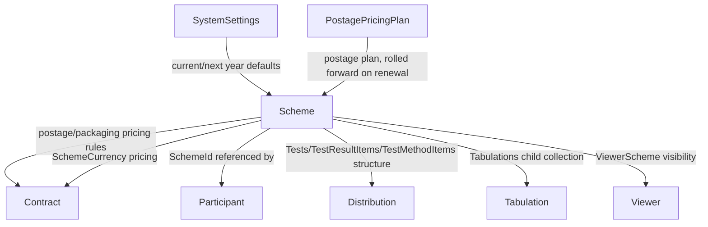

# Scheme Domain Analysis (AS-IS)

**Scope:** Scheme domain in the legacy PTLIMS solution as implemented in the ASP.NET Web Forms / CSLA / ASMX architecture.
**Analysis date:** 2026-09-17
**Repository:** `proficiency-testing`
**Cross-reference inputs:** `docs/analysis/customer-analysis.md`, `docs/analysis/participant-analysis.md`, `docs/analysis/contract-analysis.md`, `docs/analysis/csla-analysis.md`, `docs/migration/api-migration.md`, `docs/source/PTLIMS-HLD-v0.3.docx`.

This is an AS-IS analysis only. It does not define .NET 10 design, migration architecture, repository design, CQRS, DDD, or future implementation plans.

---

## Executive Summary

The Scheme domain is the proficiency-testing "round" catalogue: it defines what is being tested (identifier, name, sample/test configuration), when it runs (year, schedule, distribution months or "as available"), how it is priced and posted (currency pricing, postage plan), who can see it (viewer visibility), and the test/result structure used downstream by distribution and tabulation. A scheme is the single richest business object identified across the domains analysed so far — the core `Scheme` business object is nearly 1,900 lines and owns four distinct child aggregates (currency pricing, tests, tabulations, viewers) persisted transactionally in one save.

The current AS-IS design is a classic Web Forms + CSLA architecture spanning two internal admin front-ends and one external participant-facing page:

- Internal pages exist in **both** `ProficiencyTestingWeb/Scheme Admin` and `ProficiencyTestingAdmin/Scheme Admin` (a duplicated folder structure across two ASP.NET projects — see Open Questions) for scheme create/edit (`Scheme.aspx`), list (`SchemeList.aspx`), history (`SchemeHistory.aspx`), and a print-friendly list (`SchemeListForPrinting.aspx`).
- The core domain object is the CSLA `Scheme` business object (`PtaBusinessObjects/Business Objects/Schemes/Scheme.vb`), an `AuditableBusinessBase(Of Scheme)` (audited, not just validated) persisted to `tblScheme` via `spgSchemeBySchemeId`/`spiScheme`/`spuScheme`, with a transactional save that also updates child collections: `SchemeCurrency` (per-currency pricing), `Tests`/`TestCollection` (each `Test` itself an audited aggregate with `TestResultItems`, `TestMethodItems`, `CategoryItems`), `Tabulations`, and `Viewers` (`ViewerScheme`).
- Scheme has a **year-linked renewal model**: `Scheme.RenewScheme(oldSchemeId)` clones a scheme forward one year while preserving a `SharedId` that links the whole multi-year "family" of a scheme together, and rolls the postage plan forward to the next year's equivalently-named plan. `Scheme.CopyScheme(oldSchemeId)` clones within the same year with a **new** `SharedId` (an unrelated duplicate scheme).
- `SchemeInfo`/`SchemeInfoCollection` provide lightweight list/history projections (`spgSchemeInfoBySchemeId`, `spgSchemeInfoBySharedId`, `spgSchemeInfoByYearId`) used by `SchemeList.aspx`/`SchemeHistory.aspx`.
- The external participant-facing `SchemeList.aspx` (in `ProficiencyTestingExternalWeb`) shows the current participant's commercial and non-commercial scheme lists via `SchemeListCollection.asmx`, gated by an **active** role check (`AuthoriseUser(tokenId, Roles.Participant)`) — in contrast to several other Scheme-related ASMX methods where the equivalent check is present in code but **commented out**.
- The main persistence table is `tblScheme`; like `tblContract`/`tblParticipant`, it shows an incremental `ALTER TABLE IF NOT EXISTS` migration history (e.g. `fldAssessor1..4`), carrying the same schema-drift risk already encountered elsewhere in this migration.

**Evidence:**
- Source file: `proficiency-testing/PtaBusinessObjects/Business Objects/Schemes/Scheme.vb` — Project: `PtaBusinessObjects` — Class: `BusinessObjects.Schemes.Scheme` — Method: `DataPortal_Fetch`, `DataPortal_Insert`, `DataPortal_Update`, `RenewScheme`, `CopyScheme`
- Source file: `proficiency-testing/ProficiencyTestingDatabase/Object Scripts/Tables/tblScheme.sql` — Project: `ProficiencyTestingDatabase`
- Source file: `proficiency-testing/ProficiencyTestingWeb/Scheme Admin/Scheme.aspx.vb` — Project: `ProficiencyTestingWeb` — Class: `SchemeAdmin_Scheme`
- Source file: `proficiency-testing/ProficiencyTestingExternalWeb/SchemeList.aspx.vb` — Project: `ProficiencyTestingExternalWeb` — Class: `SchemeList`
- Source file: `proficiency-testing/ProficiencyTestingWebServices/SchemeListCollection.asmx.vb` — Project: `ProficiencyTestingWebServices` — Class: `ServiceSchemeListCollection`

---

## Business Purpose

The Scheme domain exists to define, configure, price, and publish a proficiency-testing round that customers/participants subscribe to (via the Contract/Participant domains) and that drives sample distribution, results entry, and tabulation.

It supports:

- scheme identity: `Identifier` (`PT####` pattern), `Name`, `YearId`, `SharedId` (multi-year family linkage)
- scheduling: `ScheduleId`, `ScheduleCodeId`, `StartDate`, per-month distribution flags (`DistributionMonthJan`..`Dec`) **or** `DistributionAsAvailable` (mutually exclusive), `WeekNumber`, `DayOfWeekId`, `Deadline`
- classification/visibility: `Pilot`, `Accredited`, `ComerciallyAvailable`, `LimitedSampleAvailability`, `NoVlaLabs`, viewer visibility (`Viewers`/`ViewerScheme`)
- logistics: `Postage` (postage pricing plan), `CombinedPackaging`, `SampleOrigin`, `Subcontractor`, `SamplePackingInstructions`, `NumberOfSamples`/`SampleNoSequence`, `DateOfReceipt`, `StorageConditions`, `ConditionOnReceipt`, `Instructions`
- customs/export metadata: `CustomsDescription`, `CustomsVolume`
- consent: `DataConsentDeclarationActive`/`DataConsentDeclarationText` (conditionally required)
- assessment configuration: `CommentsRequired`, `RequiresAssessment`/assessor assignment (`fldAssessor1..4`), and per-month "can edit" flags mirrored from the Participant domain's `ParticipantScheme.CanEditJan..Dec` pattern
- test/result structure: `Tests` (`TestCollection`), each `Test` owning `TestResultItems`, `TestMethodItems`, and `CategoryItems` — the structural definition consumed downstream by results entry and tabulation
- currency-scoped pricing: `SchemeCurrency` child collection (one row per currency)
- read-only/lock state (`IsReadonly`), computed by the fetch stored procedure, mirroring `Contract.IsReadOnly`

**Primary business role:** a scheme is the versioned, year-scoped definition of a proficiency-testing round — its content, schedule, pricing, and visibility — that all downstream participation, distribution, and results/tabulation activity is built against.

**Evidence:**
- Source file: `proficiency-testing/PtaBusinessObjects/Business Objects/Schemes/Scheme.vb` — Property: `Identifier`, `YearId`, `SharedId`, `DistributionMonthJan..Dec`, `DistributionAsAvailable`, `Postage`, `DataConsentDeclarationActive`, `IsReadonly`
- Source file: `proficiency-testing/PtaBusinessObjects/Business Objects/Schemes/Test.vb` — Property: `TestResultItems`, `TestMethodItems`, `CategoryItems`

---

## User Journeys

### 1. Internal admin creates, edits, or renews a scheme

- User role: Scheme Admin
- Entry point: `Scheme Admin/SchemeList.aspx` → `Scheme.aspx` (new, edit by `SchemeId`, or renewal via `?renewal=true`)
- Exit point: scheme saved (`mScheme.Save()`), navigating back to the scheme list/history
- Workflow:
  1. Admin opens `Scheme.aspx` with no id (create — defaults to current or next year via `?currentyear=true`), with a `SchemeId` (edit), or with `SchemeId` + `renewal=true` (renew).
  2. For a new scheme, `Scheme.NewScheme(yearId)` seeds a blank scheme for that year.
  3. For a renewal, `Scheme.RenewScheme(oldSchemeId)` fetches the prior scheme, deep-copies its fields (`CopyScheme` helper), sets `YearId = oldScheme.YearId + 1`, preserves `SharedId` (linking the year-over-year family), and rolls the postage plan forward via `getNextYearsPostagePlan` (looks up the same-named `PostagePricingPlan` for `YearId + 1`).
  4. For an unrelated duplicate, `Scheme.CopyScheme(oldSchemeId)` performs the same field copy but keeps the **same** `YearId` and assigns a **new** `SharedId` (i.e. not linked to the source scheme's family).
  5. Form binds scheme identity, schedule, distribution months, postage, sample/test config, consent, and nested `Tests` (`dlTests` bound from `TestCollection.GetSortedList(mScheme.Tests)`) and viewer assignment (`PopulateViewersListBoxes`).
  6. If `mScheme.IsReadonly`, the page switches to a read-only rendering (`SetReadonly()`); a new scheme's `RequiresAssessment` checkbox is only editable on create (disabled once persisted).
  7. On save, the transactional `DataPortal_Insert`/`DataPortal_Update` persists `tblScheme` plus the `SchemeCurrency`, `Tests`, `Tabulations`, and `Viewers` child collections in one transaction.
- Dependencies: `Scheme`, `TestCollection`, `PTNumberCollection`, `ViewerInfoCollection`, `SystemObjects.SystemSettings` (current/next year), `PostagePricingPlan`

**Evidence:**
- Source file: `proficiency-testing/ProficiencyTestingWeb/Scheme Admin/Scheme.aspx.vb` — Class: `SchemeAdmin_Scheme` — Method: `Page_Load`, `LoadFormFromObject`
- Source file: `proficiency-testing/PtaBusinessObjects/Business Objects/Schemes/Scheme.vb` — Method: `NewScheme`, `FetchScheme`, `RenewScheme`, `CopyScheme`, `getNextYearsPostagePlan`, `DataPortal_Insert`, `DataPortal_Update`

### 2. Internal admin lists schemes and navigates to renew/print

- User role: Scheme Admin
- Entry point: `Scheme Admin/SchemeList.aspx`
- Exit point: scheme opened for edit/renewal, or navigation to `SchemeListForPrinting.aspx`/`SchemeHistory.aspx`
- Workflow:
  1. Page loads `SchemeInfoCollection.FetchSchemeInfoCollection()` (all scheme "families"/current-next state) into a paged grid (`GridViewSchemes`, page size 15).
  2. Row data-bound logic hides the "current scheme" link when `CurrentSchemeId = Guid.Empty`, and relabels the "next scheme" link as **"Renew"** (navigating to `Scheme.aspx?SchemeId={RecentSchemeId}&renewal=true`) when `NextSchemeId = Guid.Empty` — i.e. the list screen is itself a renewal entry point, not just a navigation index.
  3. A master-page menu action offers "Create Scheme for Current Year" (`Scheme.aspx?currentyear=true`).
- Dependencies: `SchemeInfoCollection`

**Evidence:**
- Source file: `proficiency-testing/ProficiencyTestingWeb/Scheme Admin/SchemeList.aspx.vb` — Class: `SchemeAdmin_SchemeList` — Method: `Page_Load`, `GridViewSchemes_RowDataBound`

### 3. External participant views their scheme lists (commercial / non-commercial)

- User role: external participant
- Entry point: `ProficiencyTestingExternalWeb/SchemeList.aspx`
- Exit point: read-only display; no mutation on this page
- Workflow:
  1. `ParticipantPageGuard(Me)` gates the page to participant identities (shared guard pattern also referenced in the Participant domain's external pages).
  2. Current user's token (`Context.User.Identity.Name`) is used to fetch two grids: commercial schemes (`SchemeListCollection.FetchSchemeListCollection(tokenId, 0)`) and non-commercial schemes (`listType = 1`), each with independently persisted grid paging/sort state (`GridStateService`/`Session`).
  3. A client-side "bold schemes" script highlights rows (likely newly-available or currently-participating schemes — exact highlighting rule not confirmed in this pass).
- Dependencies: `SchemeListCollection` (external BO), `GridStateService`, `ParticipantPageGuard`

**Evidence:**
- Source file: `proficiency-testing/ProficiencyTestingExternalWeb/SchemeList.aspx.vb` — Class: `SchemeList` — Method: `Page_Load`, `UpdateBoldScript`
- Source file: `proficiency-testing/ProficiencyTestingWebServices/SchemeListCollection.asmx.vb` — Class: `ServiceSchemeListCollection` — Method: `GetSchemeListCollection`, `GetSchemeInfoListCollection`

### 4. External/participant-facing scheme lookup and pricing via ASMX

- User role: external participant / ordering workflow
- Entry point: `Scheme.asmx`, `SchemeCurrency.asmx`, `PostagePricingPlan.asmx` (consumed by the Contract-domain ordering workflow — see `docs/analysis/contract-analysis.md`)
- Exit point: read-only scheme/pricing data returned to caller
- Workflow:
  1. `Scheme.asmx.GetScheme(tokenId, schemeId)` resolves identity then returns a near-complete flattened projection of the `Scheme` business object (identity, schedule, distribution, sample/test config, consent, edit-permission flags) — but **not** the nested `Tests`/`SchemeCurrency`/`Viewers` child collections in this method (those remain internal-admin-only concerns in the reviewed code).
  2. `SchemeCurrency.asmx.GetSchemeCurrency(tokenId, schemeId, currencyId)`/`GetAllSchemeCurrency` return currency-scoped pricing for a scheme, used by the Contract-domain ordering/pricing flow.
  3. `PostagePricingPlan.asmx` returns postage plan detail, used both by Scheme's own renewal logic (server-side, not via ASMX) and by external pricing display.
- Dependencies: `UserService`, `PtWebServicesBusinessObjects.Scheme`/`SchemeCurrency`/`PostagePricingPlan`

**Evidence:**
- Source file: `proficiency-testing/ProficiencyTestingWebServices/Scheme.asmx.vb` — Class: `ServiceScheme` — Method: `GetScheme`
- Source file: `proficiency-testing/ProficiencyTestingWebServices/SchemeCurrency.asmx.vb` — Class: `ServiceSchemeCurrency` — Method: `GetSchemeCurrency`
- Source file: `proficiency-testing/ProficiencyTestingWebServices/PostagePricingPlan.asmx.vb` — Class: `ServicePostagePricingPlan` — Method: `GetPostagePricingPlan`
- Cross-reference: `docs/analysis/contract-analysis.md` — Section: "External participant proposes a contract/scheme order for renewal"

---

## Page Inventory

| Page | Project | Role | Purpose | Dependencies | Complexity |
|---|---|---|---|---|---|
| `Scheme Admin/Scheme.aspx` | `ProficiencyTestingWeb` (and duplicated in `ProficiencyTestingAdmin`) | Scheme Admin | Create, edit, renew, or copy a scheme, including nested tests and viewer assignment | `Scheme`, `TestCollection`, `PTNumberCollection`, `ViewerInfoCollection`, `PostagePricingPlan` | High |
| `Scheme Admin/SchemeList.aspx` | `ProficiencyTestingWeb` (and duplicated in `ProficiencyTestingAdmin`) | Scheme Admin | List all scheme families; entry point for renewal | `SchemeInfoCollection` | Medium |
| `Scheme Admin/SchemeHistory.aspx` | `ProficiencyTestingWeb` (and duplicated in `ProficiencyTestingAdmin`) | Scheme Admin | View year-over-year history for a scheme family (`SharedId`) | `SchemeInfoCollection.FetchSchemeInfoCollectionBySharedId` | Medium |
| `Scheme Admin/SchemeListForPrinting.aspx` | `ProficiencyTestingWeb` (and duplicated in `ProficiencyTestingAdmin`) | Scheme Admin | Print-friendly scheme list | `SchemeInfoCollection` | Low |
| `SchemeList.aspx` | `ProficiencyTestingExternalWeb` | External Participant | View commercial/non-commercial scheme lists available to the participant | `SchemeListCollection`, `GridStateService`, `ParticipantPageGuard` | Medium |

**Note:** `Scheme Admin` pages exist under **both** `ProficiencyTestingWeb` and `ProficiencyTestingAdmin` projects with the same file names — see Open Questions regarding which is the canonical/live application.

**Evidence:**
- Source file: `proficiency-testing/ProficiencyTestingWeb/Scheme Admin/Scheme.aspx.vb`
- Source file: `proficiency-testing/ProficiencyTestingWeb/Scheme Admin/SchemeList.aspx.vb`
- Source file: `proficiency-testing/ProficiencyTestingWeb/Scheme Admin/SchemeHistory.aspx.vb`
- Source file: `proficiency-testing/ProficiencyTestingWeb/Scheme Admin/SchemeListForPrinting.aspx.vb`
- Source file: `proficiency-testing/ProficiencyTestingExternalWeb/SchemeList.aspx.vb`
- Source file: `proficiency-testing/ProficiencyTestingAdmin/Scheme Admin/Scheme.aspx.vb` (duplicate)

---

## Service Inventory (ASMX)

| Service | Project | WebMethod | Inputs | Outputs | Consumers | Authorization pattern |
|---|---|---|---|---|---|---|
| `Scheme.asmx` | `ProficiencyTestingWebServices` | `GetScheme(tokenId, schemeId)`, `GetFullSchemeInformationListCollection(tokenId, yearId)` | `schemeId`/`yearId` | `Scheme` DTO, `Collection(Of Scheme)` | scheme lookup screens, contract/pricing flows | token lookup only; role check **commented out** |
| `SchemeListCollection.asmx` | `ProficiencyTestingWebServices` | `GetSchemeListCollection(tokenId, listType)`, `GetSchemeInfoListCollection(tokenId, yearId)` | `listType`/`yearId` | `Collection(Of SchemeList)`, `Collection(Of SchemeInfoList)` | external `SchemeList.aspx` (commercial/non-commercial lists) | **active** `AuthoriseUser(tokenId, Roles.Participant)` check |
| `SchemeCurrency.asmx` | `ProficiencyTestingWebServices` | `GetSchemeCurrency(tokenId, schemeId, currencyId)`, `GetAllSchemeCurrency(tokenId)` | `schemeId`, `currencyId` | `SchemeCurrency`, `List(Of SchemeCurrency)` | pricing/currency screens, contract ordering flow | token lookup only; no role check at all (only a null-guid check on `ssoId`) |
| `PostagePricingPlan.asmx` | `ProficiencyTestingWebServices` | `GetPostagePricingPlan(tokenId, postagePricingPlanId)`, `GetAllPostagePricingPlans(tokenId)` | `postagePricingPlanId` | `PostagePricingPlan`, `List(Of PostagePricingPlan)` | pricing screens, `Scheme.RenewScheme`'s postage roll-forward (server-side, not via this ASMX) | token lookup only; role check **commented out** |
| `AvailableSchemeCollection.asmx` | `ProficiencyTestingWebServices` | `FetchAvailableSchemes(tokenId, yearId)` | `yearId` | `Collection(Of AvailableScheme)` | Contract-domain ordering workflow (cross-referenced) | token lookup only; role check **commented out** |
| `CurrentlyParticipatingSchemeCollection.asmx` | `ProficiencyTestingWebServices` | `FetchCurrentlyParticipatingSchemes(tokenId, yearId, participatingYearId, participantId)` | year/participating year/participant id | `Collection(Of CurrentlyParticipatingScheme)` | Contract-domain ordering workflow (cross-referenced) | token lookup only; role check **commented out** |

### Service details

#### `ServiceScheme.GetScheme`

- Resolves identity via `UserService.Service.GetUserByTokenId(tokenId)`.
- Contains a **commented-out** authorisation call (`'Dim validRequest As Boolean = s.AuthoriseUser(ssoId, Roles.Participant)`), matching the disabled-check pattern already documented for Participant and Contract ASMX.
- Maps a large, near-complete set of `Scheme` fields to the returned DTO (identity, schedule, distribution, sample/test config, consent, edit-permission flags) but does **not** include the nested `Tests`/`SchemeCurrency`/`Viewers` collections.

Source:
- File: `proficiency-testing/ProficiencyTestingWebServices/Scheme.asmx.vb`
- Class / Method: `ServiceScheme.GetScheme`

#### `ServiceSchemeListCollection`

- **Notably different from every other Scheme-related ASMX**: both `GetSchemeListCollection` and `GetSchemeInfoListCollection` have an **active, uncommented** `AuthoriseUser(tokenId, Roles.Participant)` check that short-circuits (`Return Nothing`) if the check fails.
- This inconsistency — one Scheme-domain ASMX enforcing the role check while the others (`Scheme.asmx`, `PostagePricingPlan.asmx`, `AvailableSchemeCollection.asmx`, `CurrentlyParticipatingSchemeCollection.asmx`) have it disabled — suggests no clear, consistently-applied authorization policy across this domain's external surface.

Source:
- File: `proficiency-testing/ProficiencyTestingWebServices/SchemeListCollection.asmx.vb`
- Class / Method: `ServiceSchemeListCollection.GetSchemeListCollection`, `GetSchemeInfoListCollection`

---

## Business Objects

### 1. `Scheme` (CSLA `AuditableBusinessBase`)

**Primary domain object**

- File: `proficiency-testing/PtaBusinessObjects/Business Objects/Schemes/Scheme.vb`
- Project: `PtaBusinessObjects`
- Class: `BusinessObjects.Schemes.Scheme`
- Base: `AuditableBusinessBase(Of Scheme)` — audited (change-tracked), not a plain `BusinessBase`; cross-reference `docs/analysis/csla-analysis.md` for the `AuditableBusinessBase`/`AuditableClass` pattern.

Key responsibilities:
- Owns scheme identity/schedule/logistics/consent/assessment fields (see Business Purpose).
- Owns four child aggregates persisted transactionally with the parent: `SchemeCurrency` (currency pricing), `Tests` (`TestCollection`, each `Test` itself audited with `TestResultItems`/`TestMethodItems`/`CategoryItems`), `Tabulations`, and `Viewers` (`ViewerScheme`).
- Enforces validation through `AddBusinessRules()`, including a mutual-exclusivity rule between per-month distribution flags and `DistributionAsAvailable`.
- Provides year-linked renewal (`RenewScheme`) and same-year duplication (`CopyScheme`) factory methods that both funnel through a private `CopyScheme(oldScheme)` instance helper.
- `IsReadonly` is computed by the fetch stored procedure (aliased `Readonly`), mirroring `Contract.IsReadOnly`.

Extracted DataPortal methods:
- `DataPortal_Fetch(criteria)` — delegates to an internal `Fetch(cn, schemeId)` calling `spgSchemeBySchemeId`
- `DataPortal_Insert()` — `<Transactional(TransactionalTypes.TransactionScope)>` — `EXEC spiScheme` via `DoInsertUpdate`, then `mSchemeCurrencys.Update`, `mTests.UpdateNotDelete`, `mTabulations.Update`, `mViewers.Update` (all in the same transaction)
- `DataPortal_Update()` — `<Transactional(TransactionalTypes.TransactionScope)>` — `EXEC spuScheme`, then the same four child-collection updates but with an explicit insert-before-delete-across-collections ordering comment: *"Due to Foreign Key Constraint, need to do Inserts as (mTests.Insert; mTabulations.Insert) and deletes in the other order (mTabulations.delete; mTests.delete)"* — i.e. `mTests.UpdateNotDelete` then `mTabulations.Update` then `mTests.UpdateDeleteOnly`

Source:
- `proficiency-testing/PtaBusinessObjects/Business Objects/Schemes/Scheme.vb`
- Methods: `NewScheme`, `FetchScheme`, `RenewScheme`, `CopyScheme`, `getNextYearsPostagePlan`, `DataPortal_Fetch`, `DataPortal_Insert`, `DataPortal_Update`, `AddBusinessRules`, `ValidateDistribution`, `ValidateDataConsentDeclaration`

### 2. `Test` (CSLA `AuditableBusinessBase`)

- File: `proficiency-testing/PtaBusinessObjects/Business Objects/Schemes/Test.vb`
- Project: `PtaBusinessObjects`
- Class: `BusinessObjects.Schemes.Test`
- Base: `AuditableBusinessBase(Of Test)`, `<AuditableClass("spiAuditTest", AuditOnDelete, AuditOnInsert)>`
- Purpose: a single test defined within a scheme, itself owning `TestResultItems` (`TestResultItemCollection`), `TestMethodItems` (`TestMethodItemCollection`), and `CategoryItems` (`CategoryItemCollection`) — a third level of nested aggregate structure below `Scheme` → `Tests` → `Test` → (`TestResultItems`/`TestMethodItems`/`CategoryItems`).
- This nested structure defines the shape of results-entry data collected downstream (Distribution/Results domain, not analysed in this pass).

Source:
- `proficiency-testing/PtaBusinessObjects/Business Objects/Schemes/Test.vb`

### 3. `SchemeInfo` / `SchemeInfoCollection` (CSLA `ReadOnlyListBase`)

- File: `proficiency-testing/PtaBusinessObjects/Business Objects/Schemes/SchemeInfoCollection.vb`
- Project: `PtaBusinessObjects`
- Class: `BusinessObjects.Schemes.SchemeInfoCollection`
- Base: `ReadOnlyListBase(Of SchemeInfoCollection, SchemeInfo)`
- Purpose: lightweight list/history projections with four fetch variants: all schemes (`FetchSchemeInfoCollection`), by `SharedId` (scheme family history — `SchemeHistory.aspx`), by `YearId`, and by a specific `SchemeId`.

Source:
- `proficiency-testing/PtaBusinessObjects/Business Objects/Schemes/SchemeInfoCollection.vb` — Method: `FetchSchemeInfoCollection`, `FetchSchemeInfoCollectionBySharedId`, `FetchSchemeInfoCollectionByYearId`, `FetchSchemeInfoCollectionBySchemeId`

### 4. `SchemeCurrency` (child aggregate, currency-scoped pricing)

- Referenced from `Scheme.mSchemeCurrencys` and consumed directly by `SchemeCurrency.asmx`.
- Purpose: per-currency pricing for a scheme, used by the Contract-domain ordering/pricing flow (cross-reference `docs/analysis/contract-analysis.md`).

### 5. `PostagePricingPlan`

- Purpose: named, year-scoped postage pricing plan referenced by `Scheme.Postage`; `Scheme.RenewScheme` rolls a scheme's postage plan forward to the same-named plan for `YearId + 1` via `PostagePricingPlan.FetchPostagePricingPlan(name, yearId)`.

Source:
- `proficiency-testing/PtaBusinessObjects/Business Objects/Schemes/Scheme.vb` — Method: `getNextYearsPostagePlan`

### 6. `ViewerScheme` / `ViewerSchemeCollection`

- Purpose: visibility linkage between a scheme and the external `Viewer` role/entity (which viewers may see this scheme's published tabulation) — persisted via `Scheme.mViewers.Update(cn)` in the same transaction as the scheme save.

Source:
- `proficiency-testing/PtaBusinessObjects/Business Objects/Schemes/ViewerScheme.vb`, `ViewerSchemeCollection.vb`

---

## DTO Inventory

### ASMX DTOs

| DTO | Project | Source file | Fields (examples) | Use |
|---|---|---|---|---|
| `Scheme` (nested `Structure`, in `Scheme.asmx.vb`) | `ProficiencyTestingWebServices` | `ProficiencyTestingWebServices/Scheme.asmx.vb` | `SchemeId`, `SharedId`, `YearId`, `Identifier`, `Name`, distribution month flags, `Postage`, `Pilot`, `Accredited`, `ComerciallyAvailable`, `CanEditJan..Dec`, `IsReadonly` | Returned by `GetScheme` |
| `SchemeList` (nested `Structure`, in `SchemeListCollection.asmx.vb`) | `ProficiencyTestingWebServices` | `ProficiencyTestingWebServices/SchemeListCollection.asmx.vb` | scheme id/name/identifier + participation-list fields | Returned by `GetSchemeListCollection` |
| `SchemeInfoList` (nested `Structure`) | `ProficiencyTestingWebServices` | `ProficiencyTestingWebServices/SchemeListCollection.asmx.vb` | `SchemeName`, `CurrentIdentifier`, `CurrentSchemeId` | Returned by `GetSchemeInfoListCollection` |
| `SchemeCurrency` (nested `Structure`) | `ProficiencyTestingWebServices` | `ProficiencyTestingWebServices/SchemeCurrency.asmx.vb` | `SchemeCurrencyId`, `SchemeId`, `CurrencyId`, price fields | Returned by `GetSchemeCurrency`/`GetAllSchemeCurrency` |
| `PostagePricingPlan` (nested `Structure`) | `ProficiencyTestingWebServices` | `ProficiencyTestingWebServices/PostagePricingPlan.asmx.vb` | plan id/name/year/price fields | Returned by `GetPostagePricingPlan`/`GetAllPostagePricingPlans` |
| `AvailableScheme` | `ProficiencyTestingWebServices` | `ProficiencyTestingWebServices/AvailableSchemeCollection.asmx.vb` | scheme id/name/identifier + distribution month flags | Cross-referenced in `docs/analysis/contract-analysis.md` |
| `CurrentlyParticipatingScheme` | `ProficiencyTestingWebServices` | `ProficiencyTestingWebServices/CurrentlyParticipatingSchemeCollection.asmx.vb` | scheme id/name + participation fields | Cross-referenced in `docs/analysis/contract-analysis.md` |

### Internal / read-model DTOs

- `SchemeInfo` — list/history summary
- `[NEEDS INVESTIGATION]` full field list of `SchemeInfo` not read in this pass

**Evidence:**
- Source file: `proficiency-testing/ProficiencyTestingWebServices/Scheme.asmx.vb` — `Structure Scheme` (implicit; class body defines it below `GetScheme`)
- Source file: `proficiency-testing/ProficiencyTestingWebServices/SchemeListCollection.asmx.vb` — `Structure SchemeInfoList`

---

## Database Mapping

### Page → Business Object → Stored Procedure → Table

| Page | Business Object | Stored Procedure | Database Table |
|---|---|---|---|
| `Scheme Admin/Scheme.aspx` | `Scheme` (+ `SchemeCurrency`, `TestCollection`, `Tabulations`, `ViewerSchemeCollection`) | `spgSchemeBySchemeId`, `spiScheme`, `spuScheme` | `tblScheme` (+ child tables for currency/tests/tabulations/viewer-scheme links — table scripts not individually confirmed in this pass) |
| `Scheme Admin/SchemeList.aspx` | `SchemeInfoCollection` | `spgSchemeInfoByYearId` (or the parameterless all-schemes fetch) | `tblScheme` |
| `Scheme Admin/SchemeHistory.aspx` | `SchemeInfoCollection` | `spgSchemeInfoBySharedId` | `tblScheme` |
| `Scheme Admin/SchemeListForPrinting.aspx` | `SchemeInfoCollection` | `spgSchemeInfoBySchemeId` / `spgSchemeInfoByYearId` `[NEEDS INVESTIGATION: exact procedure used by this specific page not confirmed]` | `tblScheme` |
| `SchemeList.aspx` (external) | `SchemeListCollection` (external BO) | `[NEEDS INVESTIGATION — not located under standard spg/spi/spu folders in this pass]` | `tblScheme` joined to participant/contract scheme-selection tables |

### Stored procedures

#### `spgSchemeBySchemeId`
- File: `ProficiencyTestingDatabase/Object Scripts/Stored Procedures/spg/spgSchemeBySchemeId.sql`
- Purpose: fetch a single scheme by `@SchemeId`, including the derived `Readonly` flag consumed as `Scheme.IsReadonly`.

#### `spiScheme` / `spuScheme`
- Referenced by `Scheme.DataPortal_Insert`/`DataPortal_Update` via the shared `DoInsertUpdate` parameter-binding helper (not individually enumerated in this pass given the object's size — see Open Questions for parameter-count verification).
- Both run inside `<Transactional(TransactionalTypes.TransactionScope)>`, alongside the four child-collection updates, meaning a partial failure rolls back the whole scheme save.

#### `spgSchemeInfoBySchemeId` / `spgSchemeInfoBySharedId` / `spgSchemeInfoByYearId`
- File: `ProficiencyTestingDatabase/Object Scripts/Stored Procedures/spg/spgSchemeInfoBySchemeId.sql`, `spgSchemeInfoBySharedId.sql`, `spgSchemeInfoByYearId.sql`
- Purpose: three different list-projection shapes backing `SchemeList.aspx` (all/by year), `SchemeHistory.aspx` (by shared family id), and single-scheme info lookups.

### Tables

#### `tblScheme`
- File: `ProficiencyTestingDatabase/Object Scripts/Tables/tblScheme.sql`
- Purpose: scheme aggregate table. The reviewed script fragment shows an incremental `ALTER TABLE IF NOT EXISTS` pattern adding `fldAssessor1`..`fldAssessor4` after the original table — the same schema-drift risk shape already flagged for `tblParticipant`/`tblContract` elsewhere in this migration.

#### Related tables
- Child tables for `SchemeCurrency`, `Tests`/`TestResultItems`/`TestMethodItems`/`CategoryItems`, `Tabulations`, and `ViewerScheme` link table — **not individually confirmed** in this pass; inferred purely from the CSLA object model's child-collection structure. `[NEEDS INVESTIGATION]`
- `tlnkParticipantScheme` — owned by the Participant domain, references `SchemeId` (cross-reference `docs/analysis/participant-analysis.md`, `docs/analysis/contract-analysis.md`).

**Evidence:**
- `proficiency-testing/ProficiencyTestingDatabase/Object Scripts/Tables/tblScheme.sql`
- `proficiency-testing/ProficiencyTestingDatabase/Object Scripts/Stored Procedures/spg/spgSchemeBySchemeId.sql`
- `proficiency-testing/ProficiencyTestingDatabase/Object Scripts/Stored Procedures/spg/spgSchemeInfoBySchemeId.sql`
- `proficiency-testing/ProficiencyTestingDatabase/Object Scripts/Stored Procedures/spg/spgSchemeInfoBySharedId.sql`
- `proficiency-testing/ProficiencyTestingDatabase/Object Scripts/Stored Procedures/spg/spgSchemeInfoByYearId.sql`

---

## Validation Rules

Defined in `Scheme.AddBusinessRules()`.

### Critical
- `Identifier` is required, max length 6, and must match `^PT[0-9]{4}$` — the canonical scheme code format.
- `Name` is required, max length 100.
- `Deadline` must be between 1 and 999 (integer range, not a date).
- `SampleOrigin` is required, max length 50.
- `NumberOfSamples` must be between 1 and 999.
- `Instructions` is required, max length 50,000 (a very large free-text field).
- `CustomsDescription` and `CustomsVolume` are required (max length 500 and 20 respectively).
- `ValidateDistribution`: distribution months and `DistributionAsAvailable` are **mutually exclusive** — a scheme must have either specific distribution months set **or** be "as available", never both and never neither.
- `ValidateDataConsentDeclaration`: `DataConsentDeclarationText` is required **only if** `DataConsentDeclarationActive` is true (conditional requirement, with an explicit rule-failure description set on the CSLA rule args — the only rule in this object that customises its error message this way).

### Important
- Max lengths: `Subcontractor` (50), `SamplePackingInstructions` (2000), `StandardTabulationText` (500), `DataConsentDeclarationText` (500).

### Optional
- None identified beyond the above; all located rules are structural (required/format), numeric-range, or conditional-requirement checks.

**Evidence:**
- Source file: `proficiency-testing/PtaBusinessObjects/Business Objects/Schemes/Scheme.vb` — Method: `AddBusinessRules`, `ValidateDistribution`, `ValidateDataConsentDeclaration`

---

## Business Rules

### Scheme identity and multi-year family linkage
- `SchemeId` uniquely identifies one year's instance of a scheme; `SharedId` links every year's instance of "the same" scheme into a family, used by `SchemeHistory.aspx` and `SchemeList.aspx`'s current/next-year navigation.
- `RenewScheme` preserves `SharedId` (same family, next year); `CopyScheme` assigns a **new** `SharedId` (an unrelated duplicate) — this distinction is a critical business rule that a naive "clone" migration could easily conflate.

**Evidence:** `proficiency-testing/PtaBusinessObjects/Business Objects/Schemes/Scheme.vb` — Method: `RenewScheme`, `CopyScheme`

### Postage plan roll-forward on renewal
- On renewal, if the old scheme's `Postage` is not empty, the new scheme's postage plan is looked up by **name** for `YearId + 1` (`getNextYearsPostagePlan`) rather than reusing the same `PostagePricingPlan` row — i.e. postage plans are themselves year-scoped and must have a same-named counterpart for the new year, or renewal will fail to resolve a plan.

**Evidence:** `proficiency-testing/PtaBusinessObjects/Business Objects/Schemes/Scheme.vb` — Method: `getNextYearsPostagePlan`

### List-screen renewal shortcut
- `SchemeList.aspx` is not purely a read screen: when a scheme family has no "next scheme" (`NextSchemeId = Guid.Empty`), the grid's action link is relabelled "Renew" and navigates directly into the renewal flow — the list and renewal-initiation responsibilities are combined in one screen.

**Evidence:** `proficiency-testing/ProficiencyTestingWeb/Scheme Admin/SchemeList.aspx.vb` — Method: `GridViewSchemes_RowDataBound`

### Read-only lock on assessment configuration
- `RequiresAssessment` (assessor configuration) can only be set at scheme creation — once a `SchemeId` exists (edit mode), the checkbox is disabled (`CheckboxRequiresAssessment.Enabled = False`), meaning this is a create-time-only decision in the legacy UI.

**Evidence:** `proficiency-testing/ProficiencyTestingWeb/Scheme Admin/Scheme.aspx.vb` — Method: `Page_Load`

### Transactional multi-aggregate save with insert/delete ordering constraint
- Saving a scheme is one database transaction covering `tblScheme` plus four child collections. The update path has an explicit, commented ordering requirement: inserts must happen as `Tests` then `Tabulations`, but deletes must happen in the **reverse** order (`Tabulations` then `Tests`), due to a foreign-key relationship between tests and tabulations. This is a non-obvious cross-collection referential constraint that any replatformed persistence layer must reproduce.

**Evidence:** `proficiency-testing/PtaBusinessObjects/Business Objects/Schemes/Scheme.vb` — Method: `DataPortal_Update` (inline comment)

### Read-only contract-style lock
- `IsReadonly`, like `Contract.IsReadOnly`, is computed by the fetch SP rather than client-derived, and the admin UI switches to a read-only rendering (`SetReadonly()`) accordingly. `[NEEDS INVESTIGATION: exact SQL predicate not confirmed]`

**Evidence:** `proficiency-testing/PtaBusinessObjects/Business Objects/Schemes/Scheme.vb` — Property: `IsReadonly`

---

## Security Analysis

### Authentication dependencies
- Internal `Scheme Admin` pages rely on ASP.NET session/ViewState (`SessionPageStatePersister`, `ViewState.Item("CurrentScheme")`) with no explicit per-request identity check observed in the reviewed code-behind, the same pattern seen in the Contract domain's internal admin pages.
- External-facing pages/ASMX resolve identity via `Context.User.Identity.Name`/`UserService.Service.GetUserByTokenId(tokenId)`, the same token-based SSO pattern used across Customer/Participant/Contract.

### Authorization dependencies
- **Inconsistent enforcement, not just a single disabled check**: `SchemeListCollection.asmx` **actively enforces** `AuthoriseUser(tokenId, Roles.Participant)` (and returns `Nothing` if it fails), while `Scheme.asmx`, `PostagePricingPlan.asmx`, `AvailableSchemeCollection.asmx`, and `CurrentlyParticipatingSchemeCollection.asmx` all have the **same call commented out**. `SchemeCurrency.asmx` has **no role-check call at all** (only a `ssoId <> Guid.Empty` sanity check). This is a distinct and arguably more concerning finding than the single "disabled check" pattern already documented for Participant/Contract: within the same domain, some endpoints enforce authorization and others do not, with no visible policy explaining the difference.
- No role/ownership check was located in the internal `Scheme Admin` code-behind beyond implicit session/ViewState presence. `[NEEDS INVESTIGATION: confirm whether scheme-admin page access is gated elsewhere, e.g. web.config role-based authorization on the `Scheme Admin` folder, consistent with the same open question raised for Contract.]`

### Role / identity dependency
- The external `SchemeList.aspx` uses a shared `ParticipantPageGuard` helper (also referenced in the Participant domain's external pages) rather than an ASMX-style token check, suggesting the external Web Forms pages and the ASMX layer use two different (and inconsistently applied) authorization mechanisms.

**Evidence:**
- Source file: `proficiency-testing/ProficiencyTestingWebServices/Scheme.asmx.vb` — Method: `GetScheme`
- Source file: `proficiency-testing/ProficiencyTestingWebServices/SchemeListCollection.asmx.vb` — Method: `GetSchemeListCollection`, `GetSchemeInfoListCollection`
- Source file: `proficiency-testing/ProficiencyTestingWebServices/SchemeCurrency.asmx.vb` — Method: `GetSchemeCurrency`
- Source file: `proficiency-testing/ProficiencyTestingExternalWeb/SchemeList.aspx.vb` — Method: `Page_Load` (`ParticipantPageGuard`)
- Cross-reference: `docs/analysis/participant-analysis.md`, `docs/analysis/contract-analysis.md` — equivalent disabled-role-check findings

---

## Cross-Domain Dependencies

### Upstream domains (Scheme depends on)

```
SystemSettings (current/next year)
  ↓
Scheme
```
- New-scheme creation defaults to the system's current or next year (`SystemObjects.SystemSettings.FetchSystemSettings().CurrentYearId`/`NextYearId`).

```
PostagePricingPlan
  ↓
Scheme
```
- `Scheme.Postage` references a year-scoped postage plan; renewal explicitly re-resolves the plan for the new year by name.

### Downstream / shared domains (depend on Scheme)

```
Scheme
  ↓
Contract
```
- `ContractItems`'s dynamic online-order pricing recomputation reads `Scheme.Postage`/`Scheme.CombinedPackaging` (cross-reference `docs/analysis/contract-analysis.md`, Business Rules → "Online-order pricing recomputation"). `AvailableSchemeCollection.asmx`/`CurrentlyParticipatingSchemeCollection.asmx` (physically Scheme-adjacent ASMX) directly serve the Contract-domain external ordering workflow.

```
Scheme
  ↓
Participant
```
- `ParticipantScheme` (Participant domain) references `SchemeId` and mirrors several of `Scheme`'s per-month `CanEdit*` flags at the participant-selection level (cross-reference `docs/analysis/participant-analysis.md`).

```
Scheme
  ↓
Distribution / Results / Tabulation
```
- `Scheme.Tests`/`TestResultItems`/`TestMethodItems`/`CategoryItems` define the structure that results-entry (`ResultsEntry.asmx`, per `docs/migration/api-migration.md`) and tabulation (`Tabulation.asmx`/`TabulationCollection.asmx`) consume. `Scheme.Tabulations` (a direct child collection of `Scheme`) is the tightest coupling point — not analysed in depth in this pass. `[NEEDS INVESTIGATION: full Distribution/Results/Tabulation domain not yet analysed]`

```
Scheme
  ↓
Viewer
```
- `ViewerScheme`/`ViewerSchemeCollection` control which external viewers can see a scheme's published tabulation, persisted transactionally with the scheme.

### Shared domains
- **Contract** and **Scheme** jointly define what a customer/participant can purchase and how it is priced — Scheme owns the catalogue/pricing-rule side, Contract owns the customer-scoped commercial aggregation side (see `docs/analysis/contract-analysis.md`'s "Shared domains" note, which already identifies this relationship from the Contract side).

### Mermaid diagram



**Evidence:**
- `proficiency-testing/PtaBusinessObjects/Business Objects/Schemes/Scheme.vb` — Method: `NewScheme` (`SystemSettings`), `getNextYearsPostagePlan`
- `docs/analysis/contract-analysis.md` — Section: "Cross-Domain Dependencies" (Scheme↔Contract)
- `docs/analysis/participant-analysis.md` — Section: "Domain Dependencies" (Scheme↔Participant)

---

## Workflow Boundaries

### Entry points

```
SchemeList.aspx
  ↓
Scheme Creation / Renewal / Copy (Scheme.aspx)
```

```
Scheme
  ↓
Scheme History (SchemeHistory.aspx, by SharedId)
```

### Exit points

```
Scheme
  ↓
Contract Item Pricing (ContractItems — Contract domain)
```
- `Scheme.Postage`/`CombinedPackaging` exit the Scheme workflow boundary and are consumed read-only by the Contract domain's item-pricing computation.

```
Scheme
  ↓
Participant Scheme Selection (ParticipantScheme.aspx — Participant domain)
```
- A scheme becomes selectable/purchasable once published; the actual selection workflow is owned by the Participant domain.

```
Scheme
  ↓
Distribution / Tabulation (not analysed in this pass)
```
- `Tests`/`Tabulations` exit into downstream distribution and results/tabulation processing. `[NEEDS INVESTIGATION]`

**Evidence:**
- `proficiency-testing/ProficiencyTestingWeb/Scheme Admin/SchemeList.aspx.vb` — Method: `GridViewSchemes_RowDataBound`
- `docs/analysis/contract-analysis.md`, `docs/analysis/participant-analysis.md` (cross-reference)

---

## Stored Procedure Dependency Matrix

| Stored Procedure | Page | Business Object | Table(s) |
|---|---|---|---|
| `spgSchemeBySchemeId` | `Scheme.aspx` | `Scheme` | `tblScheme` (+ child tables, unconfirmed) |
| `spiScheme` | `Scheme.aspx` (new/renew/copy) | `Scheme` | `tblScheme` (+ transactional child-collection writes) |
| `spuScheme` | `Scheme.aspx` (edit) | `Scheme` | `tblScheme` (+ transactional child-collection writes) |
| `spgSchemeInfoByYearId` | `SchemeList.aspx` | `SchemeInfoCollection` | `tblScheme` |
| `spgSchemeInfoBySharedId` | `SchemeHistory.aspx` | `SchemeInfoCollection` | `tblScheme` |
| `spgSchemeInfoBySchemeId` | `SchemeListForPrinting.aspx` (or single-scheme lookups) | `SchemeInfoCollection` | `tblScheme` |
| external `SchemeListCollection` SP(s) `[NEEDS INVESTIGATION]` | `SchemeList.aspx` (external) | `SchemeListCollection` (external BO) | `tblScheme` joined to participant/contract scheme-selection tables |

---

## Migration Impact Assessment

If the Scheme domain changes:

### High impact
- **Contract domain** — pricing computation (especially online-order dynamic recomputation) directly reads `Scheme.Postage`/`CombinedPackaging`; a change to scheme postage-type modelling changes contract pricing.
- **Participant domain** — `ParticipantScheme` references `SchemeId` directly; a change to scheme identity/lifecycle (e.g. how `SharedId`/renewal works) would ripple into participant-scheme selection and history.
- **Distribution/Results/Tabulation** (not yet analysed) — `Tests`/`TestResultItems`/`TestMethodItems`/`Tabulations` define the structural contract that downstream results entry and tabulation depend on; any change here is a high-impact, cross-domain structural change.

### Medium impact
- **Postage/pricing domain** — the year-scoped, name-matched postage plan roll-forward logic in `RenewScheme` is a business rule that must be explicitly preserved or consciously redesigned; silently dropping it would break renewal for schemes with postage plans.
- **Viewer domain** — `ViewerScheme` visibility is transactionally coupled to the scheme save; decoupling it without an equivalent guarantee could produce visibility gaps.

### Low impact
- **Scheme list/history read-models** (`SchemeInfoCollection`) — pure projections; low risk to re-platform independently of the core `Scheme` write path.

**Evidence:**
- `proficiency-testing/PtaBusinessObjects/Business Objects/Schemes/Scheme.vb`
- `docs/analysis/contract-analysis.md` — Section: "Migration Impact Assessment" (equivalent Scheme-dependency note from the Contract side)

---

## Complexity Assessment

The Scheme domain is currently **the highest complexity domain analysed so far** (higher than Customer, Participant, or Contract), because it combines:

- the largest core business object encountered (`Scheme`, ~1,900 lines), an **audited** (`AuditableBusinessBase`) aggregate rather than a plain `BusinessBase`
- four transactionally-coupled child collections (`SchemeCurrency`, `Tests`, `Tabulations`, `Viewers`) saved in one multi-step transaction with an explicit, non-obvious insert/delete ordering constraint across two of those collections due to a foreign-key relationship
- a third level of nested aggregate structure below the root (`Scheme` → `Tests` → `Test` → `TestResultItems`/`TestMethodItems`/`CategoryItems`), itself independently audited (`Test` is also `AuditableBusinessBase` with its own `AuditableClass` attribute)
- two distinct clone/copy semantics (`RenewScheme` vs `CopyScheme`) that differ only in `YearId`/`SharedId` handling but have materially different business meaning (same family vs unrelated duplicate) — an easy migration pitfall
- a postage-plan roll-forward rule that depends on name-matching across years, not a stable foreign key
- **inconsistent authorization enforcement across the domain's own ASMX surface** — one endpoint enforces a role check, several others have the identical check commented out, and one has no check at all — a more concerning security posture than a single, domain-wide disabled check
- a duplicated internal admin UI across two separate ASP.NET projects (`ProficiencyTestingWeb` and `ProficiencyTestingAdmin`), raising an open question about canonical ownership

This complexity reflects the current implementation model in the legacy application; it is not a migration-design recommendation.

---

## Open Questions

- Which of `ProficiencyTestingWeb/Scheme Admin/*` and `ProficiencyTestingAdmin/Scheme Admin/*` is the canonical, currently-deployed admin application? Both contain identically-named pages (`Scheme.aspx`, `SchemeList.aspx`, `SchemeHistory.aspx`, `SchemeListForPrinting.aspx`). [NEEDS INVESTIGATION]
- What SQL predicate computes `Scheme.IsReadonly` (the `Readonly` column returned by `spgSchemeBySchemeId`)? [NEEDS INVESTIGATION]
- What are the exact table names and schemas backing `SchemeCurrency`, `Test`/`TestResultItem`/`TestMethodItem`/`CategoryItem`, `Tabulations` (as a Scheme child collection, distinct from the Distribution/Results `Tabulation` business object), and `ViewerScheme`? [NEEDS INVESTIGATION]
- What are the exact stored procedure(s)/table(s) backing the external `SchemeListCollection` business object (`SchemeList.aspx`'s data source)? [NEEDS INVESTIGATION]
- Is there a documented reason why `SchemeListCollection.asmx` enforces its role check while every other Scheme-related ASMX has it disabled or absent — is this an intentional exception or an oversight? [NEEDS INVESTIGATION]
- Does the HLD (`docs/source/PTLIMS-HLD-v0.3.docx`) describe Scheme-domain responsibilities not reflected in this page/service inventory, particularly around the Distribution/Results/Tabulation boundary? [NEEDS INVESTIGATION]
- What does the "bold schemes" client-side highlighting logic in the external `SchemeList.aspx` actually indicate to the participant (e.g. newly available, deadline approaching)? [NEEDS INVESTIGATION]
- Current live-schema parameter count for `spiScheme`/`spuScheme` given the same `tblScheme` incremental-migration pattern that caused the `spiParticipant` schema-drift bug elsewhere in this workspace? [NEEDS INVESTIGATION]

---

## Source Summary

The analysis above is based on the following current-source references:

- `proficiency-testing/ProficiencyTestingWeb/Scheme Admin/Scheme.aspx.vb`
- `proficiency-testing/ProficiencyTestingWeb/Scheme Admin/SchemeList.aspx.vb`
- `proficiency-testing/ProficiencyTestingAdmin/Scheme Admin/Scheme.aspx.vb` (duplicate project)
- `proficiency-testing/ProficiencyTestingExternalWeb/SchemeList.aspx.vb`
- `proficiency-testing/ProficiencyTestingWebServices/Scheme.asmx.vb`
- `proficiency-testing/ProficiencyTestingWebServices/SchemeListCollection.asmx.vb`
- `proficiency-testing/ProficiencyTestingWebServices/SchemeCurrency.asmx.vb`
- `proficiency-testing/ProficiencyTestingWebServices/PostagePricingPlan.asmx.vb`
- `proficiency-testing/ProficiencyTestingWebServices/AvailableSchemeCollection.asmx.vb`
- `proficiency-testing/ProficiencyTestingWebServices/CurrentlyParticipatingSchemeCollection.asmx.vb`
- `proficiency-testing/PtaBusinessObjects/Business Objects/Schemes/Scheme.vb`
- `proficiency-testing/PtaBusinessObjects/Business Objects/Schemes/Test.vb`
- `proficiency-testing/PtaBusinessObjects/Business Objects/Schemes/SchemeInfoCollection.vb`
- `proficiency-testing/PtaBusinessObjects/Business Objects/Schemes/ViewerScheme.vb`
- `proficiency-testing/ProficiencyTestingDatabase/Object Scripts/Tables/tblScheme.sql`
- `proficiency-testing/ProficiencyTestingDatabase/Object Scripts/Stored Procedures/spg/spgSchemeBySchemeId.sql`
- `proficiency-testing/ProficiencyTestingDatabase/Object Scripts/Stored Procedures/spg/spgSchemeInfoBySchemeId.sql`
- `proficiency-testing/ProficiencyTestingDatabase/Object Scripts/Stored Procedures/spg/spgSchemeInfoBySharedId.sql`
- `proficiency-testing/ProficiencyTestingDatabase/Object Scripts/Stored Procedures/spg/spgSchemeInfoByYearId.sql`
- `docs/analysis/customer-analysis.md` (cross-reference)
- `docs/analysis/participant-analysis.md` (cross-reference)
- `docs/analysis/contract-analysis.md` (cross-reference)
- `docs/analysis/csla-analysis.md` (cross-reference — `AuditableBusinessBase` pattern)
- `docs/migration/api-migration.md` (cross-reference)
- `docs/source/PTLIMS-HLD-v0.3.docx` (cross-reference — not independently re-parsed in this pass beyond prior analyses' citations)

This document intentionally describes only the current AS-IS Scheme domain and does not define new design targets, repositories, CQRS, DDD, migration architecture, or .NET 10 patterns.
