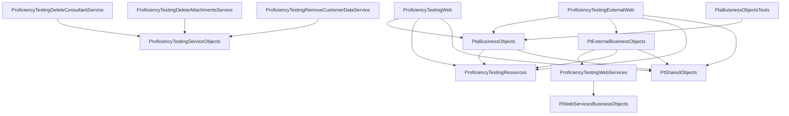

# Legacy Modernization Assessment for Migration to .NET 10

## 1. Executive Summary

The current solution is a large, mixed-language **.NET Framework 4.8** platform with significant legacy architecture characteristics:

- ASP.NET Web Forms applications
- ASMX SOAP service layer
- SSDT-based SQL database project with heavy stored procedure usage
- SSRS reporting project
- Multiple background/cleanup services

A direct in-place upgrade to `.NET 10` is not feasible for major parts (especially Web Forms and ASMX). A phased modernization strategy is required, prioritizing security, service boundary extraction, and incremental replacement using ASP.NET Core APIs and modern authentication.

---

## 2. Technology Inventory

### Runtime and Languages

- **Framework**: .NET Framework 4.8 (all projects)
- **Languages**: VB.NET and C#

### Application Technologies

- **ASP.NET Web Forms**: Present (`ProficiencyTestingWeb`, `ProficiencyTestingExternalWeb`)
- **ASP.NET MVC**: Not detected
- **WCF Services**: No hosted WCF service project detected
- **ASMX Services**: Present (`ProficiencyTestingWebServices`)
- **REST APIs**: Not detected

### Data Access

- ADO.NET (`System.Data`, direct SQL patterns)
- Dapper (`Dapper 2.1.35`) in cleanup services
- Stored-procedure-centric access model
- Entity Framework / EF Core: Not detected

### Reporting

- **SSRS**: Present (`ProficiencyTestingReports.rptproj`, `.rdl`, `.rsd`, `.rds`)
- Crystal Reports: Not detected
- RDLC: Not detected
- PDF generation: `TallComponents.PDF.Layout`, `Aspose.Words`

### Third-party Libraries (observed)

- `Csla 2.0.3`
- `Aspose.Words 24.12.0`
- `AjaxControlToolkit 20.1.0`
- `HtmlAgilityPack 1.11.71`
- `AntiXSS 4.3.0`
- `Dapper 2.1.35`
- `Newtonsoft.Json 5.0.4`
- `WebGrease 1.5.2`
- `Microsoft.AspNet.Web.Optimization 1.1.3`

### COM Interop

- No explicit COM interop references (`COMReference`) detected in reviewed project files.

---

## 3. Project Inventory and Categorization

| Project | Category | Language | Notes |
|---|---|---|---|
| PtaBusinessObjects | Class Library | VB.NET | Core business/domain library |
| ProficiencyTestingEmailService | Windows Service / Console-hosted EXE | VB.NET | Email and scheduled processing |
| ProficiencyTestingDatabase | Database Project | SQL | SSDT project |
| ProficiencyTestingWeb | Web Application (Web Forms) | VB.NET | Internal web app |
| ProficiencyTestingExternalWeb | Web Application (Web Forms) | VB.NET | External web app |
| PtWebServicesBusinessObjects | Class Library | VB.NET | DTO/business objects for service layer |
| ProficiencyTestingWebServices | ASMX Service | VB.NET | SOAP service endpoints |
| PtExternalBusinessObjects | Class Library | VB.NET | External-facing service client objects |
| ProficiencyTestingReports | Reporting Project (SSRS) | RDL/RSD | SSRS deployment/report definitions |
| GetPrinterSettings | Console Application | C# | Utility |
| PtaBuisnessObjectsTests | Test Project | VB.NET | MSTest-based |
| ProficiencyTestingResources | Class Library | VB.NET | Resource/shared localization project |
| PtSharedObjects | Class Library | VB.NET | Cross-cutting helpers |
| ProficiencyTestingDeleteConsultantService | Windows Service | C# | Data cleanup job |
| ProficiencyTestingServiceObjects | Class Library | C# | Shared service infrastructure |
| ProficiencyTestingRemoveCustomerDataService | Windows Service | C# | Data cleanup job |
| ProficiencyTestingDeleteAttachmentsService | Windows Service | C# | Data cleanup job |

---

## 4. Project Dependencies

### Direct Project Reference Relationships

- `ProficiencyTestingWeb` → `PtaBusinessObjects`, `ProficiencyTestingResources`, `PtSharedObjects`
- `ProficiencyTestingExternalWeb` → `PtaBusinessObjects`, `PtExternalBusinessObjects`, `ProficiencyTestingResources`, `PtSharedObjects`
- `PtaBusinessObjects` → `ProficiencyTestingResources`, `PtSharedObjects`
- `ProficiencyTestingWebServices` → `PtWebServicesBusinessObjects`
- `PtExternalBusinessObjects` → `ProficiencyTestingWebServices`, `ProficiencyTestingResources`, `PtSharedObjects`
- `PtaBuisnessObjectsTests` → `PtaBusinessObjects`
- `ProficiencyTestingDeleteConsultantService` → `ProficiencyTestingServiceObjects`
- `ProficiencyTestingDeleteAttachmentsService` → `ProficiencyTestingServiceObjects`
- `ProficiencyTestingRemoveCustomerDataService` → `ProficiencyTestingServiceObjects`

### Circular Dependencies

- No circular project-reference dependency was detected in reviewed `.vbproj/.csproj` relationships.

### Shared Libraries

- `PtSharedObjects`
- `ProficiencyTestingResources`
- `ProficiencyTestingServiceObjects`

---

## 5. Dependency Diagram

---

## 6. API Inventory (ASMX / SOAP Catalog)

### Hosted Service Project

- `ProficiencyTestingWebServices`

### ASMX Services Identified

- `AssessmentResultCollection.asmx`
- `AvailableSchemeCollection.asmx`
- `CountryCollection.asmx`
- `CurrentDistributionCollection.asmx`
- `Customer.asmx`
- `DistributionForComment.asmx`
- `DistributionForCommentCollection.asmx`
- `MainPageMessage.asmx`
- `Participant.asmx`
- `ParticipantCollection.asmx`
- `PastDistributionCollection.asmx`
- `PendingContractOrder.asmx`
- `PendingCustomerUpdate.asmx`
- `PendingParticipantScheme.asmx`
- `PendingParticipantSchemeCollection.asmx`
- `PendingParticipantUpdate.asmx`
- `PostagePricingPlan.asmx`
- `ResultsEntry.asmx`
- `Scheme.asmx`
- `SchemeCurrency.asmx`
- `SchemeListCollection.asmx`
- `SystemInformation.asmx`
- `SystemSettings.asmx`
- `Tabulation.asmx`
- `TabulationCollection.asmx`
- `TestConsultant.asmx`
- `Viewer.asmx`

### Service Operation Summary (representative)

- **AssessmentResultCollection**: `GetAssessmentResultCollection`
- **AvailableSchemeCollection**: `FetchAvailableSchemes`
- **CountryCollection**: `GetCountryCollection`
- **CurrentDistributionCollection**: `GetCurrentDistributionCollection`
- **Customer**: `GetCustomer`
- **DistributionForComment**: `GetDistributionForComment`, `UpdateTestConsultantComments`
- **DistributionForCommentCollection**: `GetDistributionForCommentCollection`
- **MainPageMessage**: `GetMainPageMessage`
- **Participant**: `GetParticipant`
- **ParticipantCollection**: `FetchParticipantCollection`
- **PastDistributionCollection**: `GetPastDistributionCollection`
- **PendingContractOrder**: `GetPendingContractOrder`, `InsertPendingContractOrder`, `UpdatePendingContractOrder`
- **PendingCustomerUpdate**: `GetPendingCustomerUpdate`, `InsertPendingCustomerUpdate`, `UpdatePendingCustomerUpdate`
- **PendingParticipantScheme**: `GetPendingParticipantScheme`, `InsertPendingParticipantScheme`, update-style operations
- **PendingParticipantSchemeCollection**: `FetchPendingParticipantSchemeCollection`
- **PendingParticipantUpdate**: `GetPendingParticipantUpdate`, `InsertPendingParticipantUpdate`, `UpdatePendingParticipantUpdate`
- **PostagePricingPlan**: `GetPostagePricingPlan`, `GetAllPostagePricingPlans`
- **ResultsEntry**: `GetResultsEntry`, `UpdateResults`
- **Scheme**: `GetScheme`, `GetFullSchemeInformationListCollection`
- **SchemeCurrency**: `GetSchemeCurrency`, `GetAllSchemeCurrency`
- **SchemeListCollection**: `GetSchemeListCollection`, `GetSchemeInfoListCollection`
- **SystemInformation**: `GetSystemInformation`
- **SystemSettings**: `GetSystemSettings`
- **Tabulation**: `GetTabulation`
- **TabulationCollection**: `GetTabulationCollection`
- **TestConsultant**: `GetTestConsultant`
- **Viewer**: `GetViewer`

### Request/Response Contract Characteristics

- Requests are mostly primitive parameters (`Guid`, `Int32`, `Boolean`, `String`)
- Responses are custom VB structures (`Structure`) and `Collection(Of T)` wrappers

### Authentication Mechanism

- Predominantly token-based checks via `UserService.Service()` and role authorization.
- Some service methods have authorization checks disabled/commented, which introduces security risk.

### Consuming Applications

- `ProficiencyTestingExternalWeb` (configured ASMX endpoint list)
- `PtExternalBusinessObjects` (Web References to internal ASMX services)

### REST API Inventory

- No REST API endpoints detected in reviewed solution artifacts.

---

## 7. Database Inventory and Dependency Map

### Connection Strings and Databases

Detected `Security` connection strings across web and service applications:

- `(localdb)\MSSQLLocalDB`, Database: `ProficiencyTesting`
- `.\sqlexpress`, Database: `ProficiencyTesting`
- `10.98.2.4`, Database: `ProficiencyTesting`
- SSRS data source: `10.98.2.7`, Initial Catalog `ProficiencyTesting`

### Database Objects (from SQL project)

- Tables: extensive set (examples: `tblPendingContract`, `tblCustomerStatus`, `tblAuditInvoiceGeneration`, `tblParticipant`, `tlnkPendingParticipantScheme`)
- Stored Procedures: extensive set by naming families (`spg*`, `spi*`, `spu*`, `spd*`, `spga*`, `spp*`, `spiAudit*`)
- Functions: examples include `fnParticipantSchemeHasOverride`, `fnIsParticipantActiveForMonthAndNotOverride`, `fnIsParticipantOverrideForMonth`, `fnParticipantSchemeHasOverrideByMonth`
- User-defined table type: `GuidIdTableType`

### Database Dependency Map (confirmed)

- **Delete Consultant Service**
  - Read: `spgInactiveTestConsultants`
  - Delete/update: `spdInactiveTestConsultants`
  - TVP: `GuidIdTableType`
- **Delete Attachments Service**
  - Read: `spgAttachmentsToDelete`
  - Delete/update: `spdAttachments`
  - TVP: `GuidIdTableType`
- **Remove Customer Data Service**
  - Read: `spgInactiveCustomerData`, `spgInactiveParticipantData`
  - Delete/update: `spdInactiveCustomerData`, `spdInactiveParticipantData`
  - TVP: `GuidIdTableType`
- **SSRS Reports**
  - Data source: `ProficiencyTesting`
  - Dataset example: `spgaParticipantStatusDataset`

### Stored Procedures per Module (high-level)

Exact counts were not fully enumerated from every SQL object file, but module families are clear:

- Security/user/role and identity support: significant (`spgUser*`, `spgUserRole*`, etc.)
- Participant/customer lifecycle: significant (`spgParticipant*`, `spuParticipant*`, etc.)
- Scheme/distribution/tabulation/results workflows: very high density
- Reporting/admin datasets (`spga*`): substantial
- Cleanup/deletion (`spd*`): present and actively used

---

## 8. Business Domain Model Discovery

### 8.1 Identity and Access

- **Purpose**: Authenticate users and enforce role-based access
- **Main entities**: User, Role, Token, SSO user mapping
- **Workflows**: token validation, role authorization, role-specific endpoint access

### 8.2 Customer Management

- **Purpose**: Manage customer profile, billing/contact details, status
- **Main entities**: Customer, PendingCustomerUpdate, CustomerStatus
- **Workflows**: retrieve/update customer data, pending update approval patterns

### 8.3 Participant Management

- **Purpose**: Manage participant identity, participation status, contact details
- **Main entities**: Participant, PendingParticipantUpdate, ParticipantStatus
- **Workflows**: participant retrieval/update, inactivity handling, cleanup

### 8.4 Scheme and Contract Management

- **Purpose**: Define available schemes, pricing, contract selections, participation
- **Main entities**: Scheme, SchemeCurrency, AvailableScheme, PendingContractOrder, PendingParticipantScheme
- **Workflows**: select schemes by year, maintain pending contract order, pricing and availability resolution

### 8.5 Distribution and Results

- **Purpose**: Operate monthly distributions, collect participant results, produce tabulations
- **Main entities**: MonthlyDistributionScheme, ResultsEntry, Tabulation, AssessmentResult
- **Workflows**: publish distributions, submit results, process tabulations, assessment and sign-off

### 8.6 Test Consultant and Reviewer Flows

- **Purpose**: Consultant comments and reviewer access to published outcomes
- **Main entities**: TestConsultant, DistributionForComment, Viewer
- **Workflows**: retrieve assignments, enter comments, retrieve approved/published outputs

### 8.7 Notifications and Messaging

- **Purpose**: Operational communication and reminder emails
- **Main entities**: Email templates/settings, MainPageMessage
- **Workflows**: scheduled emails, notification toggles, support/system messaging

### 8.8 Data Retention/Cleanup

- **Purpose**: Remove stale/inactive records and attachments
- **Main entities**: inactive consultants/customers/participants/attachments
- **Workflows**: scheduled cleanup with dry-run + batch processing and logging

### 8.9 Reporting and Analytics

- **Purpose**: Operational/commercial/status reporting via SSRS
- **Main entities**: SSRS datasets/reports and supporting stored procedures
- **Workflows**: execute SP-backed datasets, render and deploy SSRS reports

---

## 9. Authentication and Security Assessment

### Current Auth Patterns

- Internal web/services use Windows authentication in places
- External web uses Forms authentication
- Service calls use custom token-based authorization checks via SOAP user service

### Security Findings

- Hardcoded credentials and secrets found in configuration:
  - AD credentials
  - SQL usernames/passwords
  - machineKey values
  - SMTP certificate hash/config
- Inconsistent authorization enforcement in some ASMX methods (commented checks)
- Legacy cryptographic and membership patterns

### Recommended Target Security Model (.NET 10)

- Federate identity with **Microsoft Entra ID**
- Use **OpenID Connect** for interactive user authentication
- Use **OAuth2/JWT bearer tokens** for API authorization
- Centralize secrets in **Azure Key Vault**
- Use managed identities for service-to-resource access
- Apply policy-based authorization in ASP.NET Core
- Enforce TLS and remove plaintext credentials from config files

---

## 10. External Dependency Analysis

### Email

- **Endpoint/technology**: SMTP server/port from config
- **Purpose**: workflow notifications and reminders
- **Consumers**: web app + email/background services
- **Technology**: `System.Net.Mail` with optional certificate hash validation

### Identity Provider (SOAP)

- **Endpoint**: `UserManagement/Service.asmx`, `SsoUserManagement/Service.asmx`
- **Purpose**: token validation and role authorization
- **Consumers**: ASMX services and web/business object layers
- **Technology**: ASMX Web References (SOAP)

### Internal SOAP Services

- **Endpoint**: `ProficiencyTestingWebServices/*.asmx`
- **Purpose**: business operations for external/internal clients
- **Consumers**: `ProficiencyTestingExternalWeb`, `PtExternalBusinessObjects`
- **Technology**: ASMX SOAP contracts

### File Shares / Local Paths

- **Usage**: templates, uploaded docs, invoice archive paths in app settings
- **Purpose**: document handling and operational output
- **Consumers**: web and service components

### FTP/SFTP/Payment Providers

- No explicit FTP, SFTP, or payment provider integration was detected in reviewed files.

---

## 11. Reporting Inventory and Modernization

### Reporting Stack

- SSRS report project targeting SSRS 2008R2/2016 variants
- Shared datasource: `ProficiencyTesting`
- Shared datasets and multiple operational/commercial reports

### Reports Identified

- `ActiveParticipantSchemes.rdl`
- `CommercialIncome.rdl`
- `CommercialLosses.rdl`
- `CommercialLossesCC.rdl`
- `CommercialLossesCS.rdl`
- `Contracts.rdl`
- `Customer.rdl`
- `CustomerDetailsByCountry.rdl`
- `ParticipantsByStatus.rdl`
- `SchemeRanking.rdl`
- `SchemeRankingDetails.rdl`
- `SchemeReducedDistributions.rdl`
- `SchemeReducedDistributionsDetails.rdl`
- `ExampleReport.rdl`

### Data Sources

- SQL datasource `ProficiencyTesting` (server observed: `10.98.2.7`)
- Stored procedure-backed datasets (example: `spgaParticipantStatusDataset`)

### Usage Frequency

- Frequency data is not instrumented in reviewed source files; requires production telemetry/log analysis.

### Modernization Recommendation

- Keep SSRS initially (compatibility-first)
- Introduce API-driven reporting data services
- Gradually evaluate migration to Power BI/Fabric for strategic analytics

---

## 12. Code Quality Assessment

### Findings

- **Tight coupling**: strong dependency on stored procedures and generated SOAP proxies
- **Legacy service contracts**: large DTO/structure payloads
- **Static/global usage**: heavy use of `ConfigurationManager`, static helpers
- **Mixed strictness**: several VB projects use `OptionStrict Off`
- **Potential dead/legacy code**: commented authorization checks and old bootstrap artifacts
- **Large methods**: service operations performing mapping + auth + orchestration

### Risk Ratings

- Security posture: **High risk**
- Web platform portability (Web Forms): **High risk**
- ASMX service portability: **High risk**
- Data layer migration effort: **High risk**
- Reporting migration: **Medium risk**
- Background services migration: **Medium risk**
- Utility/resource projects: **Low risk**

---

## 13. Testing Assessment

### Current State

- Test project present: `PtaBuisnessObjectsTests` (MSTest)
- Unit tests were not discoverable in current Test Explorer query context
- No dedicated integration-test project detected
- Significant manual testing likely required for web + SOAP + reporting workflows

### Recommended Pre-migration Test Strategy

1. Establish baseline regression suite for highest-value business flows
2. Add contract tests for current ASMX endpoints (before replacement)
3. Add data-access integration tests around critical stored procedures
4. Add snapshot/approval tests for report outputs where feasible
5. Introduce API tests for new ASP.NET Core services in parallel

### Regression Coverage Requirements

- Must cover:
  - auth/authorization
  - participant/customer update workflows
  - distribution/results/tabulation workflows
  - notification emails
  - cleanup service behavior
  - key SSRS outputs

---

## 14. Migration Complexity Analysis by Project

### High Complexity

- `ProficiencyTestingWeb` (Web Forms rewrite required)
- `ProficiencyTestingExternalWeb` (Web Forms + forms auth + ASMX dependencies)
- `ProficiencyTestingWebServices` (ASMX to REST/API redesign)
- `PtaBusinessObjects` (legacy core domain and data coupling)
- `PtExternalBusinessObjects` (generated SOAP reference-heavy client layer)
- `ProficiencyTestingDatabase` (very large SP-centric database footprint)

### Medium Complexity

- `PtWebServicesBusinessObjects`
- `ProficiencyTestingEmailService`
- `ProficiencyTestingDeleteConsultantService`
- `ProficiencyTestingDeleteAttachmentsService`
- `ProficiencyTestingRemoveCustomerDataService`
- `ProficiencyTestingServiceObjects`
- `ProficiencyTestingReports`
- `PtaBuisnessObjectsTests`

### Low Complexity

- `GetPrinterSettings`
- `ProficiencyTestingResources`
- `PtSharedObjects`

---

## 15. Recommended .NET 10 Target Architecture

### Architectural Style

- Clean Architecture with bounded domains
- DDD-inspired modular decomposition
- Incremental strangler approach

### Core Technical Recommendations

- ASP.NET Core Web APIs as replacement for ASMX
- OpenAPI/Swagger for contract governance
- Entra ID + OIDC/OAuth2/JWT for identity and API auth
- Dependency Injection throughout
- EF Core for newly modeled domains where suitable
- Dapper/ADO.NET wrappers retained initially for critical stored procedures
- Worker Services for cleanup/background jobs
- Observability via OpenTelemetry + structured logs

### Suggested Solution Structure

- `src/Api.Gateway`
- `src/Modules/Customer`
- `src/Modules/Participant`
- `src/Modules/Scheme`
- `src/Modules/Distribution`
- `src/Modules/Reporting`
- `src/Infrastructure/Data`
- `src/Infrastructure/Identity`
- `src/Infrastructure/Messaging`
- `src/Workers/Cleanup`
- `src/Workers/Email`
- `tests/Unit`
- `tests/Integration`
- `tests/Contract`

---

## 16. Migration Roadmap (Phased)

### Phase 1: Discovery

- Finalize current-state inventory and interfaces
- Capture baseline performance and defect rates
- Establish migration KPIs and governance

### Phase 2: Architecture

- Define domain boundaries and target API contracts
- Define security model and platform standards
- Prepare CI/CD and environment strategy for dual-run migration

### Phase 3: Core Services

- Build shared platform components (identity, config, telemetry)
- Implement first ASP.NET Core domain APIs (read-first)
- Introduce anti-corruption layer for legacy integration

### Phase 4: Internal Applications

- Migrate highest-priority internal Web Forms journeys
- Replace ASMX dependencies with new APIs by slice
- Retire corresponding legacy pages incrementally

### Phase 5: External Applications

- Migrate external portal workflows (participant/customer/scheme/results)
- Replace forms auth with OIDC
- Progressive rollout using feature flags and canary strategy

### Phase 6: Reporting

- Stabilize SSRS during transition
- Move reporting retrieval to API-backed patterns
- Assess selective migration to modern BI platform

### Phase 7: Testing

- Full regression execution and non-functional validation
- Security testing, load testing, and compatibility testing
- User acceptance and operational readiness

### Phase 8: Production Cutover

- Parallel run and data reconciliation
- Staged traffic switch
- Rollback plan and hypercare support

---

## 17. Migration Risks

1. **Security risk** from hardcoded secrets and mixed auth models
2. **Functional regression risk** due to broad SOAP contract surface
3. **Data migration risk** due to high stored-procedure complexity
4. **Timeline risk** for rewriting Web Forms functionality
5. **Test coverage risk** from currently limited automation visibility
6. **Operational risk** during coexistence of legacy and modern stacks

Mitigation: security-first remediation, contract-first API replacement, phased rollout, and strong regression gates.

---

## 18. Effort Estimate by Module (High-level)

| Module | Estimate | Complexity |
|---|---:|---|
| Identity and Security Modernization | 8–12 weeks | High |
| ASMX to REST API Platform | 10–16 weeks | High |
| Internal Web Application Modernization | 12–20 weeks | High |
| External Web Application Modernization | 12–18 weeks | High |
| Data Access Modernization Layer | 8–14 weeks | High |
| Cleanup/Background Worker Migration | 4–6 weeks | Medium |
| Reporting Modernization | 4–8 weeks | Medium |
| Test Automation and Regression Hardening | 6–10 weeks | High |

> Overall program duration (parallelized): typically **9–15 months**, depending on team capacity, release constraints, and scope prioritization.

---

## 19. Notes and Assumptions

- Assessment is based on repository artifacts reviewed in the solution (project files, configs, key service classes, database and report project metadata).
- Some items (exact API consumer inventory beyond known internal clients, exact report usage frequency, full SQL object counts by module) require runtime telemetry and production environment analysis.
- WCF was not identified as an active hosted service implementation in reviewed projects.
