# PTLIMS — Knowledge Transfer Document

> **Audience:** Developer / Architect — working .NET knowledge assumed; legacy patterns and domain concepts explained inline.
> **Type:** Handover snapshot — July 2026.
> **Companion Documents:** [PTLIMS_AWS_Migration_Analysis.md](../PTLIMS_AWS_Migration_Analysis.md) · [ptlims-net10-migration-plan.md](../ptlims-net10-migration-plan.md) · [implementation-plan-devs.md](../implementation-plan-devs.md)

---

## Table of Contents

**Part 1 — Understanding the Application**
1. [Executive Summary](#1-executive-summary)
2. [Application Domain & Purpose](#2-application-domain--purpose)
3. [Functional Module Map](#3-functional-module-map)
4. [Legacy Technology Primer](#4-legacy-technology-primer)

**Part 2 — Current System Architecture**
5. [Solution Structure & Project Layers](#5-solution-structure--project-layers)
6. [Runtime Deployment Topology](#6-runtime-deployment-topology)
7. [Authentication & Security Flows](#7-authentication--security-flows)
8. [Key Execution Flows](#8-key-execution-flows)
9. [Data Architecture](#9-data-architecture)
10. [External Integrations Map](#10-external-integrations-map)
11. [Technical Debt & Known Issues](#11-technical-debt--known-issues)

**Part 3 — Migration Plan**
12. [Why We Are Migrating](#12-why-we-are-migrating)
13. [Target Architecture](#13-target-architecture)
14. [Component Migration Mapping](#14-component-migration-mapping)
15. [Key Architecture Decisions Record](#15-key-architecture-decisions-record)
16. [Migration Phasing & Timeline](#16-migration-phasing--timeline)
17. [Effort Estimates & AI Agent Strategy](#17-effort-estimates--ai-agent-strategy)
18. [Risk Register](#18-risk-register)

**Part 4 — Getting Started**
19. [Pre-Migration Prerequisites Checklist](#19-pre-migration-prerequisites-checklist)
20. [Developer Onboarding: First Week](#20-developer-onboarding-first-week)
21. [Definition of Done](#21-definition-of-done)

---

# Part 1 — Understanding the Application

---

## 1. Executive Summary

**PTLIMS (Proficiency Testing Laboratory Information Management System)** is an operational web application built for **APHA (Animal and Plant Health Agency)**, a UK government agency under Defra, responsible for running the **VETQAS** External Quality Assurance programme.

The system manages the complete lifecycle of proficiency testing schemes for veterinary and food laboratories across the UK and internationally. APHA distributes unknown samples to enrolled laboratories, collects their analytical results, tabulates them against known values, and publishes comparative reports. PTLIMS manages every step — from scheme design and participant contracts through sample distribution, results entry, tabulation, sign-off, PDF report generation, and invoicing.

| Attribute | Current State |
|---|---|
| Technology | .NET Framework 4.8, VB.NET, ASP.NET WebForms, ASMX Web Services, CSLA.NET 2.0.3, TallComponents.PDF.Layout |
| Deployment | On-premises Windows Server / IIS |
| Database | SQL Server (`ProficiencyTesting` database) |
| Internal Users | APHA staff across 9 roles (Admin, Contracts Admin, Scheme Admin, Distributions, Scheduling, Assessor, Test Consultant, Results Sign-off, Internal User) |
| External Users | Laboratory participants, external test consultants, viewers |
| Solution Projects | 18 projects in one Visual Studio solution |

**Migration Goal:** Migrate the full platform to **.NET 10 / ASP.NET Core / REST API** running on **Linux ECS Fargate containers on AWS**, replacing all Windows-specific, proprietary, and end-of-life libraries in the process, and converting all VB.NET code to C#.

| Attribute | Migration Target |
|---|---|
| Framework | .NET 10 |
| Language | C# (all VB.NET projects converted) |
| Containers | Linux ECS Fargate (`mcr.microsoft.com/dotnet/aspnet:10.0`) |
| Internal Auth | SAML 2.0 (Microsoft Entra ID) |
| External Auth | OIDC (Gov.UK OneLogin) |
| PDF Generation | Razor templates + Playwright headless Chromium |
| Email | Amazon SES (SMTP relay) |
| Session | ElastiCache Redis |
| Secrets | AWS Secrets Manager + Parameter Store |
| Scheduled Jobs | AWS Lambda (.NET 8) + EventBridge Scheduler |
| Target Go-Live | 13 November 2026 |
| Team | 2 Developers, 1 QA Engineer, 1 DevOps Engineer, 1 Data Engineer |

---

## 2. Application Domain & Purpose

### What PTLIMS Does

Veterinary laboratories must periodically demonstrate their analytical competence through **proficiency testing (PT)** — a process by which APHA distributes unknown samples, collects laboratory results, and compares them against known reference values. PTLIMS manages the entire operational lifecycle of this process:

- APHA staff design **schemes** covering specific analytes and tests (e.g. "Bovine Brucellosis ELISA")
- Laboratories enrol in schemes under a **contract** with APHA
- APHA creates **distributions** — testing events where physical samples are sent to participating labs
- Laboratories log in to the external portal to **submit results**
- APHA staff **tabulate** results, score assessments, and sign off the tabulation
- Participants download a **tabulation PDF** showing comparative results across all participants
- APHA generates and archives **invoices** for participation fees

### User Groups

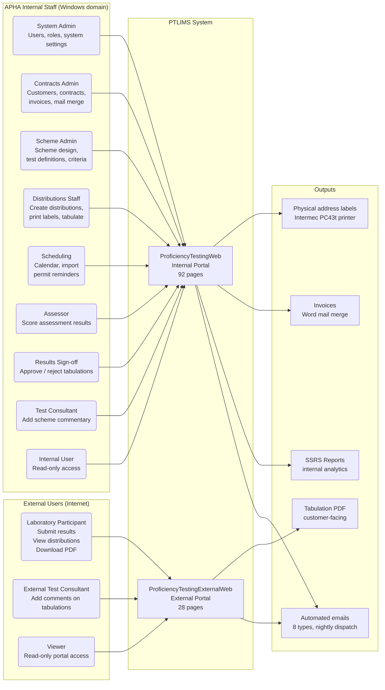

### Distribution Lifecycle — The Core Business Process

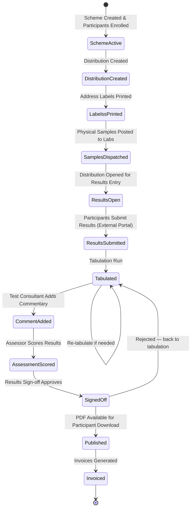

---

## 3. Functional Module Map

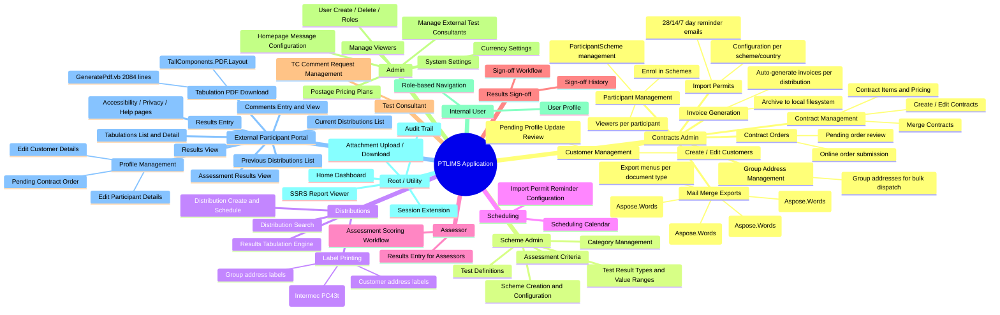

| Module | Key Pages | Notes |
|---|---|---|
| Contracts Admin | `Contract.aspx`, `ContractList.aspx`, `Customer.aspx`, `CustomerList.aspx`, `Participant.aspx`, `ParticipantList.aspx`, `InvoiceGeneration.aspx`, `ExportJobSheets.aspx` + 18 more | Largest area (27 pages); Aspose.Words mail merge throughout |
| Scheme Admin | `SchemeAdmin/` folder — 12 pages | Test definitions, criteria, categories |
| Distributions | `Distributions/GroupAddress.aspx`, `ParticipantAddress.aspx`, `MenuDistributions.aspx` | Label printing happens inline during a web request |
| Scheduling | `Scheduling/` — 12 pages | Import permit reminders triggered from the scheduling calendar |
| Assessor | `Assessor/` — 3 pages | Assessment scoring against scheme criteria |
| Results Sign-off | `Results Sign-off/` — 3 pages | Gated sign-off workflow; rejects re-open tabulation |
| Test Consultant | `Test Consultant/` — 2 pages | Comment request management for external TCs |
| Admin | `Admin/` — 12 pages | User and system administration |
| External Portal — Distributions | `DistributionsCurrent.aspx`, `DistributionsPrevious.aspx`, `TabulationView.aspx` | All data via ASMX proxy calls |
| External Portal — Results | `ResultsEntry.aspx`, `ResultsView.aspx`, `AssessmentResults.aspx` | Results written through ASMX layer |
| External Portal — PDF | `ShowPrintableTabulation.aspx` → `GeneratePdf.GetPdfBytes()` | Customer-facing; 500 on any failure |
| Background Email | `ProficiencyTestingEmailService` | 8 email types; 20-second polling timer |
| Background GDPR | 3 cleanup Windows Services | Delete attachments, consultants, and customer data after retention period |

---

## 4. Legacy Technology Primer

This section explains every unfamiliar technology a .NET developer will encounter before opening the code. Each pattern was mainstream at time of implementation but is now considered legacy or end-of-life.

---

### 4.1 ASP.NET WebForms

**What it is:** The original Microsoft web framework for .NET, introduced in 2002. Each web page is an `.aspx` file (HTML markup) paired with a `.aspx.vb` code-behind file (server-side logic). Pages post back to themselves via `__VIEWSTATE`, a hidden field that serialises the entire page control tree. Server controls (buttons, grids, text boxes) raise server-side events.

**Why it matters here:** `ProficiencyTestingWeb` has 92 `.aspx` pages. `ProficiencyTestingExternalWeb` has 28 pages. ASP.NET WebForms does not exist in .NET 5+. Every page must be rewritten as an ASP.NET Core Razor Page.

**Key patterns you will see:**
- `Page_Load(sender As Object, e As EventArgs)` — runs on every GET and POST to the page
- `IsPostBack` — `false` on first load, `true` when a form is submitted
- `Response.Redirect(url)` — navigates away; throws `ThreadAbortException` by design in .NET 4.x
- `AjaxControlToolkit UpdatePanel` — partial-page AJAX refresh without a full reload; wraps controls in `<asp:UpdatePanel>` with `<Triggers>`
- `GridView`, `DropDownList`, `TextBox` — WebForms server controls with automatic view state and event handling
- Master pages (`.master` / `.master.vb`) — the site-wide template equivalent of `_Layout.cshtml`
- User controls (`.ascx` / `.ascx.vb`) — reusable partial-page components (e.g. `ExpandableTable.ascx`, `TextboxEdit.ascx`)

---

### 4.2 CSLA.NET 2.0.3

**What it is:** A .NET business object framework by Rocky Lhotka. Version **2.0.3** is used here — released circa 2006 against .NET 2.0. It provides base classes for business objects, validation rules, and a **data portal** — a mechanism that transparently routes data fetch/save calls to a local or remote data provider.

**Why it matters here:**
- `PtaBusinessObjects` (528 source files) is built almost entirely on CSLA objects — distributions, schemes, contracts, participants, tabulations, labels, invoices, everything.
- `CustomPrincipal` extends `BusinessPrincipalBase` and is CSLA's equivalent of `ClaimsPrincipal`. It is created by `SecurityModule` on every HTTP request.
- `CustomIdentity` holds the user's roles and maps AD identity to PTLIMS role codes.
- CSLA 2.0.3 uses `System.Runtime.Remoting` and `BinaryFormatter` — **both removed from .NET 5+**. This is categorically different from `System.Runtime.Remoting` being deprecated — it simply does not exist. The application will not compile on .NET 10 while any CSLA 2.0.3 type is referenced.
- There is no CSLA 2.0.3 NuGet package. It is committed as `dlls/Csla.dll` and `dlls/Csla.XmlSerializers.dll`. No upgrade path exists.
- This is the **single highest-risk migration task**. Removing CSLA requires replacing every domain entity's data access with DI-wired repositories.

**Key patterns you will see:**
- `BusinessBase(Of T)` — base class for editable business objects (e.g. `Distribution`, `Scheme`, `Contract`)
- `ReadOnlyBase(Of T)` / `ReadOnlyListBase(Of T)` / `BusinessListBase(Of T)` — read-only and list variants
- `DataPortal_Fetch(criteria)` / `DataPortal_Insert()` / `DataPortal_Update()` / `DataPortal_Delete()` — the methods that contain the real SQL queries and business rules
- `ApplicationContext.User` — CSLA's global user property
- `SecurityModule` — an `IHttpModule` that intercepts every request, builds a `CustomPrincipal` from the Windows identity and AD lookup, and writes an encrypted Forms Authentication ticket

---

### 4.3 ASMX Web Services

**What it is:** Microsoft's original XML web service technology, introduced in 2002. Each service is an `.asmx` file with a code-behind decorated with `[WebService]` and `[WebMethod]` attributes. The runtime generates WSDL automatically and accepts SOAP requests over HTTP.

**Why it matters here:** `ProficiencyTestingWebServices` hosts **28 ASMX endpoints** used by the external web application. When `ProficiencyTestingExternalWeb` needs any data, it calls one of these 27+ ASMX proxies via the `ServiceWrapper` singleton factory. ASMX (`System.Web.Services`) was not ported to .NET Core. All 28 endpoints must be replaced with an ASP.NET Core Web API. Additionally, the external web has **no direct database access** — it is 100% dependent on the ASMX layer for all data operations.

**Key patterns you will see:**
- `.asmx` files — e.g. `Scheme.asmx`, `Tabulation.asmx`, `DistributionForComment.asmx`
- `[WebService(Namespace="...")]` / `[WebMethod()]` — service and method attributes on VB.NET classes
- `Web References/` folder in `PtExternalBusinessObjects` — the auto-generated WSDL proxy files (28 `.datasource`, `.disco`, `.map`, and `.wsdl` files); these are live build dependencies — do not delete them before replacement is validated
- `ServiceWrapper.vb` — a singleton factory in `PtExternalBusinessObjects` that creates and caches all 27+ ASMX proxy instances; calling `ServiceWrapper.SchemeService.GetScheme(id)` internally makes an HTTP POST to the ASMX endpoint

---

### 4.4 TallComponents.PDF.Layout

**What it is:** A commercial .NET PDF layout library by TallComponents. It provides a document object model (`Document`, `Section`, `Table`, `Paragraph`) that you populate programmatically and render to a PDF byte stream. Version 3.0.23.0 is used here.

**Why it matters here:**
- The entire tabulation PDF report — the primary customer-facing output downloaded by external laboratory participants — is generated by `PtExternalBusinessObjects/GeneratePdf.vb`: **2,084 lines, 43 methods**.
- The DLL is **Windows-only and GDI+-dependent**. It will **fail to load on any Linux container**. There is no NuGet package. There is no public source. The vendor is effectively defunct for this version.
- This is the **second highest-risk migration component** and is directly customer-facing: if it fails, every participant receives a 500 error attempting to download their results report.
- The licence is coupled to the on-premise Windows host. The DLL cannot be removed until APHA has signed off the replacement output.

**Key patterns you will see:**
- `TallComponents.PDF.Layout.Document` — root object; constructed with A4 landscape settings
- `TallComponents.PDF.Layout.Section` — page range with headers/footers
- `TallComponents.PDF.Layout.Tables.Table` — used for all structured content (test result tables, ratings, title blocks)
- `TallComponents.PDF.Layout.Paragraphs.XhtmlParagraph` — renders inline HTML (assessor commentary from TinyMCE) — the hardest feature to replicate
- `GetFont()` / `GetBoldFont()` — loads `VERDANA.TTF` / `VERDANAB.TTF` from `Server.MapPath("~/style/font/")` — filesystem-dependent, incompatible with containers
- `GetIndices()` / `GetBreakIndex()` — the custom horizontal pagination engine; tables wider than the page are split into sequential sub-tables

---

### 4.5 System.Drawing.Printing (Label Printing)

**What it is:** The .NET wrapper around Win32 GDI+ for sending rendered content to a Windows print spooler. Used here to print address labels directly from within a web request to a named network Intermec PC43t label printer.

**Why it matters here:** `PtaBusinessObjects/LabelBase.vb` uses `System.Drawing.Printing.PrintDocument` to render label content (participant address, customer address, group address) and dispatch it to the Windows Print Spooler. This is called **synchronously inside an HTTP request handler**. In any Linux container or cloud environment:
1. `System.Drawing.Printing` is not available on Linux (it is `net-windows` only in .NET 5+)
2. There is no Windows Print Spooler accessible from a cloud-hosted container
3. Named network printers cannot be discovered from ECS Fargate tasks

The entire label printing subsystem requires redesign to a ZPL command generation + on-site print agent model.

**Key patterns you will see:**
- `LabelBase.vb` — abstract base class with `PrintLabel()` and `pd_PrintPage()` event handler; GDI+ drawing commands (`e.Graphics.DrawString`, `e.Graphics.DrawRectangle`)
- `ParticipantAddressLabel.vb`, `CustomerAddressLabel.vb`, `GroupAddressLabel.vb` — concrete label types
- `LabelPrinterPrintableWidth` / `LabelPrinterPrintableHeight` — config values (in hundredths of an inch) for the Intermec PC43t paper dimensions
- `PrinterName` appSettings key — the Windows printer name as registered on the server

---

### 4.6 Windows Services (ServiceBase)

**What it is:** A .NET application that runs as a Windows Service process under the Service Control Manager. Inherits from `System.ServiceProcess.ServiceBase` and overrides `OnStart()` / `OnStop()`. Can run interactively (via reflection invoking `OnStart`) for developer testing.

**Why it matters here:** Four Windows Services run on the application server. In any containerised or cloud environment, `ServiceBase` has no equivalent process model. All four must be rewritten as AWS Lambda functions triggered by EventBridge Scheduler.

**The four services:**
- `ProficiencyTestingEmailService` — polls a SQL email queue every 20 seconds; dispatches 8 email types via SMTP
- `ProficiencyTestingDeleteAttachmentsService` — GDPR: deletes file attachments past retention
- `ProficiencyTestingDeleteConsultantService` — GDPR: deletes external TC accounts no longer active
- `ProficiencyTestingRemoveCustomerDataService` — GDPR: removes customer/participant personal data after 7-year retention

**Key patterns you will see:**
- `Public Class ProficiencyTestingEmailService Inherits ServiceBase` — the service class
- `Protected Overrides Sub OnStart(args() As String)` — starts the timer
- `Private Sub Timer_Elapsed(sender, e)` — the recurring work loop
- `BaseCleanupService` in `ProficiencyTestingServiceObjects` — shared base class for all three cleanup services; provides dry-run mode, Dapper TVP bulk deletes, `GuidIdTableType` TVP, and dry-run report output

---

### 4.7 The `dlls/` Folders

**What they are:** Committed folders of DLLs not available on NuGet. Each of the two web applications and the ASMX project has a `dlls/` subfolder.

**Why they matter:** `nuget restore` does not restore these. If a folder is missing or a DLL is absent, the build fails with assembly-not-found errors. The critical contents are:

| DLL | Project | Notes |
|---|---|---|
| `Csla.dll` / `Csla.XmlSerializers.dll` | `PtaBusinessObjects`, `ProficiencyTestingWeb`, `ProficiencyTestingEmailService`, `ProficiencyTestingWebServices` | CSLA 2.0.3 — vendored, no NuGet |
| `TallComponents.PDF.Layout.dll` | `PtExternalBusinessObjects` | TallComponents PDF 3.0.23.0 — proprietary, no NuGet |
| `System.Web.DataVisualization.dll` | `PtExternalBusinessObjects` | GDI+ chart rendering; used inside PDF generation |

---

# Part 2 — Current System Architecture

---

## 5. Solution Structure & Project Layers

The single solution file `ProficiencyTesting.sln` contains **18 projects** grouped into five layers.

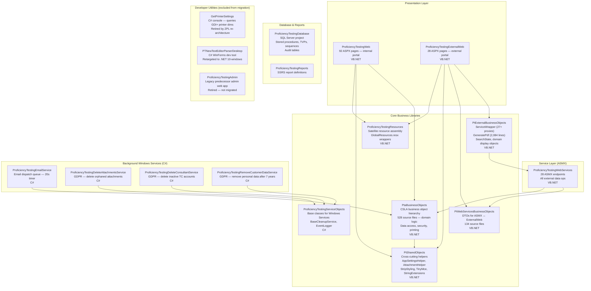

### Project Inventory Table

| Project | Language | Layer | Risk | Notes |
|---|---|---|---|---|
| `ProficiencyTestingWeb` | VB.NET | Presentation | 🔴 High | 92 ASPX pages; Windows Auth; InProc session; label printing |
| `ProficiencyTestingExternalWeb` | VB.NET | Presentation | 🔴 High | Machine keys in source control; InProc session; TallPDF |
| `ProficiencyTestingWebServices` | VB.NET | Service | 🔴 High | 28 ASMX endpoints; no .NET Core support |
| `PtaBusinessObjects` | VB.NET | Business | 🔴 High | CSLA 2.0.3 root; AD via DirectoryServices; label printing; 528 files |
| `PtExternalBusinessObjects` | VB.NET | Business | 🔴 High | `ServiceWrapper` singleton; `GeneratePdf.vb` 2,084 lines; TallPDF |
| `PtWebServicesBusinessObjects` | VB.NET | Business | 🟡 Medium | CSLA v2.0.3 serialised DTOs; 134 files |
| `PtSharedObjects` | VB.NET | Business | 🟡 Medium | `AntiXSS 4.3.0` (deprecated); `StripStyling` HTML sanitiser |
| `ProficiencyTestingResources` | VB.NET | Business | 🟢 Low | Resource assembly; minimal code |
| `ProficiencyTestingServiceObjects` | C# | Business | 🟡 Medium | `BaseCleanupService` — dry run, Dapper TVP; `EventLogger` Windows Event Log |
| `ProficiencyTestingEmailService` | VB.NET | Service | 🔴 High | `ServiceBase`; SMTP `localhost:25`; filesystem templates; hardcoded cert hash |
| `ProficiencyTestingDeleteAttachmentsService` | C# | Service | 🟡 Medium | `ServiceBase`; batch delete via `GuidIdTableType` TVP |
| `ProficiencyTestingDeleteConsultantService` | C# | Service | 🟡 Medium | `ServiceBase`; same pattern as above |
| `ProficiencyTestingRemoveCustomerDataService` | C# | Service | 🟡 Medium | `ServiceBase`; hardcoded 7-year retention `AddYears(-7)` |
| `ProficiencyTestingDatabase` | SQL | Database | 🟡 Medium | `runscripts.bat`; SA-level DDL; `GuidIdTableType` TVP |
| `ProficiencyTestingReports` | SSRS | Reports | 🟡 Medium | `ReportViewer` control; `Microsoft.Reporting.WebForms` |
| `PtaBuisnessObjectsTests` | VB.NET | Tests | 🟡 Medium | Note: project name has intentional typo — preserve in solution references |

---

## 6. Runtime Deployment Topology

PTLIMS has a single deployment topology with a clear split between internal and external access paths. The two web applications share the same SQL Server database but differ fundamentally in how they access it.

```mermaid
flowchart TB
    subgraph Users
        IntUser["APHA Staff\n(AD domain)"]
        ExtUser["Laboratory Participants\n(Internet)"]
    end

    subgraph IIS["On-Premise Windows Server (IIS)"]
        subgraph InternalWeb["ProficiencyTestingWeb (Internal Portal)"]
            PTW_Node["ASP.NET WebForms\nWindows Auth / Kerberos\nInProc Session\nCSLA CustomPrincipal\nDirect DB access"]
        end

        subgraph ExternalWeb["ProficiencyTestingExternalWeb (External Portal)"]
            PTEW_Node["ASP.NET WebForms\nForms Auth (SsoAuth cookie)\nInProc Session\nNo direct DB access\nAll data via ASMX"]
        end

        subgraph ASMXLayer["ProficiencyTestingWebServices (ASMX Layer)"]
            ASMX_Node["28 ASMX endpoints\nSOAP / HTTP\nWindows Auth\nDirect DB access"]
        end

        subgraph WinSvcs["Windows Services (C#)"]
            Email["EmailService\n20-second timer"]
            DelAtt["DeleteAttachmentsService"]
            DelCon["DeleteConsultantService"]
            RemCust["RemoveCustomerDataService"]
        end

        subgraph FileSystem["Local File System (C:\\)"]
            Templates["Word Templates\n(TemplatesFolder)"]
            Uploads["Uploaded Attachments\n(TempFolder)"]
            Invoices["Invoice Archive\n(InvoiceArchivePath)"]
            EmailTpl["Email HTML Templates\n(C:\\Services\\APHA\\...)"]
        end
    end

    subgraph Infra["Infrastructure"]
        SQL[("SQL Server\nProficiencyTesting DB\n10.98.2.4")]
        AD["Active Directory\n(LDAP / DirectoryServices)"]
        Printer["Intermec PC43t\nNetwork Label Printer"]
        SMTP["SMTP Server\n(localhost:25)"]
        SSRS["SSRS\nReporting Services"]
        SSOLogin["VLAServices\nLogin.aspx (SSO redirect)"]
        UserMgmt["UserManagementAdmin\nASMX Service (SSO)"]
    end

    IntUser -- "HTTPS / Windows Auth\nKerberos / NTLM" --> PTW_Node
    ExtUser -- "HTTPS / Forms Auth\nSsoAuth cookie" --> PTEW_Node

    PTW_Node -- "System.Data.SqlClient\nCSLA DataPortal" --> SQL
    PTW_Node -- "System.DirectoryServices\nAD group lookup" --> AD
    PTW_Node -- "System.Drawing.Printing\nGDI+ → Print Spooler" --> Printer
    PTW_Node -- "ASMX / SOAP" --> UserMgmt
    PTW_Node <--> FileSystem

    PTEW_Node -- "ASMX / SOAP HTTP\n27+ ServiceWrapper proxies" --> ASMX_Node
    PTEW_Node -- "HTTP Redirect" --> SSOLogin
    ASMX_Node -- "System.Data.SqlClient" --> SQL
    ASMX_Node -- "ASMX / SOAP" --> UserMgmt

    Email -- "SQL email queue" --> SQL
    Email -- "SMTP" --> SMTP
    Email -- "File.ReadAllText" --> EmailTpl
    DelAtt -- "Dapper + TVP" --> SQL
    DelCon -- "Dapper + TVP" --> SQL
    RemCust -- "Dapper + TVP" --> SQL

    PTW_Node -- "ReportViewer" --> SSRS
    SSRS --> SQL
    PTW_Node <--> FileSystem
```

> **Critical topology observation:** `ProficiencyTestingExternalWeb` has **no direct database connection**. Every piece of data — scheme lists, tabulation results, participant profiles — is fetched by calling one of the 27+ `ServiceWrapper` ASMX proxies, which then call `ProficiencyTestingWebServices`, which calls SQL Server. A single external portal page can trigger a chain of 5–10 sequential SOAP HTTP calls.

### The `BypassVLAWebService` Flag

The `appSettings` key `BypassVLAWebService` in `ProficiencyTestingExternalWeb/Web.config` controls whether the SSO service call for external user validation is skipped. When `true`, the application uses a fallback local credential path for developer testing. This flag is **completely silent** — there is no log entry when it is active. It must be migrated to AWS Parameter Store with a default of `false` for all production environments.

---

## 7. Authentication & Security Flows

### 7.1 Internal Web — Windows Authentication + CSLA CustomPrincipal

`ProficiencyTestingWeb` uses IIS Integrated Windows Authentication. The browser presents a Kerberos or NTLM token; IIS resolves the Windows identity. A custom HTTP module (`SecurityModule` in `PtaBusinessObjects`) then runs on every request.

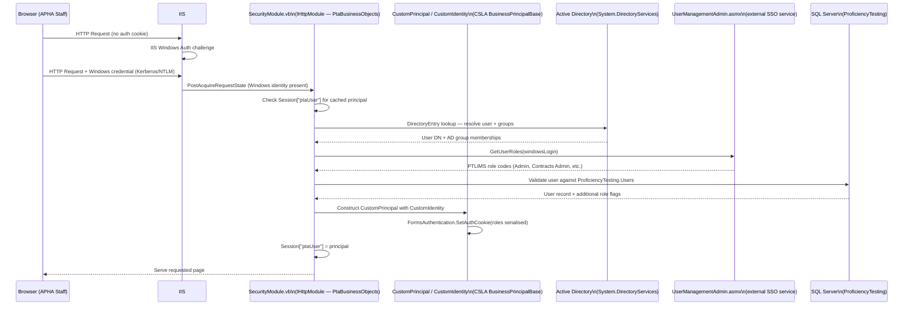

> **Critical Note:** `Session["ptaUser"]` stores the principal in InProc session — per IIS worker process. In a multi-container ECS deployment, each container holds its own session store. A user whose request is routed to a different container will have no session and be re-authenticated — or redirected to login — on every request. This must be replaced with ElastiCache Redis-backed distributed session.

### 7.2 External Web — Forms Authentication + SsoAuth Cookie

`ProficiencyTestingExternalWeb` uses ASP.NET Forms Authentication with a custom cookie named `.SsoAuth`. Unauthenticated requests are redirected to `http://localhost/VLAServices/Login.aspx` — a hardcoded localhost URL that must be updated for every environment.

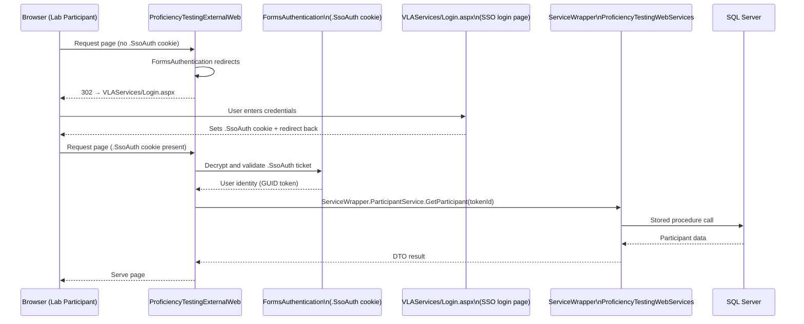

> **Security Issue:** The `validationKey` and `decryptionKey` for the `.SsoAuth` cookie are **hardcoded in plaintext** in `ProficiencyTestingExternalWeb/Web.config` and committed to source control. Any person with repository read access can forge a valid `.SsoAuth` authentication ticket and impersonate any external participant without knowing their credentials. **This must be treated as a day-zero security incident.**

### 7.3 Security Issues Inventory

| Issue | Severity | Location |
|---|---|---|
| `validationKey` / `decryptionKey` hardcoded in source | 🔴 Critical | `ProficiencyTestingExternalWeb/Web.config` — cookie forgery / ViewState deserialisation attack |
| Active Directory service account password in source | 🔴 Critical | `PtaBusinessObjects` config — `Qrf5&R7]89wj518` |
| Hardcoded DB passwords (multiple users) | 🔴 Critical | `web.config` / `app.config` across multiple projects |
| Hardcoded SQL Server IP (`10.98.2.4`) | 🔴 High | Multiple config files — infrastructure mapping exposure |
| Hardcoded SMTP cert hash | 🔴 High | `ProficiencyTestingEmailService/App.config` — `23BE2BC6ECCAAD07327B72C6C571F864E49B42F8` |
| `Aspose.Words.NET.lic` binary in source control | 🟡 Medium | Repository root — commercial licence key exposure |
| `Newtonsoft.Json 5.0.4` — known CVEs | 🟡 Medium | `ProficiencyTestingExternalWeb` |
| `AntiXSS 4.3.0` deprecated | 🟡 Medium | `PtSharedObjects/StripStyling.vb` |
| `aspnet:MaxHttpCollectionKeys=10000` | 🟡 Medium | `ProficiencyTestingWeb/Web.config` — large POST form attack surface |
| `requestValidationMode="2.0"` | 🟡 Medium | `ProficiencyTestingWeb/Web.config` — legacy bypass of request validation |

---

## 8. Key Execution Flows

### 8.1 Tabulation PDF Generation

The most complex customer-facing flow, spanning 5 components across 3 projects. A 500 error here is directly visible to external laboratory participants.

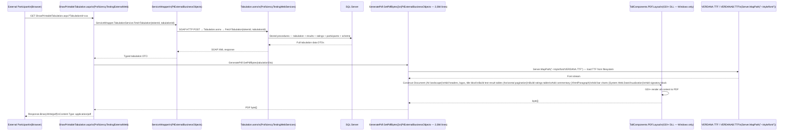

> **Failure modes to know:** (1) Any font file missing from `~/style/font/` → runtime exception on every PDF request. (2) Running in a Linux container → `TallComponents.PDF.Layout.dll` fails to load → every PDF request returns 500. (3) `System.Web.DataVisualization` not available → chart generation fails silently or throws.

### 8.2 Label Printing Flow

Label printing is called **synchronously from within an HTTP request** on the internal portal. There is no queue, no background process, and no retry.

```mermaid
sequenceDiagram
    participant STAFF as APHA Staff\n(Browser)
    participant PAGE as ParticipantAddress.aspx\n(ProficiencyTestingWeb)
    participant PBO as PtaBusinessObjects\nLabelBase.vb → ParticipantAddressLabel.vb
    participant GDI as System.Drawing.Printing\nPrintDocument
    participant SPL as Windows Print Spooler\n(local OS service)
    participant PRT as Intermec PC43t\nNetwork Label Printer

    STAFF->>PAGE: Click "Print Labels" (POST)
    PAGE->>PBO: ParticipantAddressLabel.PrintLabel(distributionId)
    PBO->>GDI: new PrintDocument(); pd.PrinterSettings.PrinterName = "Intermec PC43t"
    GDI->>GDI: pd_PrintPage event: e.Graphics.DrawString(address lines)\ne.Graphics.DrawRectangle(label border)
    GDI->>SPL: Send rendered page to Windows Print Spooler
    SPL->>PRT: Forward print job to network printer by name
    PRT-->>SPL: Acknowledged
    SPL-->>GDI: Print complete
    GDI-->>PBO: Returned
    PBO-->>PAGE: Complete
    PAGE-->>STAFF: Response (page reloads)
```

> **Why this cannot work in ECS Fargate:** Step 4 (`pd.PrinterSettings.PrinterName = "Intermec PC43t"`) requires the printer to be registered in the Windows Print Spooler on the host machine. ECS Fargate tasks run on ephemeral Linux hosts with no Print Spooler. Even Windows containers on ECS cannot reach a named on-premise network printer. The entire `System.Drawing.Printing` pathway must be replaced.

### 8.3 Email Dispatch — Windows Service

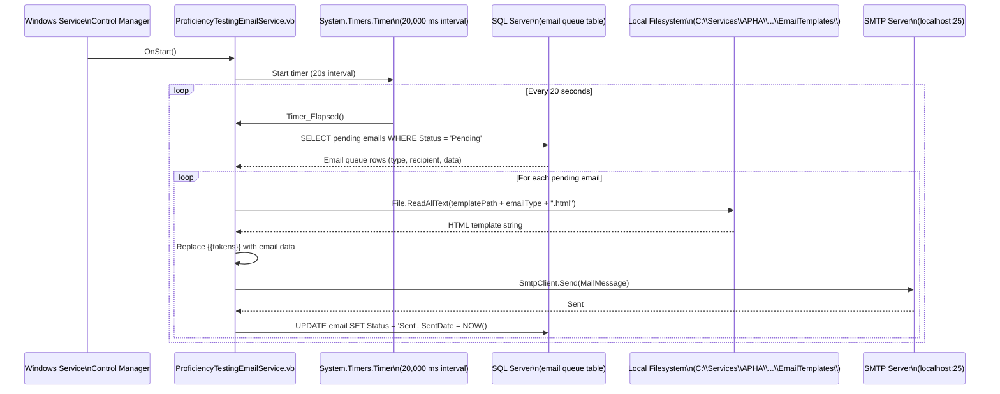

> **Email feature flags:** Eight boolean `appSettings` keys (`SendTestConsultantEmails`, `SendPublishNotificationEmails`, `SendWelcomeEmails`, `SendDistributionPostedEmails`, `SendCustomerUpdateEmails`, `SendParticipantUpdateEmails`, `SendOnlineContractOrderEmail`, `SendImportPermitReminderEmails`) independently control which email types are sent. These are **entirely invisible** unless you read the service source code. All must be migrated to Parameter Store.

### 8.4 GDPR Cleanup Services

All three cleanup services share the same pattern via `BaseCleanupService`:

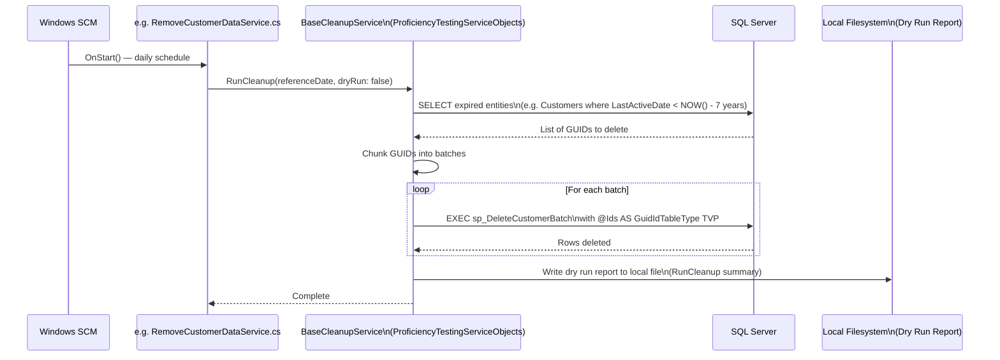

> **Known issue (`RemoveCustomerDataService`):** A 300ms `Task.Delay` is hardcoded between customer and participant batch operations to reduce contention. This is a workaround for a concurrency issue that was never formally diagnosed. The delay must be removed and replaced with proper transaction isolation on RDS.

---

## 9. Data Architecture

### Database Connection

| Context | Server | Database | Credentials |
|---|---|---|---|
| Internal web + ASMX | `10.98.2.4` (hardcoded) | `ProficiencyTesting` | `ProficiencyTestingInternalUser` — plaintext in config |
| External web (via ASMX) | Inherited from ASMX layer | `ProficiencyTesting` | Same |
| Cleanup services | `.\sqlexpress` (dev) / `10.98.2.4` (live) | `ProficiencyTesting` | `ProficiencyTestingExternalUser` — plaintext in config |

> **Security:** All database passwords are committed to source control in plaintext. They must be rotated immediately and moved to AWS Secrets Manager.

### Stored Procedure Naming Convention

PTLIMS uses a mix of stored procedures and inline ADO.NET SQL. Stored procedure names have no consistent prefix convention — they are generally verb-noun (e.g. `GetDistribution`, `SaveTabulation`, `DeleteAttachment`). Data access is performed via `System.Data.SqlClient` through the CSLA `DataPortal` in `PtaBusinessObjects`, and via `Dapper` in the three cleanup services.

### Key Database Objects

| Object | Type | Purpose |
|---|---|---|
| `GuidIdTableType` | TVP (Table-Valued Parameter) | Used by all three cleanup services for bulk GUID-batch deletes via Dapper |
| Audit tables | Tables | Track all insert/update/delete operations with user ID and timestamp |
| Sequences | SQL Sequences | Key generation for certain entity types |
| Email queue table | Table | Persisted email queue polled by `ProficiencyTestingEmailService` |

### Core Schema (Simplified ER)

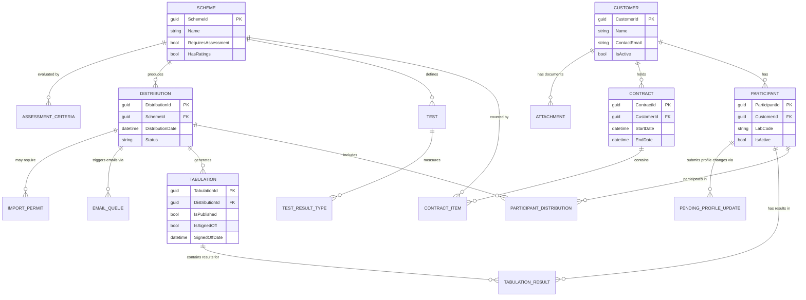

### DB Setup (Dev)

Schema scripts are in `ProficiencyTestingDatabase/`. The deployment mechanism is `deployment/scripts/runscripts.bat` — a simple batch file that runs numbered `.sql` files against the target server. This will be replaced by **Flyway** for the migrated system.

> **Gotcha:** `runscripts.bat` uses `sqlcmd` with SA-level credentials. On RDS SQL Server, SA-level DDL (e.g. `CREATE LOGIN` statements) is not supported. All scripts must be reviewed and adapted before the first RDS dry-run.

---

## 10. External Integrations Map

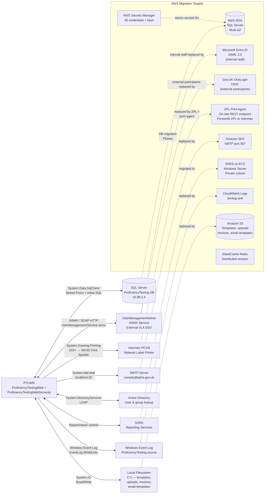

| Integration | Current | Protocol | Migration Target |
|---|---|---|---|
| SQL Server | `10.98.2.4` — on-premise | ADO.NET / Dapper | AWS RDS SQL Server Multi-AZ |
| Identity (internal) | AD + UserManagementAdmin ASMX | Windows Auth / LDAP | SAML 2.0 (Microsoft Entra ID) |
| Identity (external) | SsoAuth cookie + VLAServices Login | Forms Auth redirect | OIDC (Gov.UK OneLogin) |
| Label printing | Windows Print Spooler → Intermec PC43t | System.Drawing.Printing / GDI+ | ZPL command generation + on-site print agent REST |
| Email | SMTP `localhost:25` | System.Net.Mail | Amazon SES (SMTP relay, port 587) |
| File storage | Local filesystem `C:\` | System.IO | Amazon S3 |
| SSRS reports | On-premise SSRS | Microsoft.Reporting.WebForms | SSRS on EC2 (private subnet) + Microsoft.Reporting.NETCore |
| Logging | Windows Event Log | System.Diagnostics.EventLog | Serilog → AWS CloudWatch |
| Secrets | `web.config` / `app.config` plaintext | None (source control) | AWS Secrets Manager + Parameter Store |
| Session | InProc ASP.NET | In-memory per-process | ElastiCache Redis |

---

## 11. Technical Debt & Known Issues

### 11.1 Critical Security Prerequisites (Must Fix Before Any Migration Work)

| # | Issue | Location | Action |
|---|---|---|---|
| 1 | `validationKey` + `decryptionKey` in source control — cookie forgery vulnerability | `ProficiencyTestingExternalWeb/Web.config` | Rotate keys; delete from all config files; store in Secrets Manager |
| 2 | AD service account password in source control | `PtaBusinessObjects` config | Rotate password; delete from source; store in Secrets Manager |
| 3 | All plaintext database passwords in source | `web.config` / `app.config` across projects | Rotate all; delete from source; store in Secrets Manager |
| 4 | Hardcoded SMTP certificate hash | `ProficiencyTestingEmailService/App.config` | Remove `SmtpCertificateHash`; replaced by SES TLS |
| 5 | `Aspose.Words.NET.lic` binary in source control | Repository root | Remove; store in Secrets Manager; load at container startup |
| 6 | Capture PDF baseline before migration begins | `ShowPrintableTabulation.aspx` on live system | Generate tabulation PDFs for representative distributions across all scheme types; archive as acceptance baseline |

### 11.2 Architectural Coupling Hotspots

| Hotspot | Why It's Risky |
|---|---|
| `PtaBusinessObjects` god library | 528 source files covering all domain objects, data access, security, printing, mail merge, invoices, and auditing in a single assembly; any change has a wide blast radius |
| CSLA DataPortal throughout | Auth, data loading, and commands all routed through CSLA data portal; no standard DI pattern; impossible to unit-test without CSLA runtime and a database |
| `ServiceWrapper` singleton | 27+ ASMX proxy instances created and cached at application startup; all cached to the same static singleton; cannot be overridden, mocked, or replaced without touching every call site |
| External web has no direct DB access | 100% ASMX dependency for data; a network partition or ASMX service restart takes down the entire external portal |
| Synchronous label printing from HTTP request | `System.Drawing.Printing` called inline — a slow or unresponsive printer causes the web request to hang indefinitely |
| InProc session on both web apps | Session data stored per IIS worker process; any scale-out, container restart, or app pool recycle loses all active user sessions |
| `GeneratePdf.vb` — no abstraction over TallPDF | 2,084 lines of direct TallComponents API calls; no interface, no base class, no testable seam |
| Hardcoded file paths everywhere | `TempFolder`, `TemplatesFolder`, `InvoiceArchivePath`, `EmailTemplates` path, font paths — all reference `C:\` paths; incompatible with any containerised deployment |

### 11.3 Build-Time Gotchas

| Gotcha | Detail |
|---|---|
| `dlls/` folders not in NuGet | `nuget restore` will succeed; build will fail on assembly-not-found for CSLA, TallComponents.PDF.Layout, and System.Web.DataVisualization |
| `PtaBuisnessObjectsTests` project name typo | The project name has a deliberate historical typo (`BuisnessObjects`); the solution reference and project GUID are both tied to this name — renaming the project breaks references; leave the typo in place |
| Web References build dependency | `PtExternalBusinessObjects/Web References/` contains 28 live WSDL proxy files; removing them before replacement service calls are validated will break the build immediately |
| `Microsoft.JScript` reference | `ProficiencyTestingWeb/Web.config` includes a `Microsoft.JScript` assembly compilation reference; verify actual usage before removing — may be required by a legacy page |

### 11.4 Runtime Landmines

| Landmine | What Happens |
|---|---|
| `BypassVLAWebService=true` in production | External web silently bypasses SSO validation; any user token accepted; no log entry; essentially disables authentication for the external portal |
| `ShowClearDistributionsButton=true` | A destructive "Clear Distributions" button appears in the UI — intended for test environments only; silently visible to users if the flag is not set correctly |
| `ShowResetInvoicesButton=true` | A destructive "Reset Invoices" button appears; same risk as above |
| Font file missing from `~/style/font/` | Every tabulation PDF request returns 500 with no graceful error message to participants |
| ASMX endpoint URL pointing to localhost | All 27+ `ServiceWrapper` URLs default to `http://localhost/...`; in any cloud or multi-server deployment these all fail silently with WebException |
| `SendImportPermitThirdsReminderEmailDays` config key typo | The key name has a typo (should be `Thirds`); if the key is renamed during migration the email feature silently stops working; the typo must be preserved |
| Dry-run report writes to local filesystem | `BaseCleanupService` writes dry-run summary text files to a hardcoded local path; in a container the file is written to ephemeral storage and lost; in Lambda it is not available at all |
| `Task.Delay(300)` in `RemoveCustomerDataService` | An undocumented 300ms sleep between batch operations; masks a concurrency issue with customer/participant deletion ordering; do not remove without investigating the underlying contention |

### 11.5 Known Code Issues (from Migration Analysis)

| # | Issue | Severity |
|---|---|---|
| 1 | Machine keys (`validationKey`/`decryptionKey`) committed to source — active authentication forgery risk | 🔴 Critical |
| 2 | `TallComponents.PDF.Layout.dll` GDI+-dependent — will not load on Linux; all PDF requests return 500 in any container | 🔴 Critical |
| 3 | `System.Web.DataVisualization` also GDI+-dependent — chart generation inside PDF fails on Linux | 🔴 Critical |
| 4 | `ServiceWrapper` static singleton — cannot be mocked; impossible to unit-test external web without a live ASMX service | 🟡 Medium |
| 5 | `GeneratePdf.vb` has no error handling or logging — PDF failures are silent at application level | 🟡 Medium |
| 6 | Positional risks in CSLA DataPortal — business rules embedded in `DataPortal_Fetch` methods are not unit-testable | 🟡 Medium |
| 7 | `Newtonsoft.Json 5.0.4` — multiple known CVEs; 10 major versions behind | 🟡 Medium |
| 8 | `AntiXSS 4.3.0` — deprecated; security patch coverage ended | 🟡 Medium |
| 9 | No input validation at ASMX boundary — `[WebMethod]` parameters are not validated before passing to CSLA | 🟡 Medium |
| 10 | `requestValidationMode="2.0"` — allows unvalidated request data to reach page handlers | 🟢 Low |

---

# Part 3 — Migration Plan

---

## 12. Why We Are Migrating

| Driver | Current Problem | Migration Resolution |
|---|---|---|
| **Platform incompatibility** | ASP.NET WebForms, ASMX, `System.Web`, `System.Drawing.Printing`, and `System.Web.DataVisualization` all have zero support on .NET 10 or Linux containers | Full rewrite of presentation and service layers on ASP.NET Core; all GDI+ dependencies removed |
| **CSLA 2.0.3** | A 2006 vendored DLL using `System.Runtime.Remoting` and `BinaryFormatter` — both removed from .NET 5+; no NuGet package; no upgrade path; no source code | Complete removal; replace every domain entity with DI-wired repositories; replace `CustomPrincipal` with ASP.NET Core `ClaimsPrincipal` |
| **TallComponents PDF** | Proprietary, Windows-only, GDI+-dependent; will not load on Linux; directly customer-facing — failure returns 500 to all lab participants | Replace 2,084-line `GeneratePdf.vb` with Razor + Playwright headless rendering |
| **Label printing** | `System.Drawing.Printing` calls the Windows Print Spooler from inside a web request; no Print Spooler in ECS Fargate | ZPL command generation + on-site lightweight print agent REST endpoint |
| **Security** | Machine keys, AD credentials, DB passwords, SMTP cert hash, and Aspose licence all committed to source control in plaintext; `AntiXSS 4.3.0` and `Newtonsoft.Json 5.0.4` carry active CVEs | All secrets to AWS Secrets Manager; all credentials rotated; library upgrades; SonarCloud OWASP gate |
| **Session state** | InProc session — lost on any container recycle or scale-out; prevents horizontal scaling | ElastiCache Redis distributed session shared across all ECS tasks |
| **Authentication** | Windows Auth (Kerberos/NTLM) requires domain-joined IIS host — impossible in ECS Fargate; Forms Auth `SsoAuth` cookie depends on hardcoded localhost redirect | SAML 2.0 (Entra ID) for internal; OIDC (OneLogin) for external |
| **Background services** | Four Windows Services using `ServiceBase` — Windows-only process model; cannot run in Linux containers | AWS Lambda + EventBridge Scheduler |
| **Maintainability** | ~1,205 VB.NET source files across 10 projects; ASMX service layer adds unnecessary HTTP hop for external web; no DI; no unit tests on business logic | All VB.NET → C#; ASMX retired and replaced by REST API with direct DB access; `Microsoft.Extensions.DependencyInjection` throughout; 80% coverage gate |
| **Operational** | No containerisation; no CloudWatch observability; Windows Event Log not accessible from ECS; no IaC | Docker images in ECR; ECS task definitions; Terraform IaC; Serilog → CloudWatch; blue/green deployment |

---

## 13. Target Architecture

### 13.1 AWS Deployment Topology

```mermaid
graph TB
    subgraph Internet
        IntUser(("APHA Staff\n(Defra VPN)"))
        ExtUser(("Laboratory\nParticipants"))
    end

    subgraph IdP["Identity Providers"]
        EntraID["Microsoft Entra ID\nSAML 2.0\nInternal APHA staff"]
        OneLogin["Gov.UK OneLogin\nOIDC\nExternal participants"]
    end

    subgraph AWS["AWS Cloud (ECS Fargate Cluster)"]
        CF["Amazon CloudFront\nStatic assets / HTTPS"]
        ALB["Application Load Balancer\nHTTPS termination\nBlue/green target groups"]

        subgraph ECSServices["ECS Services (.NET 10 — Linux containers)"]
            InternalWeb["ProficiencyTestingWeb\nASP.NET Core Razor Pages\nSAML 2.0 auth\nRedis session\nAspose.Words\nZPL print dispatch"]
            ExternalWeb["ProficiencyTestingExternalWeb\nASP.NET Core Razor Pages\nOIDC auth\nRedis session\nPlaywright PDF\nChart.js"]
            API["ProficiencyTestingApi\nASP.NET Core REST API\n28 REST controllers\nJWT Bearer auth"]
        end

        subgraph DataTier["Data Tier"]
            RDS[("AWS RDS\nSQL Server\nMulti-AZ")]
            Redis["ElastiCache Redis\nDistributed session"]
        end

        subgraph Serverless["Serverless (.NET 8 Lambda)"]
            LEmail["Lambda\nEmailDispatch\nEventBridge: every 1 min"]
            LDelAtt["Lambda\nDeleteAttachments\nEventBridge: daily"]
            LDelCon["Lambda\nDeleteConsultant\nEventBridge: daily"]
            LRemCust["Lambda\nRemoveCustomerData\nEventBridge: daily"]
            EB["EventBridge Scheduler\nCron triggers"]
        end

        subgraph Storage["Storage"]
            S3[("S3\nTemplates / Uploads\nInvoices / Email templates\nData Protection keys")]
        end

        subgraph SecConfig["Security & Config"]
            SM["Secrets Manager\nDB passwords\nAspose licence\nSES credentials"]
            PS["Parameter Store\nApp settings\nFeature flags\nPrint agent URL\n7-year retention"]
            KMS["KMS\nData Protection key ring\nS3 SSE-KMS"]
        end

        subgraph Observability
            CW["CloudWatch\nLogs + Metrics + Alarms"]
        end

        ECR["ECR\nContainer Registry"]

        subgraph SSRS_Infra["SSRS (EC2 — Private Subnet)"]
            SSRS_EC2["SSRS on Windows Server\nMicrosoft.Reporting.NETCore\nPrivate subnet only"]
        end
    end

    subgraph OnSite["On-site (APHA Premises)"]
        PrintAgent["Print Agent\nLightweight HTTPS REST\nReceives ZPL commands"]
        Printer["Intermec PC43t\nLabel Printer"]
    end

    IntUser -->|"HTTPS / SAML"| ALB
    ExtUser -->|"HTTPS / OIDC"| CF
    CF --> ALB
    ALB --> InternalWeb
    ALB --> ExternalWeb
    ALB --> API

    InternalWeb -->|"REST / JWT"| API
    ExternalWeb -->|"REST / JWT"| API
    API --> RDS
    InternalWeb --> Redis
    ExternalWeb --> Redis
    InternalWeb --> S3
    ExternalWeb --> S3
    API --> S3
    InternalWeb -->|"ZPL over HTTPS"| PrintAgent
    PrintAgent --> Printer

    EntraID <-->|"SAML 2.0"| InternalWeb
    OneLogin <-->|"OIDC / PKCE"| ExternalWeb

    EB --> LEmail
    EB --> LDelAtt
    EB --> LDelCon
    EB --> LRemCust
    LEmail --> RDS
    LEmail --> S3
    LEmail --> SES(["Amazon SES\nSMTP port 587"])
    LDelAtt --> RDS
    LDelCon --> RDS
    LRemCust --> RDS

    InternalWeb --> SSRS_EC2
    SSRS_EC2 --> RDS

    SM --> ECSServices
    SM --> Serverless
    PS --> ECSServices
    PS --> Serverless
    KMS --> S3
    ECSServices --> CW
    Serverless --> CW
```

### 13.2 Target Authentication Flows

**Internal APHA Staff — SAML 2.0 via Microsoft Entra ID:**

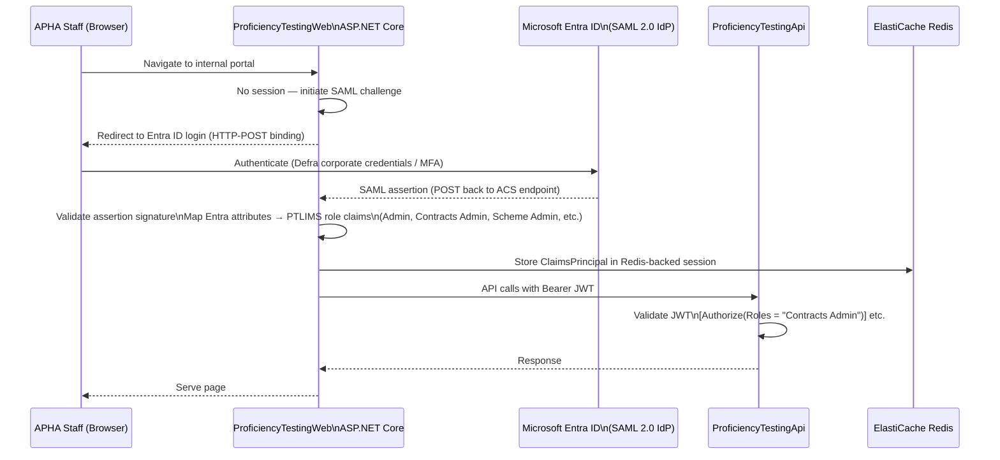

**External Laboratory Participants — OIDC via Gov.UK OneLogin:**

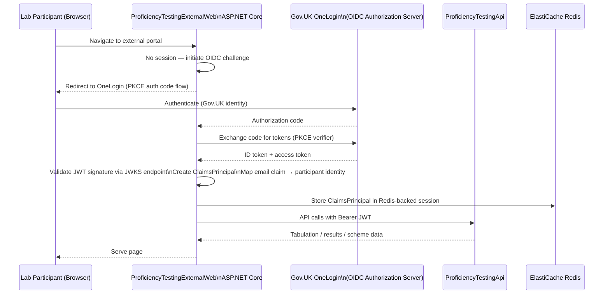

> **Pre-condition for OIDC go-live:** Gov.UK OneLogin requires a **unique email address per identity**. The PT-LIMS customer database contains shared email addresses (multiple labs sharing one contact email) and duplicate accounts. This data quality issue must be fully resolved by the Data Engineer before the OIDC provider can be activated in production. Failure to resolve it blocks OIDC go-live completely.

### 13.3 Target PDF Generation Pipeline

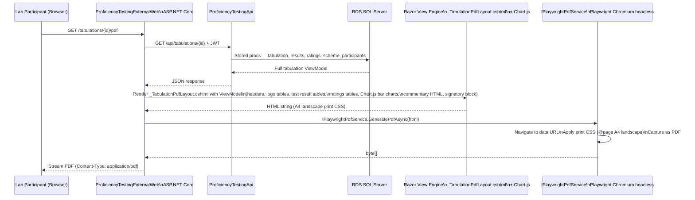

### 13.4 Target Label Printing Pipeline

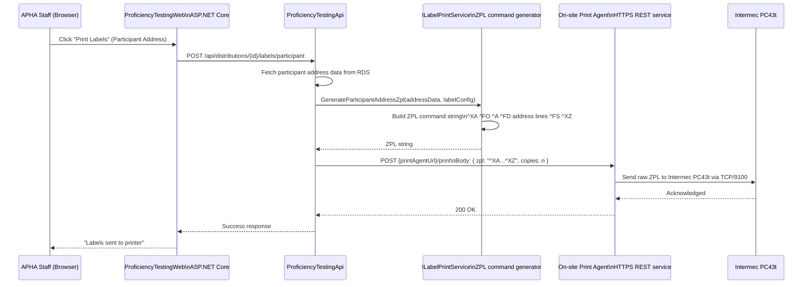

### 13.5 Target Project Structure

| Current Project | Action | Target |
|---|---|---|
| `ProficiencyTestingWeb` | Rewrite | `ProficiencyTestingWeb` — ASP.NET Core Razor Pages (.NET 10) |
| `ProficiencyTestingExternalWeb` | Rewrite | `ProficiencyTestingExternalWeb` — ASP.NET Core Razor Pages (.NET 10) |
| `ProficiencyTestingWebServices` (28 ASMX) | Retire + Rewrite | `ProficiencyTestingApi` — ASP.NET Core REST API (.NET 10) |
| `PtaBusinessObjects` (CSLA) | Decompose | DI-wired repository layer + `ClaimsPrincipal`; `Microsoft.Data.SqlClient`; Dapper |
| `PtExternalBusinessObjects` | Rewrite | `ServiceWrapper` replaced by `IHttpClientFactory` typed clients; `GeneratePdf.vb` replaced by Razor + Playwright |
| `PtWebServicesBusinessObjects` | Convert + Modernise | C# DTOs; remove CSLA serialisation attributes; `System.Text.Json` attributes |
| `PtSharedObjects` | Convert + Modernise | C#; replace `AntiXSS` with `HtmlSanitizer`; `IConfiguration` over `AppSettingsHelper` |
| `ProficiencyTestingResources` | Convert | C#; retain as satellite resource assembly |
| `ProficiencyTestingServiceObjects` | Convert + Modernise | C# (already C#); replace `EventLogger` Windows Event Log with Serilog; `BaseCleanupService` S3 for dry-run reports |
| `ProficiencyTestingEmailService` | Rewrite | AWS Lambda (.NET 8) + EventBridge Scheduler |
| `ProficiencyTestingDeleteAttachmentsService` | Rewrite | AWS Lambda (.NET 8) + EventBridge Scheduler |
| `ProficiencyTestingDeleteConsultantService` | Rewrite | AWS Lambda (.NET 8) + EventBridge Scheduler |
| `ProficiencyTestingRemoveCustomerDataService` | Rewrite | AWS Lambda (.NET 8) + EventBridge Scheduler |
| `ProficiencyTestingDatabase` | Replace runner | Flyway migration scripts (replaces `runscripts.bat`) |
| `ProficiencyTestingReports` | Update | SSRS on EC2; swap `Microsoft.Reporting.WebForms` → `Microsoft.Reporting.NETCore` |
| `PtaBuisnessObjectsTests` | Convert | C# (preserve typo in project name); xunit 3.x; 80% coverage gate |
| `ProficiencyTestingAdmin` | **Retire** | Legacy predecessor — not migrated |
| `GetPrinterSettings` | **Retire** | Made obsolete by ZPL re-architecture |
| `PTNewTextEditorParserDesktop` | Retarget | `net10.0-windows`; no language conversion |

---

## 14. Component Migration Mapping

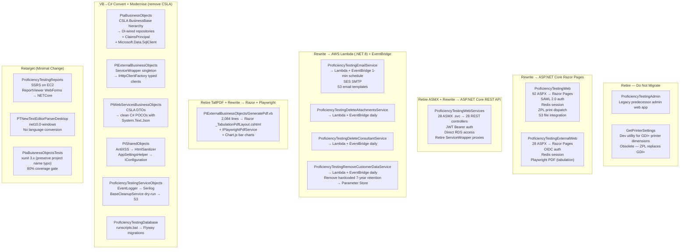

---

## 15. Key Architecture Decisions Record

### Decision 1 — PDF Library Replacement

**Chosen: Razor + Playwright (HTML-first headless rendering)**

| Option | Licence | HTML Rich-Text | Effort (with GHCP) | Status |
|---|---|---|---|---|
| A — QuestPDF | Community (free) / Professional paid | ❌ Custom HTML-to-layout translation | 41.5 person-days | Evaluated |
| B — iText7 + pdfhtml | AGPL / Commercial licence ~£5k/yr | ✅ via pdfhtml add-on | 38.0 person-days | Evaluated |
| C — PDFsharp + MigraDoc | MIT (no cost) | ❌ Custom layer required | ~43 person-days | Evaluated |
| **D — Razor + Playwright** | **Open source (MIT)** | **✅ Browser native CSS** | **~26.5 person-days** | **Chosen** |

**Rationale:** Option D wins on effort, licence cost, and HTML fidelity simultaneously. The tabulation PDF content includes TinyMCE-produced HTML rich text (assessor commentary) and dynamic Chart.js charts. Playwright renders both natively in Chromium, eliminating the need for a custom HTML-to-PDF translation layer. Zero licence cost. Fastest path with AI agent assistance. The main risk is visual regression — the assessment team must approve the output against the legacy TallPDF baseline before go-live.

**Fallback decision tree:**

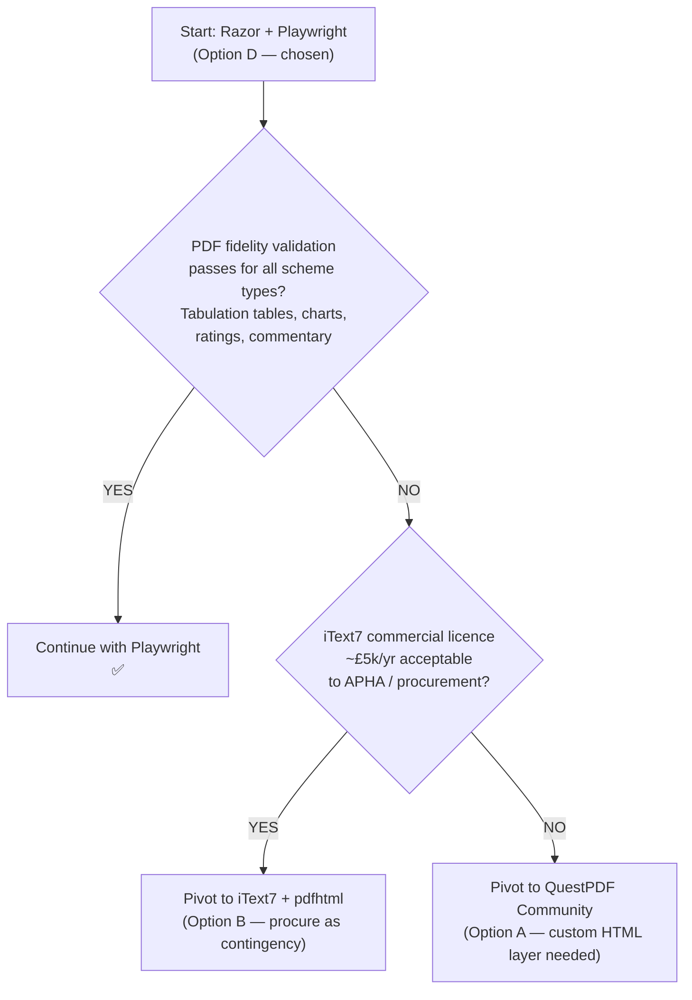

> **Prerequisite:** Begin iText7 licence enquiry in Week 1 as contingency — the procurement process takes time regardless of whether it is ultimately used.

### Decision 2 — Authentication Architecture

| User Group | Chosen Provider | Protocol | Rationale |
|---|---|---|---|
| Internal APHA staff | Microsoft Entra ID | SAML 2.0 (HTTP-POST binding) | Defra organisation already has Entra ID tenancy; maps to existing AD identities |
| External lab participants | Gov.UK OneLogin | OIDC (authorisation code + PKCE) | Government-mandated identity platform for external-facing services; DDTS requirement |
| Lambda service account | AWS IAM execution role | No credentials | Replaces Windows service accounts; IAM role provides permissions via instance profile |

### Decision 3 — Remaining Key Decisions

| Decision | Chosen | Alternatives Considered | Rationale |
|---|---|---|---|
| IoC container | `Microsoft.Extensions.DependencyInjection` | CSLA data portal (EOL), Autofac | Built into ASP.NET Core; zero licence risk; first-class .NET 10 support |
| Session store | ElastiCache Redis | ALB sticky sessions, DynamoDB | Shared across all ECS tasks; sub-millisecond reads; native `IDistributedCache` support |
| SSRS migration | SSRS on EC2 Windows Server | Power BI Embedded, SSRS → PBIRS | Lowest friction; no report rewrites; keeps existing `.rdl` files intact |
| Email | Amazon SES SMTP relay | Microsoft Graph SDK, `System.Net.Mail` | No Microsoft 365 dependency; SES handles bounces and suppression lists; simpler than Graph SDK |
| Logging | Serilog → CloudWatch | NLog, built-in ILogger only | Structured logging; `AWS.Logger.SeriLog` sink is native; CloudWatch alarms on structured properties |
| DB migration tooling | Flyway | Liquibase, EF Core Migrations | SQL-first approach matches existing stored-proc-heavy schema; Jenkins pipeline integration |
| Container OS | Linux (`aspnet:10.0`) | Windows Server 2022 containers | Linux is significantly cheaper on ECS; .NET 10 is tier-1 on Linux; no GDI+ dependencies remain after migration |
| Charts | Chart.js (rendered in Razor before Playwright PDF capture) | SkiaSharp, OxyPlot | Playwright captures the fully-rendered HTML page including Chart.js canvas elements; zero server-side charting code |
| Language | C# (all VB.NET → C#) | VB.NET retained | .NET 10 VB.NET support is maintenance-only; GHCP agent quality is significantly higher for C#; long-term maintainability |
| Lambda runtime | .NET 8 | .NET 10 | AWS Lambda managed runtime for .NET 10 not yet GA at project start; upgrade to .NET 10 Lambda post-GA |
| Label printing | ZPL command generation + on-site print agent REST | Remote desktop printing, shared network printer via VPN | Only architecture that works from a Linux ECS container; print agent is a small on-premise service that forwards ZPL to the Intermec PC43t via TCP/9100 |
| CSLA | Removed — `ClaimsPrincipal` + DI repositories | CSLA 6.x upgrade | CSLA 6 upgrade path requires significant rewrite anyway; DI + Claims is the standard .NET Core pattern; the 2.0.3 → 6.x migration delta is as large as removal |

---

## 16. Migration Phasing & Timeline

**Programme:** 15 weeks · Start 3 August 2026 · Target go-live 13 November 2026  
**Team:** 2 Developers, 1 QA Engineer, 1 DevOps Engineer, 1 Data Engineer

```mermaid
gantt
    title PTLIMS Migration — 15-Week Schedule
    dateFormat YYYY-MM-DD
    axisFormat %d %b

    section Phase 1 — Foundation (W1–W2)
    Secrets remediation (day-zero)          :crit, sec,  2026-08-03, 2d
    VB→C# bulk conversion (Dev1+Dev2+AIM)   :crit, lc,   2026-08-03, 10d
    Jenkins .NET 10 pipeline + Docker base  :      ci,   2026-08-03, 5d
    RDS instance + Flyway baseline (DE)     :      de,   2026-08-03, 5d
    Test plan + PDF baseline capture (QA)   :      qa0,  2026-08-03, 5d

    section Phase 2 — Core Architecture (W3–W5)
    ASP.NET Core scaffold + CSLA removal    :crit, fm,   2026-08-17, 10d
    REST API scaffold (28 endpoints)        :      sl,   2026-08-17, 10d
    Auth design sign-off (SAML + OIDC)      :crit, as,   2026-08-17, 5d
    Secrets Manager + IConfiguration        :      da,   2026-08-17, 5d
    DB changes — credentials, schema (DE)   :      dci,  2026-08-17, 10d

    section Phase 3 — Feature Migration (W5–W9)
    Internal web UI — 92 pages (Dev1)       :crit, ui,   2026-08-31, 20d
    External web UI — 28 pages (Dev2)       :      ew,   2026-08-31, 15d
    SAML implementation (Dev1)              :      saml, 2026-08-31, 10d
    OIDC implementation (Dev2)              :      oidc, 2026-09-07, 10d
    TallPDF → Playwright (Dev1)             :crit, pdf,  2026-09-07, 15d
    Label printing ZPL (Dev1)               :      lp,   2026-09-28, 5d

    section Phase 4 — Integration (W9–W11)
    Lambda services — 4 functions (Dev2)    :      lm,   2026-09-28, 5d
    SSRS on EC2 (DE + DevOps)               :      ssrs, 2026-09-28, 5d
    Security hardening — SonarCloud         :      sh,   2026-09-28, 5d
    DB dry-run 1 (DE)                       :      dr1,  2026-09-07, 5d

    section Phase 5 — Testing & QA (W9–W14)
    Unit + integration tests                :      ts,   2026-09-07, 35d
    QA regression — internal (92 pages)     :crit, qri,  2026-10-12, 10d
    QA regression — external (28 pages)     :crit, qre,  2026-10-26, 10d
    PDF visual regression — tabulation      :crit, pvr,  2026-09-28, 5d
    UAT Round 1 + defect fixes              :      uat1, 2026-10-26, 5d
    UAT Round 2 + APHA sign-off             :crit, uat2, 2026-11-02, 5d

    section Phase 6 — Go-Live (W14–W15)
    DB dry-run 2 + performance baseline     :      dr2,  2026-10-12, 5d
    Blue/green production deployment        :crit, gl,   2026-11-09, 3d
    Post-go-live stabilisation              :      stab, 2026-11-11, 3d

    section Milestones
    M1 Foundation complete                  :milestone, m1, 2026-08-14, 0d
    M2 Core architecture complete           :milestone, m2, 2026-08-28, 0d
    M3 All web pages migrated               :milestone, m3, 2026-09-25, 0d
    M4 PDF pipeline validated               :milestone, m4, 2026-10-09, 0d
    M5 Test suite complete                  :milestone, m5, 2026-10-30, 0d
    M6 UAT sign-off                         :milestone, m6, 2026-11-06, 0d
    M7 Go-live                              :milestone, m7, 2026-11-13, 0d
```

### Critical Path

```mermaid
flowchart LR
    SEC["🔴 Secrets\nRemediation\nW1 — Day 1"] --> LCB["VB→C# bulk\nconversion\nW1–W2"]
    LCB --> FM["Framework\nmigration + CSLA removal\n.NET 10\nW3–W5"]
    FM --> AUTH["Auth design\nSAML + OIDC\nW3"]
    AUTH --> ASMX["ASMX high-complexity\nTabulation.vb\nDistributionForComment.vb\nResultsEntry, Scheme\nW5–W10\n⚠️ Longest dev track"]
    AUTH --> PDF["TallPDF → Playwright\n15 days\nW6–W9\n⚠️ Customer-facing"]
    ASMX --> QRE["QA Regression\nExternal portal\nW11–W13"]
    PDF --> PVR["PDF visual\nregression\nW10"]
    QRE --> UAT["UAT Round 1\n+ Defect Fixes\nW14"]
    PVR --> UAT
    UAT --> UAT2["UAT Round 2\nAPHA sign-off\nW14–W15"]
    UAT2 --> GL["🚀 Go-Live\nW15"]
```

> **Critical dependency:** The ASMX high-complexity retirement track (17 person-days across 6 endpoints) is the single longest sequential development task and determines when QA can complete full external portal regression. If this track slips, UAT must be split — auth/profile flows tested first, tabulation/results flows second.

### Role Assignments

| Role | Phase 1–2 | Phase 3–4 | Phase 5–6 |
|---|---|---|---|
| Dev 1 | CSLA removal, Auth module design, internal web scaffold | SAML, internal 92 pages, TallPDF → Playwright, ZPL printing | Security hardening, Lambda services, bug triage |
| Dev 2 | VB→C# conversion lead, REST API scaffold, config externalisation | OIDC, external 28 pages, ASMX retirement (17 days), email Lambda | MS Graph alt paths, bug triage |
| QA | Test plan, PDF baseline capture | Component testing per sprint | Full regression (120 pages), PDF visual diff, UAT × 2 |
| DevOps | Docker base image, Jenkins pipeline, ECS task definitions | Terraform IaC (all AWS), ECR, ALB | CloudWatch alarms, blue/green, production deployment |
| Data Engineer | RDS + Flyway baseline, DB script review | DB changes (credentials, schema, TVP validation), dry-run 1 | Dry-run 2, production data cutover, SSRS connectivity |

---

## 17. Effort Estimates & AI Agent Strategy

### Effort Summary

| Category | Manual (days) | Agent-Assisted (days) | Total (days) | AI Saving |
|---|---:|---:|---:|---:|
| VB.NET → C# conversion | 25 | 11 | 36 | ~70% |
| Application framework migration | 14 | 15 | 29 | ~49% |
| Internal web UI — 92 pages | 61 | 47 | 108 | ~56% |
| External web UI — 28 pages | 21 | 16 | 37 | ~57% |
| Service layer — ASMX → REST (28 endpoints) | 13.5 | 9.5 | 23 | ~59% |
| PDF report migration (Playwright) | 12.75 | 13.75 | 26.5 | ~48% |
| Label printing re-architecture (ZPL) | 5.5 | 6.5 | 12 | ~46% |
| SSRS migration | 4 | 5 | 9 | ~44% |
| Authentication & security | 8.5 | 9 | 17.5 | ~49% |
| Email service & Lambda jobs (4 functions) | 10.5 | 6.5 | 17 | ~62% |
| Data access layer | 2.85 | 2.15 | 5 | ~57% |
| Database migration | 8 | 8 | 16 | ~50% |
| Infrastructure & DevOps (Terraform / CI/CD) | 18.25 | 14.25 | 32.5 | ~56% |
| Unit & integration testing | 23.25 | 15.75 | 39 | ~60% |
| QA & end-to-end regression | 15.5 | 46.5 | 62 | ~25% |
| Project governance & setup | 4.75 | 4.75 | 9.5 | ~50% |
| **Total** | **~248** | **~230** | **~478** | **~52%** |

> **Note — why QA achieves only 25% AI saving:** PDF visual regression (5 days) and functional regression across 120 pages require human judgement and cannot be delegated to agents. UAT with APHA VETQAS stakeholders (5 days) requires domain expertise. Agents surface diffs; humans make the acceptance decision.

### Agent Roles and Human Review Gates

```mermaid
flowchart TD
    subgraph Agents["AI Agents Used"]
        AIM["GitHub Copilot Agent Mode\nBulk code transformation\nVB→C# conversion (1,205 files)\nASP.NET Core scaffolding\nRazor page generation\nTest auto-generation"]
        ACH["GitHub Copilot Chat\nTargeted Q&A\nAPI research\nSQL compatibility queries\nCode explanation"]
        PLW["Playwright MCP Agent\nE2E test generation\nPDF visual comparison\nHeadless browser automation"]
        AWQ["AWS Q Developer\nTerraform IaC (ECS, RDS, Lambda)\nCloudWatch configuration\nSecretsManager / Parameter Store patterns\nIAM policy generation"]
        DBT["Dependabot\nNuGet package bumps\nAuto-PR for dependency updates"]
        SCL["SonarCloud AI Fix\nOWASP vulnerability detection\nFix suggestions for all security issues"]
    end

    subgraph Gates["Mandatory Human Review Gates"]
        PRG["Every agent-generated PR\nreviewed by a human developer\nbefore merge — NO EXCEPTIONS"]
        SECG["SonarCloud security issues\nreviewed + approved by human\nbefore closing — NO EXCEPTIONS"]
        PDFG["PDF visual regression\nEquivalence judged by human QA\n+ APHA domain sign-off\nAgents flag diffs; humans decide"]
        UATG["UAT sign-off\nAPHA VETQAS stakeholders\nCannot be delegated to agents"]
        CSAMLG["SAML / OIDC claim mapping\nHuman must agree claim schema\nwith Entra ID team and OneLogin\nbefore implementation"]
    end

    AIM --> PRG
    ACH --> PRG
    PLW --> PDFG
    SCL --> SECG
    PRG --> UATG
    CSAMLG --> PRG
```

### Tasks With Zero Agent Savings (100% Human)

| Task | Days | Why |
|---|---|---|
| Tabulation PDF visual regression — all scheme types | 5 | Agents flag pixel diffs; only APHA domain experts can judge whether a layout deviation is acceptable for a regulatory participant report |
| Functional regression — all 120 pages | ~21 | Structured manual walkthrough; agents cannot assess functional equivalence against business intent |
| UAT with APHA VETQAS stakeholders | 5 | Requires veterinary testing domain expertise; cannot be delegated |
| Physical label print validation | 3 | Requires on-site access to the Intermec PC43t printer; ZPL output can only be verified by printing physical labels |

---

## 18. Risk Register

| ID | Risk | Likelihood | Impact | Mitigation |
|---|---|---|---|---|
| R-01 | **ASMX high-complexity services** (6 services, 15 WebMethods: Tabulation.vb, DistributionForComment.vb, ResultsEntry, Scheme, PendingParticipantScheme, PendingParticipantUpdate) contain undocumented business logic not visible from the WSDL — effort substantially underestimated | High | **Critical** | Timebox each high-complexity service; escalate to Product Owner if scope grows beyond 8 days; consider deferring non-critical services to a post-go-live sprint |
| R-02 | **CSLA removal reveals hidden business rules** embedded in `DataPortal_Fetch` / `DataPortal_Insert` / `DataPortal_Update` callbacks — every method must be manually inspected to extract rules before removal | High | **Critical** | Audit all DataPortal methods in Week 1; write characterisation tests before removal; run E2E baseline against legacy system before migration begins |
| R-03 | **TallPDF → Playwright visual regression rejected** by APHA during validation — pixel differences in tables, charts, ratings layout, or horizontal pagination logic require rework | Medium | High | Agree visual acceptance criteria with APHA in Week 1; archive official TallPDF PDF baselines from live system before migration; use toleranced visual diff tooling for non-critical layout differences |
| R-04 | **Entra ID / OneLogin provider configs delayed** waiting on external teams — SAML/OIDC cannot be integration-tested without tenants | High | Medium | Request both in Week 1; use Keycloak (in-house mock IdP) for Dev/Test until provider configs are available |
| R-05 | **Email deduplication** reveals complex shared-account scenarios (labs sharing one email, consultants with multiple accounts) requiring manual APHA decisions before `UniqueEmail` constraint can be applied | Medium | High | Data Engineer begins deduplication assessment in Week 2; findings presented to Product Owner by Week 5; block OIDC go-live on resolution |
| R-06 | **RDS SQL Server compatibility issues** — SQL collations, unsupported T-SQL, SA-level DDL in `runscripts.bat`, or `GuidIdTableType` TVP behaviour differences discovered during Dry-Run 1 | Medium | Medium | Complete AWS Schema Conversion Tool (SCT) assessment in Weeks 1–2; inventory all DDL statements that require SA-level permissions; validate TVP pattern in integration tests before Dry-Run 1 |
| R-07 | **Playwright headless Chromium inside Linux container** produces inconsistent rendering or out-of-memory errors under concurrent tabulation PDF load | Low | High | Spike Playwright container behaviour under concurrent load in an isolated test by Week 7; set concurrency limits and memory reservations in ECS task definitions; consider a dedicated PDF service container |
| R-08 | **APHA VETQAS staff unavailable** during the scheduled UAT window in Weeks 14–15 | Medium | Medium | Secure UAT participant commitment and calendar blocks by Week 8; build a two-week buffer between UAT sign-off and production cutover |
| R-09 | **Unit test coverage insufficient** across ASMX business object replacements — serialisation defects surface late in QA regression rather than during development | Medium | Medium | Dev team writes unit tests incrementally within each feature sprint; test writing is not deferred to a single phase; 80% coverage gate enforced in Jenkins pipeline |
| R-10 | **Print agent on-site deployment** not ready for go-live — APHA IT must install and configure the lightweight REST print agent on-premise at APHA before production cutover | Medium | High | Agree print agent architecture and installation requirements with APHA IT in Week 2; provide deployment package and installation guide by Week 10; include print agent validation in UAT |
| R-11 | **AI agent code quality on CSLA removal** — agent output may be subtly incorrect, especially for CSLA-to-DI translation where implicit behaviour in `DataPortal_Fetch` methods is not visible in the class signature | High | High | Every agent-generated PR reviewed by a human developer; mandatory SonarCloud gate; characterisation tests before and after CSLA removal |
| R-12 | **Scope creep** — APHA requesting new features or UX improvements during the migration window | Medium | Low | Enforce change control from Week 1; all new requests logged to a post-go-live backlog; no new scope accepted after Week 3 |

---

# Part 4 — Getting Started

---

## 19. Pre-Migration Prerequisites Checklist

These items **must be complete before any migration code is written**. Items 1–5 are security-critical and must be treated as day-zero actions.

- [ ] **1. Rotate and remove `validationKey` / `decryptionKey`** from `ProficiencyTestingExternalWeb/Web.config`; generate new keys; store in AWS Secrets Manager; update all environments; treat existing keys as compromised
- [ ] **2. Rotate Active Directory service account password** (`Qrf5&R7]89wj518` committed in `PtaBusinessObjects` config); remove from all config files; store in Secrets Manager
- [ ] **3. Rotate all plaintext database passwords** (`ProficiencyTestingInternalUser`, `ProficiencyTestingExternalUser`) across all `web.config` / `app.config` files; delete from source; store in Secrets Manager
- [ ] **4. Remove SMTP certificate hash** (`23BE2BC6ECCAAD07327B72C6C571F864E49B42F8`) from `ProficiencyTestingEmailService/App.config`; replaced by SES TLS — no cert pinning needed
- [ ] **5. Remove `Aspose.Words.NET.lic` binary** from source control; store licence in Secrets Manager; update licence loading to read from Secrets Manager at container startup
- [ ] **6. Capture tabulation PDF baseline** — generate tabulation PDFs for representative distributions covering: schemes with ratings, schemes without ratings, schemes requiring assessment, schemes with test consultant comments, large schemes (max columns); save as acceptance comparison baseline; agree visual acceptance criteria with APHA before migration begins
- [ ] **7. Upgrade `Newtonsoft.Json 5.0.4` → 13.x** — execute in Week 2 as first code change; run full CSLA object serialisation and round-trip tests before ASMX retirement begins
- [ ] **8. Provision AWS environment** — IAM roles, VPC (hub + spoke), RDS SQL Server Multi-AZ, ECR registry, ElastiCache Redis cluster, S3 buckets (5+), Secrets Manager entries, Parameter Store entries, Lambda functions stub, EventBridge rules — must exist before DevOps pipeline work begins in Week 2
- [ ] **9. Request Defra Entra ID Enterprise App registrations** (all 4 environments: Dev, Test, UAT, Prod) — requires Defra IT; initiate in Week 1; SAML implementation gated on this
- [ ] **10. Request Gov.UK OneLogin client registrations** (all 4 environments) — OIDC implementation gated on this; initiate in Week 1; set up Keycloak mock IdP for development use in parallel
- [ ] **11. Agree branch strategy** — `main` / `develop` / `feature/*` / `migration/*`; branch protection rules; PR template; merge cadence for long-running VB→C# conversion branch
- [ ] **12. Begin email deduplication assessment** — Data Engineer queries customer DB for duplicate/shared email addresses; findings needed by Week 4 to determine OIDC go-live blockers
- [ ] **13. Confirm Verdana font commercial licence** — `VERDANA.TTF` / `VERDANAB.TTF` must be embedded in the External Web container image; confirm with legal that the existing licence covers this use
- [ ] **14. Initiate iText7 commercial licence enquiry** — as contingency if Playwright PDF fidelity validation fails; procurement process takes time; start in Week 1
- [ ] **15. Agree print agent architecture with APHA IT** — the on-site lightweight REST service that receives ZPL from ECS and forwards to Intermec PC43t; installation responsibility, network access, and deployment timeline must be agreed before Week 8

---

## 20. Developer Onboarding: First Week

Follow these steps in order to build a working local environment and develop an understanding of the system.

### Day 1 — Build

1. **Clone the repository** `proficiency-testing-2025-10` — ensure all `dlls/` subfolders are present in the working copy. If absent, retrieve from the team file share. If CSLA, TallComponents, or System.Web.DataVisualization DLLs are missing, the build will fail immediately.
2. **Install prerequisites:** Visual Studio 2022 (ASP.NET + .NET desktop workloads), .NET Framework 4.8 Developer Pack, SQL Server Express, SSMS, IIS 8.5+ with Windows Authentication and ASP.NET features enabled.
3. Open `ProficiencyTesting.sln` in Visual Studio 2022.
4. Right-click solution → **Restore NuGet Packages**.
5. **Build → Build Solution** (Ctrl+Shift+B). Resolve any errors — they will almost always be missing `dlls/` assemblies or NuGet path issues.
6. Confirm build succeeds with zero errors across all 16 active projects.

### Day 1 — Database

7. In SSMS, create the database and users:
   ```sql
   CREATE DATABASE ProficiencyTesting;
   CREATE LOGIN ProficiencyTestingInternalUser WITH PASSWORD = 'localdevonly';
   CREATE LOGIN ProficiencyTestingExternalUser WITH PASSWORD = 'localdevonly';
   USE ProficiencyTesting;
   CREATE USER ProficiencyTestingInternalUser FOR LOGIN ProficiencyTestingInternalUser;
   CREATE USER ProficiencyTestingExternalUser FOR LOGIN ProficiencyTestingExternalUser;
   EXEC sp_addrolemember 'db_owner', 'ProficiencyTestingInternalUser';
   EXEC sp_addrolemember 'db_owner', 'ProficiencyTestingExternalUser';
   ```
8. Run the scripts from `ProficiencyTestingDatabase/` using `deployment/scripts/runscripts.bat` — or run the `.sql` files manually in order.
9. Apply any change scripts in version order from the deployment scripts folder.

### Day 1 — Run the Applications

10. In IIS Manager: create a site pointing to `ProficiencyTestingWeb/`, enable **Windows Authentication**, disable Anonymous Authentication. Set the application pool to use your Windows identity.
11. In `ProficiencyTestingWeb/Web.config`, verify the connection string points to your local SQL Express instance.
12. Set `ProficiencyTestingWeb` as the startup project; press F5.
13. Navigate to `http://localhost/Home.aspx` — you should see the internal portal home page authenticated as your Windows user.
14. For the external web, also start `ProficiencyTestingExternalWeb` — note it will redirect to `VLAServices/Login.aspx` (the SSO service). Set `BypassVLAWebService=true` in Web.config to bypass SSO for local testing.

### Day 2 — Explore Key Flows

15. Run any existing unit tests in `PtaBuisnessObjectsTests` — note the intentional typo in the project name; this is by design.
16. Navigate to `Contracts Admin / Contract.aspx` and create a test contract — this exercises the CSLA `BusinessBase` create/save flow and gives you a sense of the data model.
17. Navigate to `Distributions / ParticipantAddress.aspx` — attempt to print labels. This will call `LabelBase.vb` and reach `System.Drawing.Printing`. It will fail if the Intermec printer is not on the network — observe the failure mode.
18. In the external web (with `BypassVLAWebService=true`), navigate to `ShowPrintableTabulation.aspx` for an existing tabulation — this exercises the full `GeneratePdf.GetPdfBytes()` pipeline through `TallComponents.PDF.Layout`.
19. Observe the email service in `ProficiencyTestingEmailService` — start it as a console app (it uses reflection to call `OnStart`/`OnStop`) and watch the 20-second timer fire against the email queue table.

### Day 2–3 — Read the Documents

20. Read [PTLIMS_AWS_Migration_Analysis.md](../PTLIMS_AWS_Migration_Analysis.md) — project-by-project analysis with all risks rated.
21. Read [ptlims-net10-migration-plan.md](../ptlims-net10-migration-plan.md) — full task breakdown with effort estimates per category.
22. Read [implementation-plan-devs.md](../implementation-plan-devs.md) — developer-facing 18-week Gantt, critical path, RAID log.
23. Read [ptlims-tallpdf-analysis-report.md](../ptlims-tallpdf-analysis-report.md) — `GeneratePdf.vb` deep-dive: all 43 methods, complexity drivers, PDF structure.
24. Read this document in full — pay particular attention to:
    - [Section 4](#4-legacy-technology-primer) — Legacy Technology Primer (CSLA 2.0.3, ASMX, TallPDF, `System.Drawing.Printing`)
    - [Section 11](#11-technical-debt--known-issues) — Technical Debt (security issues and runtime landmines)
    - [Section 15](#15-key-architecture-decisions-record) — Architecture Decisions (why Playwright, why ZPL, why SSRS on EC2)

### Day 3–5 — Orient in Code

25. Open `PtaBusinessObjects/Security/SecurityModule.vb` — understand the `IHttpModule` that authenticates every internal web request.
26. Open `PtaBusinessObjects/Security/CustomPrincipal.vb` and `CustomIdentity.vb` — understand the CSLA principal you will be replacing with `ClaimsPrincipal`.
27. Open `PtaBusinessObjects/Distribution/Distribution.vb` — examine a typical `BusinessBase(Of T)` class; find the `DataPortal_Fetch`, `DataPortal_Insert`, `DataPortal_Update`, `DataPortal_Delete` methods; these contain the real data access logic you must extract.
28. Open `PtExternalBusinessObjects/GeneratePdf.vb` — scroll through all 43 methods; understand `GetPdfBytes()`, `BuildTestTable()`, `GetIndices()`, `GetBreakIndex()` — the horizontal pagination engine is the most complex piece.
29. Open `PtExternalBusinessObjects/ServiceWrapper.vb` — understand the singleton factory pattern you will replace with `IHttpClientFactory` typed clients.
30. Open `ProficiencyTestingWebServices/Tabulation.asmx.vb` — understand the most complex ASMX endpoint (tabulation data for PDF generation); this is one of the six high-complexity ASMX services on the critical path.
31. Open `PtaBusinessObjects/Label/LabelBase.vb` — understand `System.Drawing.Printing` usage; identify the `LabelPrinterPrintableWidth` / `LabelPrinterPrintableHeight` config values you must preserve as ZPL label dimensions.
32. Attend the KT walkthrough session with the outgoing developer (allow 2–3 hours).

---

## 21. Definition of Done

### Per-Phase Acceptance Criteria

| Phase | Definition of Done |
|---|---|
| Phase 1 — Foundation | All 16 active projects compile targeting `net10.0`; all VB.NET converted to C#; CI pipeline builds and runs unit tests on each PR; RDS instance reachable and Flyway baseline applied; all critical secrets (machine keys, AD password, DB passwords, Aspose licence) removed from source control and rotated |
| Phase 2 — Core Architecture | ASP.NET Core host (`Program.cs`) starts and serves requests for both web apps and API; DI container wired; Redis session working; 10+ REST endpoints exercised with integration tests; SAML and OIDC design documents approved by both identity provider teams; all config migrated from `web.config` to `IConfiguration` + Parameter Store / Secrets Manager |
| Phase 3 — Feature Migration | All 92 internal ASPX pages have Razor Page equivalents with CSRF protection; all 28 external ASPX pages migrated; SAML and OIDC auth flows complete end-to-end; tabulation PDF generates via Playwright + Chart.js; label printing dispatches ZPL to print agent endpoint; ASMX retirement complete (all 28 endpoints replaced by REST controllers) |
| Phase 4 — Integration | All 4 Lambda functions triggered by EventBridge and functioning (email dispatch, 3 GDPR services); SSRS on EC2 serves reports from RDS data; S3 integration complete (templates, uploads, invoices, email templates); SonarCloud gate green (zero critical, zero high OWASP issues) |
| Phase 5 — Testing | 80% unit test coverage on all migrated code (enforced in Jenkins); all 120 pages pass functional regression (QA sign-off); tabulation PDF visual regression approved by APHA domain expert; physical label print validated on Intermec PC43t; UAT Round 2 signed off by APHA VETQAS stakeholders |
| Phase 6 — Go-Live | Blue/green ECS deployment to production complete; health checks passing; CloudWatch alarms configured and confirmed firing; rollback procedure tested; print agent validated on-site; operational runbooks written and approved |

### Programme-Level NFRs (Non-Functional Requirements)

| NFR | Target |
|---|---|
| Tabulation PDF visual equivalence | Pixel-level comparison of Playwright output approved by APHA VETQAS — all scheme types covered (with/without ratings, with/without assessment, with/without TC comments) |
| Horizontal table pagination | Test result tables and ratings tables split correctly across page width for high-column-count distributions |
| Label print fidelity | ZPL-generated labels produce address text, layout, and dimensions matching the legacy GDI+ output when printed on the Intermec PC43t |
| PDF concurrency | Playwright PDF service handles concurrent tabulation requests without OOM — load tested at peak concurrency (simultaneous download by multiple participants after tabulation sign-off) |
| Authentication security | All session cookies: `Secure`, `HttpOnly`, `SameSite=Strict`; SAML assertions validated (signature, audience, expiry); OIDC tokens validated via JWKS; SLO (single logout) working for both providers |
| CSRF protection | All POST actions protected with `[ValidateAntiForgeryToken]`; verified across all 120 pages |
| Security headers | `HSTS`, `Content-Security-Policy` (with nonces for TinyMCE and Chart.js), `X-Frame-Options: DENY`, `X-Content-Type-Options: nosniff`, `Referrer-Policy` on all responses |
| Security scan | SonarCloud OWASP scan: zero critical, zero high issues in CI gate before production deployment |
| Session continuity | No session loss when requests are routed to different ECS tasks; Redis session shared across all container instances |
| Test coverage | ≥ 80% line coverage on all new C# code, enforced in Jenkins pipeline |
| Deployment | Blue/green with automatic rollback on ALB health check failure |
| Observability | All errors and key business events (label print dispatch, tabulation PDF generation, email dispatch, GDPR cleanup runs) in CloudWatch with structured Serilog properties; CloudWatch alarms for error rate, PDF failure, Lambda timeout |
| Email feature flags | All 8 email feature flags (including the `SendImportPermitThirdsReminderEmailDays` key with preserved typo) migrated to Parameter Store; verified to control email dispatch correctly in staging |
| GDPR compliance | All 4 Lambda cleanup functions (delete attachments, delete consultants, remove customer data) validated against the 7-year retention period in staging before go-live; dry-run mode verified to produce output in S3 |
